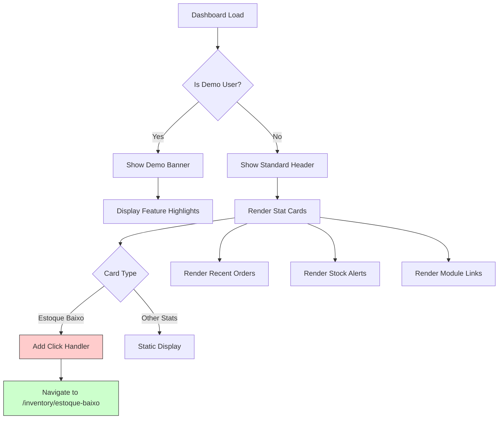

# Dashboard Module

<cite>
**Referenced Files in This Document**   
- [Dashboard.tsx](file://src/pages/Dashboard.tsx)
- [AppContext.tsx](file://src/contexts/AppContext.tsx)
- [AppContextOptimized.tsx](file://src/contexts/AppContextOptimized.tsx)
</cite>

## Table of Contents
1. [Introduction](#introduction)
2. [Core Functionality and Purpose](#core-functionality-and-purpose)
3. [Architectural Implementation](#architectural-implementation)
4. [Data Integration with Other Modules](#data-integration-with-other-modules)
5. [User Interface and Interaction Design](#user-interface-and-interaction-design)
6. [Performance Considerations](#performance-considerations)
7. [Error Handling and Data Loading States](#error-handling-and-data-loading-states)

## Introduction
The Dashboard Module serves as the central hub for executives and managers within the AABB-system, providing real-time operational insights through key performance indicators (KPIs). It aggregates critical business metrics such as daily revenue, pending orders, sales volume, and low-stock alerts to deliver a comprehensive overview of club operations. Designed with React components and enhanced by motion animations from Framer Motion, the dashboard offers an intuitive and responsive interface that adapts seamlessly across devices. The module leverages AppContext hooks to consume data efficiently, ensuring up-to-date information is always available. This document details the architectural implementation, integration points, user experience design, and performance optimizations that make the Dashboard Module a vital tool for decision-making.

## Core Functionality and Purpose
The primary purpose of the Dashboard Module is to provide executives and managers with immediate access to essential operational KPIs, enabling informed decision-making based on real-time data. Key metrics displayed include today's revenue, number of pending orders, total sales for the day, and items with low stock levels. These statistics are calculated dynamically using order and inventory data consumed via AppContext hooks. For example, daily revenue is computed by filtering delivered orders from the current date and summing their totals, while pending orders are counted by filtering orders with a 'pending' status. Low-stock items are identified by comparing current stock levels against predefined minimum thresholds. The dashboard also features conditional rendering of demo mode elements when accessed by users with the demo email address, offering guided navigation and feature testing capabilities. This centralized view allows management to monitor business health at a glance and respond promptly to emerging trends or issues.

**Section sources**
- [Dashboard.tsx](file://src/pages/Dashboard.tsx#L21-L300)

## Architectural Implementation
The Dashboard Module is implemented as a React functional component that utilizes several advanced frontend technologies to deliver a dynamic and responsive user experience. At its core, it consumes application state through the `useApp()` hook, which provides access to orders, inventory, and notification data from the AppContext. The visual presentation is enhanced with motion animations powered by Framer Motion, adding subtle transitions and interactions that improve usability and engagement. Each stat card animates into view with staggered delays, creating a polished entrance effect. The layout employs a responsive grid system that adjusts column count based on screen size—displaying four cards on large screens, two on medium screens, and one on mobile devices. Interactive elements like hover effects and click handlers are implemented using Framer Motion's `whileHover` and `whileTap` props, providing tactile feedback when users interact with low-stock alerts. The component structure follows React best practices with clear separation of concerns between data retrieval, computation, and rendering.

```mermaid
classDiagram
class Dashboard {
+navigate : NavigateFunction
+orders : Order[]
+inventory : InventoryItem[]
+user : User
+todayRevenue : number
+pendingOrders : number
+lowStockItems : number
+stats : Stat[]
+isDemoUser : boolean
-renderHeader() : JSX.Element
-renderStats() : JSX.Element
-renderRecentOrders() : JSX.Element
-renderStockAlerts() : JSX.Element
-renderModules() : JSX.Element
}
class AppContext {
+orders : Order[]
+inventory : InventoryItem[]
+notifications : string[]
+loadMenuItems() : Promise~void~
+addNotification(message : string) : void
}
class AuthContext {
+user : User
+authenticated : boolean
+permissions : string[]
}
Dashboard --> AppContext : "uses"
Dashboard --> AuthContext : "uses"
Dashboard ..> "React Router" : "navigation"
Dashboard ..> "Framer Motion" : "animations"
```

**Diagram sources**
- [Dashboard.tsx](file://src/pages/Dashboard.tsx#L21-L300)
- [AppContext.tsx](file://src/contexts/AppContext.tsx#L125-L125)

## Data Integration with Other Modules
The Dashboard Module integrates with multiple system modules by consuming aggregated data from Bar, Inventory, and Sales systems through the AppContext provider. Orders data is sourced from both bar operations (including table and counter orders) and kitchen management systems, allowing the dashboard to display comprehensive sales information. Inventory data is pulled directly from the inventory management system, where each item contains properties such as current stock level, minimum stock threshold, category, and unit of measurement. When calculating low-stock alerts, the dashboard filters inventory items where current stock is less than or equal to the minimum stock level. Sales data, though currently implemented as a placeholder, is designed to integrate with the cash management system to provide accurate revenue reporting. The module also displays recent orders with status indicators that reflect their progression through preparation stages, demonstrating integration with order lifecycle management. Clicking on the 'Estoque Baixo' (Low Stock) stat card triggers navigation to the inventory alert page (`/inventory/estoque-baixo`), creating a seamless workflow between monitoring and action.

**Section sources**
- [Dashboard.tsx](file://src/pages/Dashboard.tsx#L21-L300)
- [AppContext.tsx](file://src/contexts/AppContext.tsx#L125-L125)

## User Interface and Interaction Design
The Dashboard Module features a carefully crafted user interface with a responsive grid layout, interactive stat cards, and conditional demo mode features. The main statistics are presented in a responsive grid that automatically adjusts from four columns on desktop to a single column on mobile devices, ensuring optimal viewing across all screen sizes. Each stat card includes a title, value, icon, and color-coded background for quick visual recognition of different metric types. Interactive elements employ hover effects and micro-interactions powered by Framer Motion—when users hover over the 'Estoque Baixo' card, it gains a shadow and scales slightly larger, providing clear visual feedback of interactivity. Clicking this card navigates to the inventory alert page, enabling immediate action on stock issues. For demo users, additional educational content appears, including welcome banners with feature highlights and quick-access buttons to key modules like Bar and Kitchen. Conditional rendering ensures these demo-specific elements only appear for users with the demo email address. Recent orders and stock alerts are displayed in scrollable lists with status badges color-coded by order state (yellow for pending, blue for preparing, green for ready).



**Diagram sources**
- [Dashboard.tsx](file://src/pages/Dashboard.tsx#L21-L300)

## Performance Considerations
The Dashboard Module incorporates several performance optimizations to ensure fast loading times and smooth interactions. Computed values such as daily revenue, pending orders, and low-stock counts are memoized using React's `useMemo` hook in optimized versions of the component, preventing unnecessary recalculations during re-renders. The AppContext implementation includes lazy loading strategies where full dataset retrieval is deferred until necessary, with initial loads focusing only on essential dashboard data. In the optimized context version, inventory data is initially limited to low-stock items only, reducing payload size. The component minimizes expensive operations by avoiding inline function definitions in render methods and instead using stable callback references. Error boundaries and loading states are properly handled to maintain UI responsiveness even during data fetching delays. While the basic implementation calculates stats directly in the component body, the optimized version centralizes these computations within the AppContext, allowing shared access to pre-calculated metrics without duplication. Network requests are further optimized through selective subscriptions to real-time updates, focusing only on order changes that affect dashboard metrics rather than listening to all database events.

**Section sources**
- [Dashboard.tsx](file://src/pages/Dashboard.tsx#L21-L300)
- [AppContextOptimized.tsx](file://src/contexts/AppContextOptimized.tsx#L132-L132)

## Error Handling and Data Loading States
The Dashboard Module implements robust error handling and data loading states to ensure reliability and user confidence during operation. During initial load, the component gracefully handles asynchronous data fetching from the AppContext, displaying skeleton loaders or empty states when data is not yet available. In the optimized version of the dashboard, a dedicated loading state manages the display of a spinner animation until all required data has been retrieved. Empty states are thoughtfully designed—for instance, when no orders exist, the recent orders section displays a message indicating "No orders yet" along with a contextual call-to-action button for demo users to create their first order. The AppContext itself includes comprehensive error handling around Supabase API calls, catching and logging errors while maintaining application stability. Notifications about data changes or system events are managed through the AppContext's notification system, which adds messages to a queue that can be cleared programmatically. The dashboard also accounts for edge cases such as date formatting inconsistencies by using standardized date-fns utilities with proper locale configuration for Brazilian Portuguese.

**Section sources**
- [Dashboard.tsx](file://src/pages/Dashboard.tsx#L21-L300)
- [AppContextOptimized.tsx](file://src/contexts/AppContextOptimized.tsx#L132-L132)