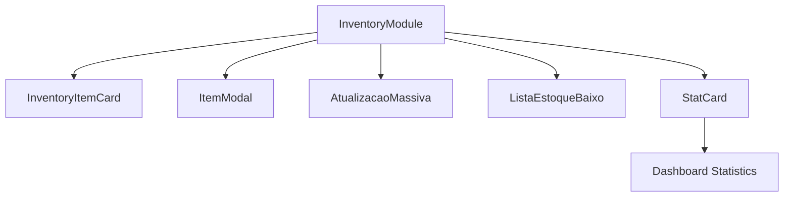
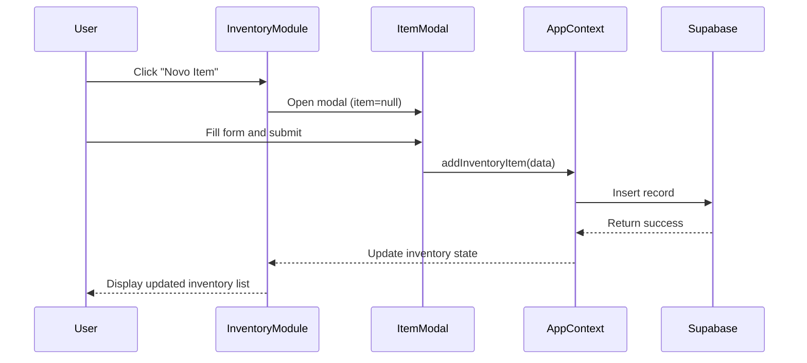
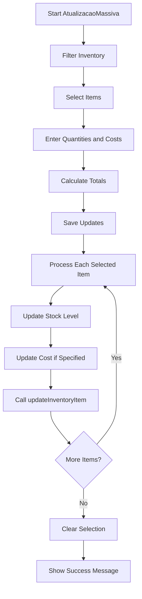
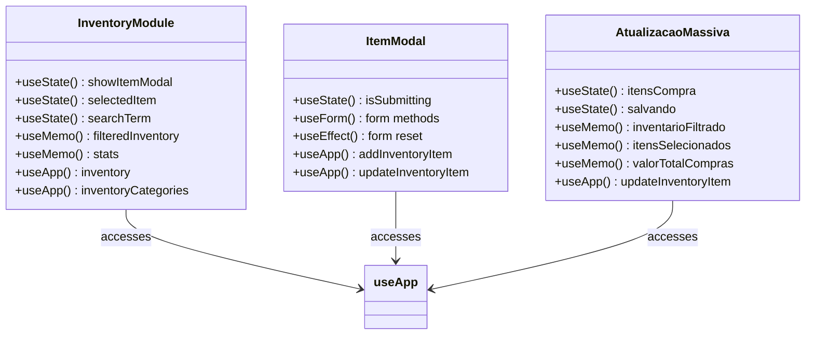
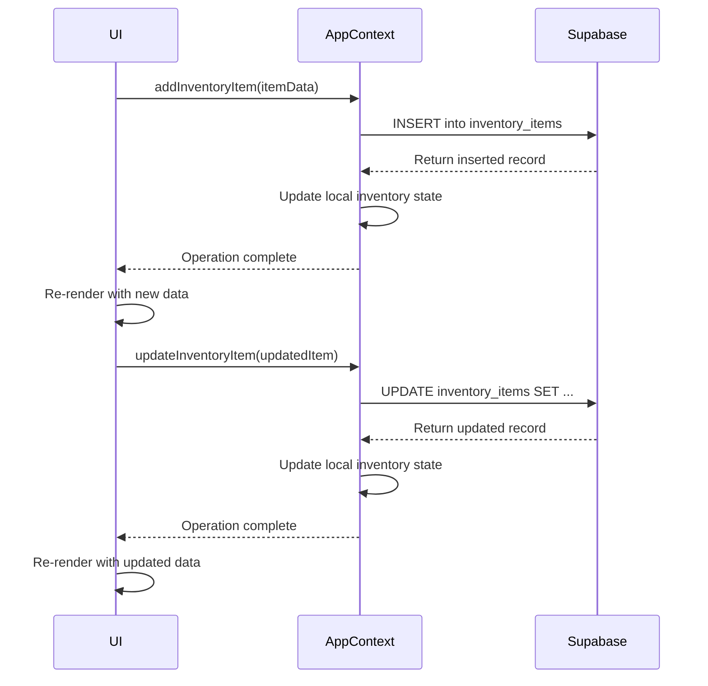
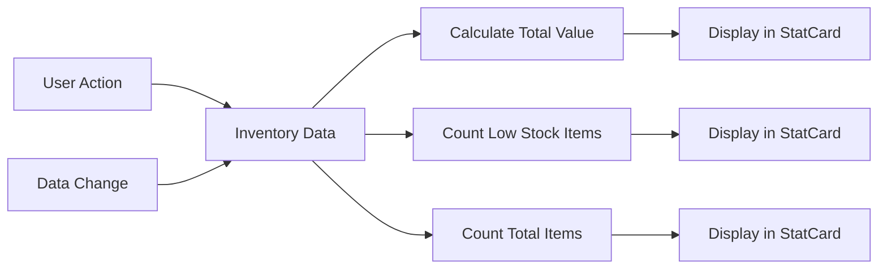
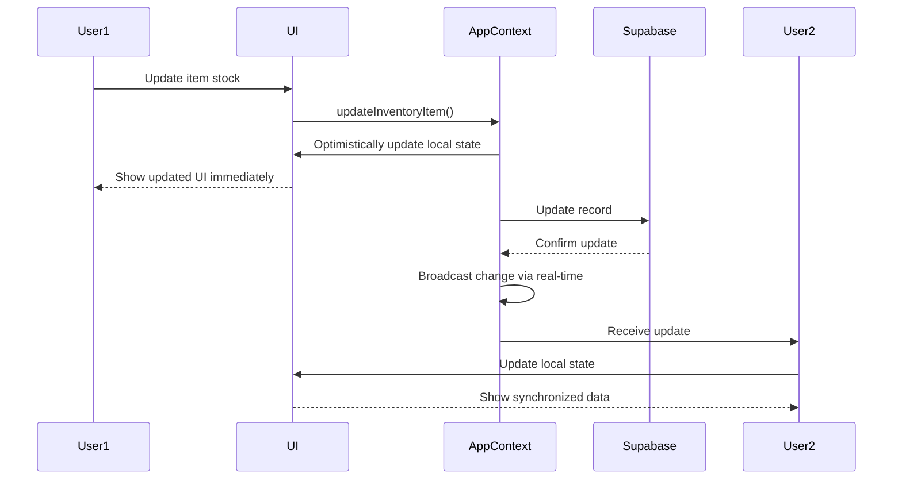
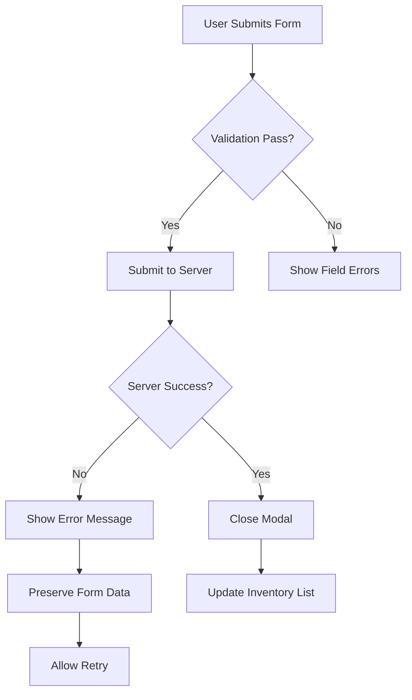

# Inventory Module

<cite>
**Referenced Files in This Document**   
- [InventoryModule.tsx](file://src/pages/Inventory/index.tsx)
- [InventoryItemCard.tsx](file://src/pages/Inventory/InventoryItemCard.tsx)
- [ItemModal.tsx](file://src/pages/Inventory/ItemModal.tsx)
- [AtualizacaoMassiva.tsx](file://src/pages/Inventory/AtualizacaoMassiva.tsx)
- [ListaEstoqueBaixo.tsx](file://src/pages/Inventory/ListaEstoqueBaixo.tsx)
- [AppContextOptimized.tsx](file://src/contexts/AppContextOptimized.tsx)
- [index.ts](file://src/types/index.ts)
</cite>

## Table of Contents
1. [Introduction](#introduction)
2. [Core Components and Architecture](#core-components-and-architecture)
3. [Inventory Item Management](#inventory-item-management)
4. [Bulk Update Feature: Atualização Massiva](#bulk-update-feature-atualizacao-massiva)
5. [State Management and React Hooks](#state-management-and-react-hooks)
6. [Integration with AppContext for CRUD Operations](#integration-with-appcontext-for-crud-operations)
7. [Inventory Statistics Calculation](#inventory-statistics-calculation)
8. [Relationship with Other Modules](#relationship-with-other-modules)
9. [Concurrency Handling and Optimistic UI Updates](#concurrency-handling-and-optimistic-ui-updates)
10. [Data Validation and Error Recovery](#data-validation-and-error-recovery)

## Introduction

The Inventory Module provides a comprehensive system for managing inventory items within the application. It enables users to view, add, edit, and perform bulk updates on inventory items through an intuitive card-based interface. The module integrates with AppContext for centralized state management and CRUD operations, ensuring data consistency across the application. Key features include search filtering, inventory statistics calculation, and a specialized bulk update functionality for efficient stock management.

**Section sources**
- [InventoryModule.tsx](file://src/pages/Inventory/index.tsx#L1-L178)

## Core Components and Architecture

The Inventory Module is composed of several key components that work together to provide a seamless user experience:

- **InventoryModule**: Main component that orchestrates the inventory interface
- **InventoryItemCard**: Displays individual inventory items in a card format
- **ItemModal**: Modal form for adding or editing inventory items
- **AtualizacaoMassiva**: Component for performing bulk inventory updates
- **ListaEstoqueBaixo**: Specialized view for low stock items

These components are organized in a parent-child relationship with the InventoryModule serving as the container that manages shared state and coordinates interactions between child components.



**Diagram sources**
- [InventoryModule.tsx](file://src/pages/Inventory/index.tsx#L1-L178)

**Section sources**
- [InventoryModule.tsx](file://src/pages/Inventory/index.tsx#L1-L178)
- [InventoryItemCard.tsx](file://src/pages/Inventory/InventoryItemCard.tsx#L1-L119)
- [ItemModal.tsx](file://src/pages/Inventory/ItemModal.tsx#L1-L291)
- [AtualizacaoMassiva.tsx](file://src/pages/Inventory/AtualizacaoMassiva.tsx#L1-L414)
- [ListaEstoqueBaixo.tsx](file://src/pages/Inventory/ListaEstoqueBaixo.tsx#L1-L188)

## Inventory Item Management

The Inventory Module provides comprehensive item management capabilities through its card-based grid interface. Each inventory item is displayed using the InventoryItemCard component, which presents key information including name, category, current stock levels, minimum stock thresholds, cost, and supplier details.

Users can perform two primary actions on existing items directly from the card interface:
- **Edit**: Opens the ItemModal with pre-filled data for modification
- **Delete**: Removes the item from inventory after confirmation

New items can be added through the "Novo Item" button, which opens the ItemModal in creation mode. The ItemModal implements a robust form validation system using react-hook-form to ensure data integrity during both creation and editing processes.



**Diagram sources**
- [InventoryModule.tsx](file://src/pages/Inventory/index.tsx#L1-L178)
- [ItemModal.tsx](file://src/pages/Inventory/ItemModal.tsx#L1-L291)
- [AppContextOptimized.tsx](file://src/contexts/AppContextOptimized.tsx#L404-L436)

**Section sources**
- [InventoryModule.tsx](file://src/pages/Inventory/index.tsx#L1-L178)
- [InventoryItemCard.tsx](file://src/pages/Inventory/InventoryItemCard.tsx#L1-L119)
- [ItemModal.tsx](file://src/pages/Inventory/ItemModal.tsx#L1-L291)

## Bulk Update Feature: Atualização Massiva

The AtualizacaoMassiva component provides a powerful bulk update capability for inventory management. This feature allows users to efficiently update multiple inventory items simultaneously, particularly useful when processing new shipments or conducting inventory adjustments.

Key functionality includes:
- Filterable inventory list with search and category filtering
- Selection of multiple items for batch processing
- Specification of quantities purchased and unit costs
- Real-time calculation of total purchase values
- Application of updates to selected items in a single operation

The implementation uses a controlled component pattern where selection state is maintained in the `itensCompra` object. When updates are saved, the system iterates through selected items, calculates new stock levels and costs, and applies these changes through the AppContext's updateInventoryItem function.



**Diagram sources**
- [AtualizacaoMassiva.tsx](file://src/pages/Inventory/AtualizacaoMassiva.tsx#L1-L414)

**Section sources**
- [AtualizacaoMassiva.tsx](file://src/pages/Inventory/AtualizacaoMassiva.tsx#L1-L414)

## State Management and React Hooks

The Inventory Module leverages React hooks extensively for state management and side effects. The primary hooks used include:

- **useState**: Manages local component states such as modal visibility, search terms, and form data
- **useMemo**: Optimizes performance by memoizing computed values like filtered inventory lists and statistics
- **useEffect**: Handles side effects such as form initialization and data loading
- **useNavigate**: Provides navigation capabilities between inventory views
- **useApp**: Custom hook for accessing the AppContext and its inventory-related functions

Search filtering is implemented using the useDebounce hook to prevent excessive re-renders during typing. The filtered inventory list is memoized using useMemo to avoid recalculation on every render, improving performance with large inventories.



**Diagram sources**
- [InventoryModule.tsx](file://src/pages/Inventory/index.tsx#L1-L178)
- [ItemModal.tsx](file://src/pages/Inventory/ItemModal.tsx#L1-L291)
- [AtualizacaoMassiva.tsx](file://src/pages/Inventory/AtualizacaoMassiva.tsx#L1-L414)
- [useDebounce.ts](file://src/hooks/useDebounce.ts#L2-L16)

**Section sources**
- [InventoryModule.tsx](file://src/pages/Inventory/index.tsx#L1-L178)
- [ItemModal.tsx](file://src/pages/Inventory/ItemModal.tsx#L1-L291)
- [AtualizacaoMassiva.tsx](file://src/pages/Inventory/AtualizacaoMassiva.tsx#L1-L414)
- [useDebounce.ts](file://src/hooks/useDebounce.ts#L2-L16)

## Integration with AppContext for CRUD Operations

The Inventory Module integrates with AppContext to perform all CRUD operations on inventory data. This centralized approach ensures data consistency and provides a single source of truth for inventory information across the application.

CRUD operations are exposed through the useApp hook and include:
- **Create**: addInventoryItem - Adds new inventory items to the database
- **Read**: inventory property - Provides access to the current inventory list
- **Update**: updateInventoryItem - Modifies existing inventory items
- **Delete**: removeInventoryItem - Removes inventory items from the system

All operations are asynchronous and interact with the Supabase backend through the AppContext provider. Successive operations automatically update the local inventory state, triggering re-renders in the UI components that depend on this data.



**Diagram sources**
- [AppContextOptimized.tsx](file://src/contexts/AppContextOptimized.tsx#L404-L436)
- [InventoryModule.tsx](file://src/pages/Inventory/index.tsx#L1-L178)

**Section sources**
- [AppContextOptimized.tsx](file://src/contexts/AppContextOptimized.tsx#L404-L436)
- [InventoryModule.tsx](file://src/pages/Inventory/index.tsx#L1-L178)

## Inventory Statistics Calculation

The Inventory Module calculates key statistics to provide insights into inventory health and value. These calculations are performed using the useMemo hook to optimize performance by avoiding recalculation on every render.

The three primary statistics calculated are:

- **Total Value of Inventory**: Sum of (cost × current stock) for all items
- **Low Stock Count**: Number of items where current stock ≤ minimum stock threshold
- **Total Items**: Total number of inventory items

These statistics are displayed in the StatCard components at the top of the inventory interface, providing immediate visibility into inventory status. The calculations are reactive, automatically updating whenever the inventory data changes due to additions, edits, or deletions.



**Diagram sources**
- [InventoryModule.tsx](file://src/pages/Inventory/index.tsx#L1-L178)

**Section sources**
- [InventoryModule.tsx](file://src/pages/Inventory/index.tsx#L1-L178)

## Relationship with Other Modules

The Inventory Module maintains critical relationships with other modules through shared inventory data. This integration enables cohesive functionality across the application, particularly in order processing systems.

Key integration points include:

- **Order Processing**: Inventory data is used to validate item availability when creating orders
- **Menu Management**: Menu items can be linked to inventory items, enabling automatic stock deduction when items are sold
- **Reporting**: Inventory statistics contribute to financial reports and business analytics
- **Purchasing**: Low stock alerts trigger purchasing workflows and supplier communications

The shared inventory data ensures that all modules operate with consistent information, preventing issues such as overselling items that are out of stock. The AppContext serves as the central hub for this data sharing, providing a clean separation of concerns while maintaining data integrity.

```mermaid
graph TD
A[Inventory Module] --> B[Order Processing]
A --> C[Menu Management]
A --> D[Reporting]
A --> E[Purchasing]
B --> F[Validate Availability]
C --> G[Link Menu Items]
D --> H[Generate Reports]
E --> I[Trigger Purchases]
J[AppContext] < --> A
J < --> B
J < --> C
J < --> D
J < --> E
```

**Diagram sources**
- [AppContextOptimized.tsx](file://src/contexts/AppContextOptimized.tsx#L404-L436)
- [InventoryModule.tsx](file://src/pages/Inventory/index.tsx#L1-L178)

**Section sources**
- [AppContextOptimized.tsx](file://src/contexts/AppContextOptimized.tsx#L404-L436)
- [InventoryModule.tsx](file://src/pages/Inventory/index.tsx#L1-L178)

## Concurrency Handling and Optimistic UI Updates

The Inventory Module addresses concurrency challenges through a combination of optimistic UI updates and proper error handling. When multiple users might modify the same inventory data simultaneously, the system employs strategies to maintain data integrity and provide a responsive user experience.

Optimistic updates are implemented by immediately reflecting changes in the UI before the server confirms the operation. If the server operation fails, the system reverts the change and notifies the user. This approach provides a snappy user experience while maintaining data consistency.

The AppContext handles potential conflicts by using Supabase's real-time capabilities to synchronize inventory changes across clients. When one user updates an inventory item, other clients receive the update and adjust their local state accordingly, preventing stale data issues.



**Diagram sources**
- [AppContextOptimized.tsx](file://src/contexts/AppContextOptimized.tsx#L404-L436)
- [InventoryModule.tsx](file://src/pages/Inventory/index.tsx#L1-L178)

**Section sources**
- [AppContextOptimized.tsx](file://src/contexts/AppContextOptimized.tsx#L404-L436)
- [InventoryModule.tsx](file://src/pages/Inventory/index.tsx#L1-L178)

## Data Validation and Error Recovery

The Inventory Module implements comprehensive data validation and error recovery strategies to ensure data integrity and provide a resilient user experience. Validation occurs at multiple levels:

- **Form Validation**: The ItemModal uses react-hook-form with defined validation rules for required fields and numerical constraints
- **Type Safety**: TypeScript interfaces define the structure of inventory data, preventing type-related errors
- **Server-Side Validation**: Supabase enforces data constraints and business rules at the database level

Error recovery mechanisms include:
- Try-catch blocks around asynchronous operations
- User-friendly error messages for failed operations
- Form state preservation during submission errors
- Automatic retry logic for transient network issues

When errors occur, the system provides clear feedback to users while maintaining the application state, allowing them to correct issues and retry operations without losing their work.



**Diagram sources**
- [ItemModal.tsx](file://src/pages/Inventory/ItemModal.tsx#L1-L291)
- [AppContextOptimized.tsx](file://src/contexts/AppContextOptimized.tsx#L404-L436)

**Section sources**
- [ItemModal.tsx](file://src/pages/Inventory/ItemModal.tsx#L1-L291)
- [AppContextOptimized.tsx](file://src/contexts/AppContextOptimized.tsx#L404-L436)