# Members Module

<cite>
**Referenced Files in This Document**   
- [MemberCard.tsx](file://src/pages/Members/MemberCard.tsx)
- [MemberModal.tsx](file://src/pages/Members/MemberModal.tsx)
- [index.tsx](file://src/pages/Members/index.tsx)
- [AppContext.tsx](file://src/contexts/AppContext.tsx)
- [index.ts](file://src/types/index.ts)
- [customers_management_module.sql](file://supabase/migrations/20250102000002_customers_management_module.sql)
</cite>

## Table of Contents
1. [Introduction](#introduction)
2. [Core Components](#core-components)
3. [Data Model and Database Schema](#data-model-and-database-schema)
4. [State Management and Filtering](#state-management-and-filtering)
5. [Membership Statistics Calculation](#membership-statistics-calculation)
6. [Integration Points](#integration-points)
7. [Performance Considerations](#performance-considerations)

## Introduction

The Members Module provides a comprehensive interface for managing club members within the AABB system. It offers a responsive grid view for member visualization, filtering by status, searching by name, and managing member profiles through modal interfaces. The module leverages React hooks for state management and integrates with AppContext for centralized data access. This documentation details the implementation of these features, explaining how membership statistics are calculated and displayed, and how the module interacts with other system components.

## Core Components

The Members Module consists of three primary components: MemberCard, MemberModal, and the main MembersModule page. These components work together to provide a complete CRUD (Create, Read, Update, Delete) interface for member management.

### MemberCard Component

The MemberCard component displays individual member information in a visually appealing card format. Each card shows the member's avatar, name, status, membership type, and contact information. The component uses conditional styling based on the member's status, with green for active members, red for inactive, and yellow for pending members.

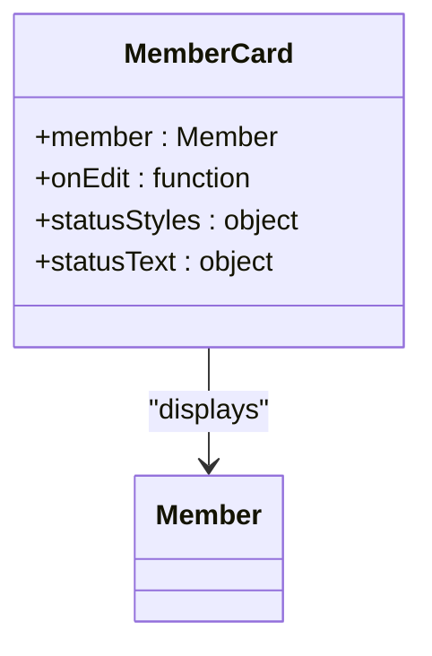

**Diagram sources**
- [MemberCard.tsx](file://src/pages/Members/MemberCard.tsx#L12-L70)

**Section sources**
- [MemberCard.tsx](file://src/pages/Members/MemberCard.tsx#L12-L70)

### MemberModal Component

The MemberModal component provides a form interface for creating new members or editing existing ones. It uses react-hook-form for form validation and handles both creation and update operations through the AppContext. The modal includes fields for name, email, phone, status, membership type, and avatar URL, with appropriate validation rules applied.

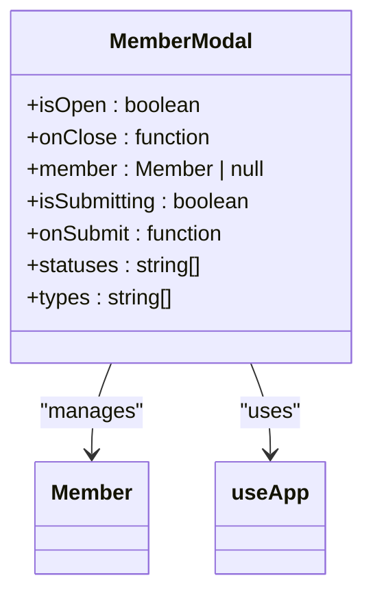

**Diagram sources**
- [MemberModal.tsx](file://src/pages/Members/MemberModal.tsx#L15-L117)

**Section sources**
- [MemberModal.tsx](file://src/pages/Members/MemberModal.tsx#L15-L117)

### MembersModule Page

The main MembersModule page orchestrates the entire member management interface. It manages the state for search term, status filter, and modal visibility, while displaying member cards in a responsive grid layout. The page also includes stat cards that display key membership metrics.

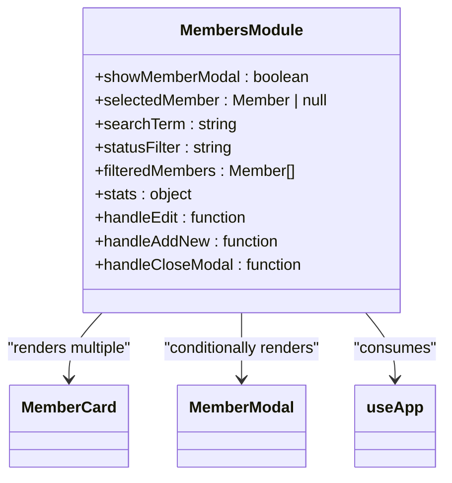

**Diagram sources**
- [index.tsx](file://src/pages/Members/index.tsx#L15-L152)

**Section sources**
- [index.tsx](file://src/pages/Members/index.tsx#L15-L152)

## Data Model and Database Schema

The member data model has evolved from a simple members table to a more comprehensive customer management system that supports both members and non-members.

### Current Data Structure

The current Member interface defined in the types file includes essential fields for member management:

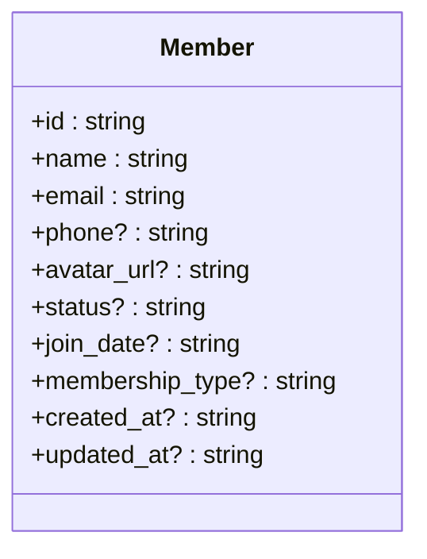

**Diagram sources**
- [index.ts](file://src/types/index.ts#L12-L23)

This client-side interface maps to the Supabase database schema, which has been expanded to include additional customer information beyond just members.

### Database Evolution

The system has undergone a migration from a simple members table to a more comprehensive customers table that supports both members and non-members. This evolution is documented in the `customers_management_module.sql` migration file.

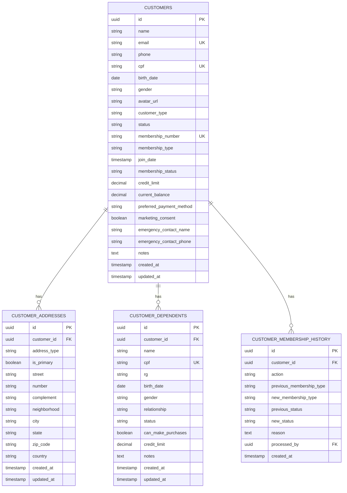

**Diagram sources**
- [customers_management_module.sql](file://supabase/migrations/20250102000002_customers_management_module.sql#L29-L169)

This enhanced schema allows for:
- Unified management of members and non-members
- Multiple addresses per customer
- Dependent tracking for family memberships
- Comprehensive membership history
- Financial tracking including credit limits and balances

## State Management and Filtering

The Members Module implements efficient state management using React hooks to handle user interactions and data filtering.

### State Variables

The module uses several useState hooks to manage different aspects of the UI state:

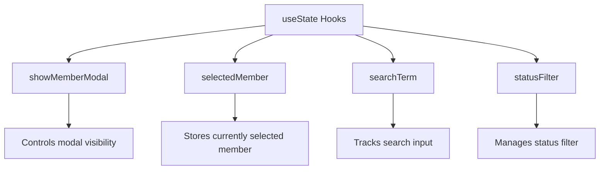

**Diagram sources**
- [index.tsx](file://src/pages/Members/index.tsx#L20-L23)

### Client-Side Filtering

The module implements client-side filtering using useMemo to optimize performance when dealing with large datasets. The filtering logic combines search term matching with status filtering:

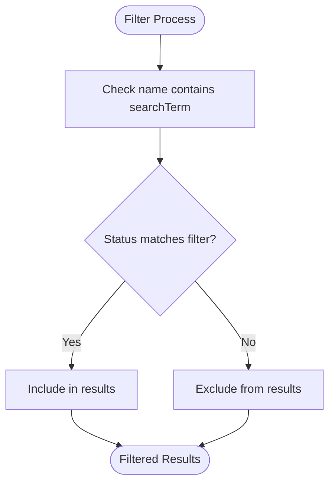

**Diagram sources**
- [index.tsx](file://src/pages/Members/index.tsx#L38-L44)

The filtering process first checks if the member's name contains the search term (case-insensitive), then verifies if the member's status matches the selected filter (or if "all" statuses are selected). Only members that pass both conditions are included in the filtered results.

## Membership Statistics Calculation

The Members Module displays key membership statistics in dedicated stat cards at the top of the interface. These statistics are calculated efficiently using useMemo to prevent unnecessary recalculations.

### Statistic Calculations

The stats object contains three key metrics:

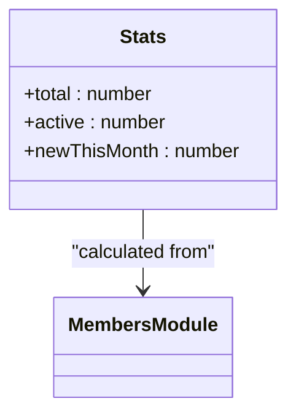

**Diagram sources**
- [index.tsx](file://src/pages/Members/index.tsx#L46-L52)

- **Total Members**: The count of all members in the system
- **Active Members**: The count of members with status 'active'
- **New This Month**: The count of members who joined within the last 30 days

The calculation uses date-fns library functions to determine the date one month ago and compare it with each member's joinDate property.

### StatCard Component

The StatCard component visualizes these statistics with appropriate icons and color coding:

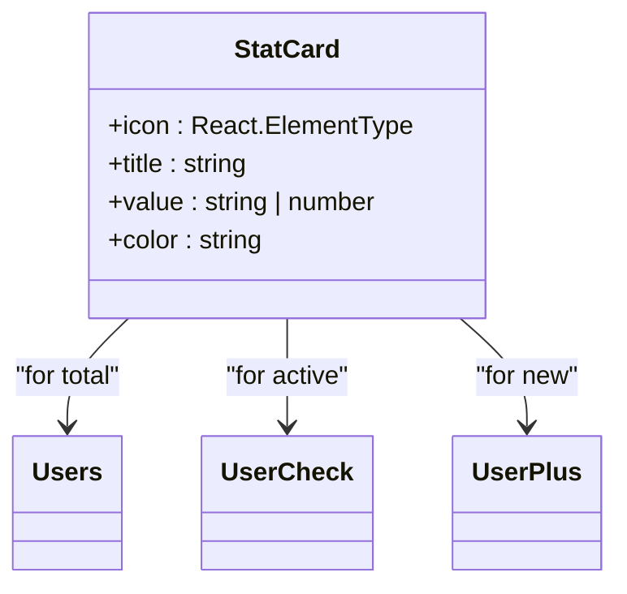

**Diagram sources**
- [index.tsx](file://src/pages/Members/index.tsx#L135-L152)

Each stat card uses a different color scheme (blue, green, purple) and relevant icon to make the information easily distinguishable at a glance.

## Integration Points

The Members Module integrates with several other parts of the system through various integration points.

### AppContext Integration

The module relies heavily on AppContext for data access and manipulation:

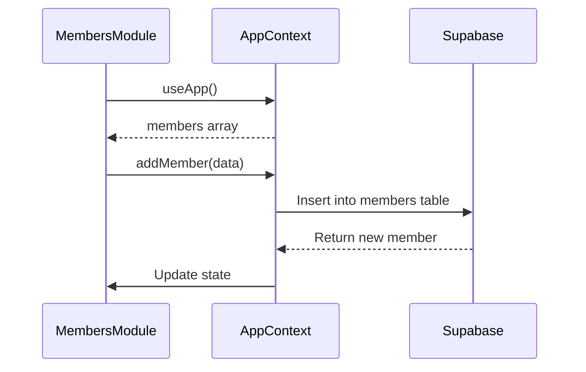

**Diagram sources**
- [AppContext.tsx](file://src/contexts/AppContext.tsx#L655-L681)
- [index.tsx](file://src/pages/Members/index.tsx#L19-L20)

The AppContext acts as an intermediary between the UI components and the Supabase backend, handling data fetching, insertion, and updates while maintaining local state consistency.

### Potential Integration Points

While not currently implemented, the system architecture suggests potential integration points:

#### Member-Specific Promotions
The customer data model includes fields that could support targeted promotions:
- marketing_consent field indicates whether members have opted in to receive promotions
- membership_type could be used to target specific promotion types to VIP or corporate members
- purchase history could be analyzed to create personalized offers

#### Billing Integration
The financial fields in the customer schema suggest potential billing integrations:
- credit_limit and current_balance enable account-based purchasing
- preferred_payment_method allows for customized billing workflows
- membership_number provides a unique identifier for billing systems

These integration points would require additional backend services and API endpoints but are supported by the current data model.

## Performance Considerations

The Members Module implements several strategies to ensure good performance, especially when handling large member databases.

### Client-Side Filtering Benefits

By implementing client-side filtering rather than server-side queries, the module achieves several performance advantages:

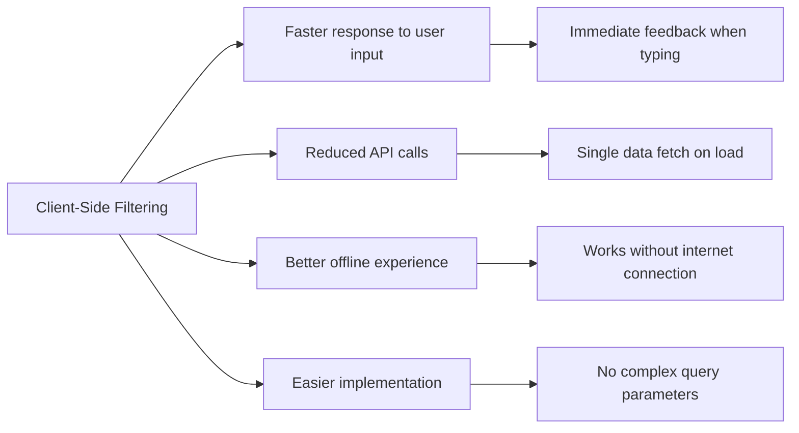

**Diagram sources**
- [index.tsx](file://src/pages/Members/index.tsx#L38-L44)

However, this approach has limitations with very large datasets, where server-side pagination and filtering would be more appropriate.

### Optimization Recommendations

For scenarios with large member databases, consider the following optimizations:

1. **Implement Virtual Scrolling**: For very large member lists, implement virtual scrolling to only render visible cards, reducing DOM complexity and memory usage.

2. **Add Server-Side Filtering**: For databases with thousands of members, implement server-side filtering to reduce the initial data payload.

3. **Implement Pagination**: Add pagination controls to limit the number of members displayed at once, improving initial load time.

4. **Optimize Image Loading**: Implement lazy loading for member avatars to improve initial page load performance.

5. **Debounce Search Input**: Add debouncing to the search input to prevent excessive filtering calculations during rapid typing.

The current implementation strikes a balance between simplicity and performance, suitable for most club sizes. As the member database grows, these optimizations can be incrementally added to maintain responsiveness.