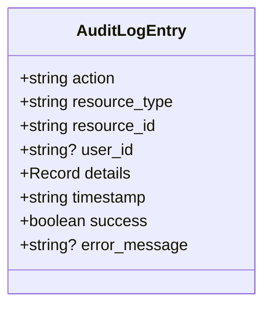
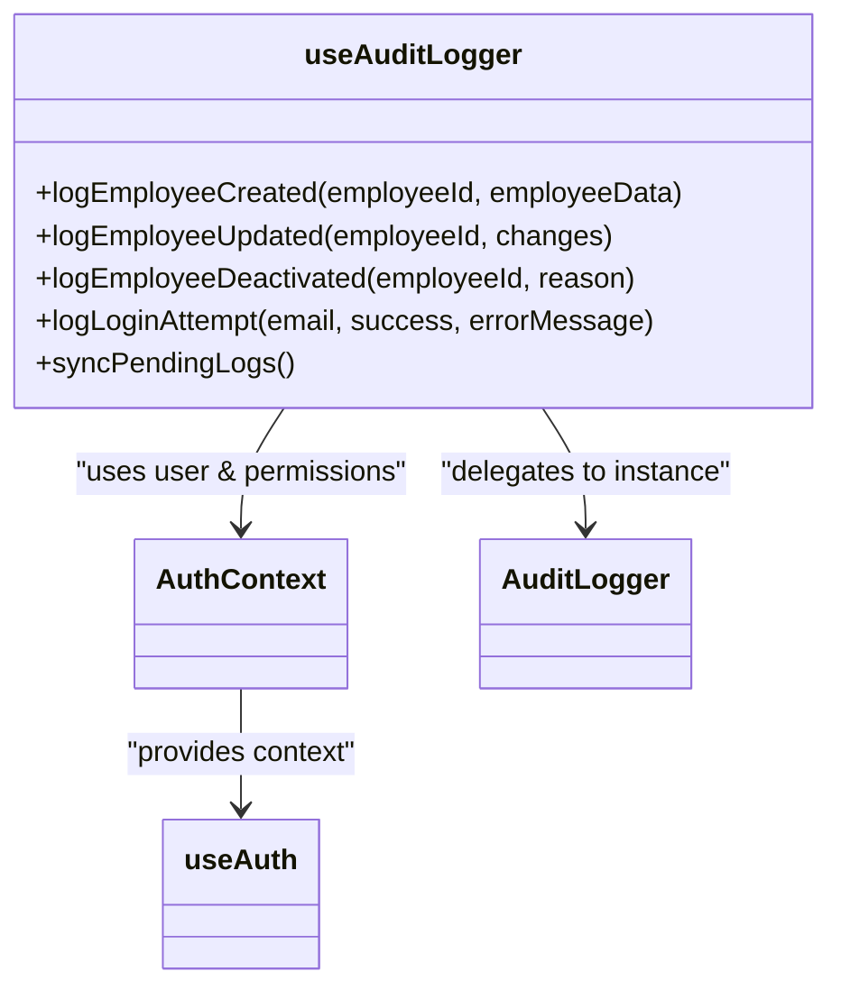
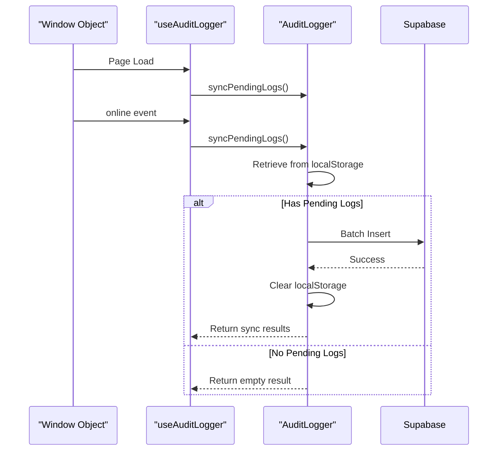

# Audit Logging Mechanism

<cite>
**Referenced Files in This Document**  
- [auditLogger.ts](file://src/utils/auditLogger.ts)
- [useAuditLogger.ts](file://src/hooks/useAuditLogger.ts)
</cite>

## Table of Contents
1. [Introduction](#introduction)
2. [Core Components](#core-components)
3. [AuditLogEntry Structure](#auditlogentry-structure)
4. [Dual-Write Persistence Strategy](#dual-write-persistence-strategy)
5. [Sensitive Data Sanitization](#sensitive-data-sanitization)
6. [useAuditLogger Hook Integration](#useauditlogger-hook-integration)
7. [Network Event Handling](#network-event-handling)
8. [Usage Examples and Invocation Patterns](#usage-examples-and-invocation-patterns)

## Introduction
The Audit Logging mechanism in the AABB-system provides a comprehensive solution for tracking critical system events, ensuring accountability and security across employee management operations. This document details the implementation of the audit logging system, focusing on its core components, data structures, persistence strategies, and integration patterns. The system is designed to maintain reliable audit trails even during network disruptions through a dual-write strategy that combines primary database storage with local fallback capabilities.

## Core Components

The audit logging system consists of two primary components: the `AuditLogger` class responsible for creating and persisting audit entries, and the `useAuditLogger` hook that integrates this functionality with the application's authentication context. The `AuditLogger` class implements specialized methods for logging employee lifecycle events including creation, updates, deactivation, and login attempts, while ensuring sensitive data is properly sanitized before recording.

**Section sources**
- [auditLogger.ts](file://src/utils/auditLogger.ts#L17-L129)
- [useAuditLogger.ts](file://src/hooks/useAuditLogger.ts#L8-L41)

## AuditLogEntry Structure

The `AuditLogEntry` interface defines the standardized structure for all audit log records, ensuring consistency across different types of logged events. Each entry contains essential metadata that enables effective monitoring and analysis of system activities.



**Diagram sources**  
- [auditLogger.ts](file://src/utils/auditLogger.ts#L6-L15)

The structure includes:
- **action**: Describes the type of operation performed (e.g., 'employee_created', 'login_success')
- **resource_type**: Identifies the category of resource affected (e.g., 'employee', 'session')
- **resource_id**: Specifies the unique identifier of the resource involved
- **user_id**: References the user who initiated the action (when available)
- **details**: Contains additional contextual information specific to the event
- **timestamp**: Records when the event occurred in ISO format
- **success**: Indicates whether the operation succeeded
- **error_message**: Provides error details when applicable

**Section sources**
- [auditLogger.ts](file://src/utils/auditLogger.ts#L6-L15)

## Dual-Write Persistence Strategy

The audit logging system implements a resilient dual-write strategy to ensure log reliability under varying network conditions. This approach prioritizes primary persistence to the Supabase 'audit_logs' table while maintaining a fallback mechanism using localStorage.

```mermaid
sequenceDiagram
participant Application as "Application Logic"
participant AuditLogger as "AuditLogger"
participant Supabase as "Supabase DB"
participant LocalStorage as "localStorage"
Application->>AuditLogger : logEmployeeCreated()
AuditLogger->>AuditLogger : Create AuditLogEntry
AuditLogger->>Supabase : saveToDB()
alt Database Write Success
Supabase-->>AuditLogger : Success
AuditLogger-->>Application : Log Complete
else Database Write Failure
Supabase--x>AuditLogger : Error
AuditLogger->>LocalStorage : saveToLocalStorage()
AuditLogger-->>Application : Log Queued Locally
end
```

**Diagram sources**  
- [auditLogger.ts](file://src/utils/auditLogger.ts#L50-L85)

When attempting to persist an audit log entry, the system first tries to write directly to the Supabase database. If this operation fails (typically due to network connectivity issues), the entry is stored in the browser's localStorage with a maximum queue size of 100 entries. This ensures that no audit events are lost during temporary outages.

**Section sources**
- [auditLogger.ts](file://src/utils/auditLogger.ts#L65-L85)

## Sensitive Data Sanitization

To protect confidential information, the audit logging system implements automatic sanitization of sensitive data through the `sanitizeDetails` method. This security measure prevents passwords, tokens, and other secret values from being recorded in audit trails.

```mermaid
flowchart TD
Start([Create Log Entry]) --> ExtractDetails["Extract Details Object"]
ExtractDetails --> IdentifySensitive["Identify Sensitive Fields"]
IdentifySensitive --> password{"Contains 'password'?}
password --> |Yes| RedactPassword["Set value to '[REDACTED]'"]
password --> |No| checkSenha["Contains 'senha'?"]
checkSenha --> |Yes| RedactSenha["Set value to '[REDACTED]'"]
checkSenha --> |No| checkToken["Contains 'token'?"]
checkToken --> |Yes| RedactToken["Set value to '[REDACTED]'"]
checkToken --> |No| checkSecret["Contains 'secret'?"]
checkSecret --> |Yes| RedactSecret["Set value to '[REDACTED]'"]
checkSecret --> |No| ReturnClean["Return Sanitized Object"]
RedactPassword --> ReturnClean
RedactSenha --> ReturnClean
RedactToken --> ReturnClean
RedactSecret --> ReturnClean
ReturnClean --> Complete([Complete Log Creation])
```

**Diagram sources**  
- [auditLogger.ts](file://src/utils/auditLogger.ts#L110-L120)

The sanitization process specifically targets common sensitive field names in both English ('password', 'token', 'secret') and Portuguese ('senha'), reflecting the bilingual nature of the application. When any of these fields are detected in the details object, their values are replaced with '[REDACTED]' before the log entry is persisted.

**Section sources**
- [auditLogger.ts](file://src/utils/auditLogger.ts#L110-L125)

## useAuditLogger Hook Integration

The `useAuditLogger` hook serves as the primary interface between application components and the audit logging system, automatically injecting user context from the authentication system and providing convenient access to logging methods.



**Diagram sources**  
- [useAuditLogger.ts](file://src/hooks/useAuditLogger.ts#L8-L41)

This hook leverages React's useEffect to automatically set the user context (ID and email) on the AuditLogger instance whenever authentication state changes. It returns bound methods that can be used directly by components, eliminating the need for manual context management.

**Section sources**
- [useAuditLogger.ts](file://src/hooks/useAuditLogger.ts#L8-L41)

## Network Event Handling

The audit logging system includes sophisticated network event handling to ensure seamless synchronization of pending logs when connectivity is restored. This mechanism monitors the browser's online status and automatically processes queued log entries.



**Diagram sources**  
- [useAuditLogger.ts](file://src/hooks/useAuditLogger.ts#L20-L30)

Upon initialization, the hook immediately attempts to synchronize any pending logs that may have accumulated during previous offline periods. It also registers an event listener for the window's 'online' event, triggering synchronization whenever the browser detects restored network connectivity. This ensures that audit trails remain complete and up-to-date regardless of intermittent connectivity issues.

**Section sources**
- [useAuditLogger.ts](file://src/hooks/useAuditLogger.ts#L20-L30)

## Usage Examples and Invocation Patterns

The audit logging system provides specialized methods for common employee management scenarios, simplifying integration with business logic flows. These methods abstract the underlying logging mechanics while ensuring consistent data capture.

### Employee Creation Logging
When a new employee is created, the system captures relevant details about the employee's role and access privileges:

[logEmployeeCreated](file://src/utils/auditLogger.ts#L87-L94)

### Employee Update Logging
Updates to employee records automatically track which fields were modified and their new values:

[logEmployeeUpdated](file://src/utils/auditLogger.ts#L96-L102)

### Employee Deactivation Logging
Deactivation events include the reason for deactivation and timestamp:

[logEmployeeDeactivated](file://src/utils/auditLogger.ts#L104-L110)

### Login Attempt Monitoring
Both successful and failed login attempts are recorded with appropriate status indicators:

[logLoginAttempt](file://src/utils/auditLogger.ts#L112-L119)

These invocation patterns demonstrate how the audit logging system integrates seamlessly with core business operations, providing comprehensive visibility into system activities while maintaining data privacy and reliability.

**Section sources**
- [auditLogger.ts](file://src/utils/auditLogger.ts#L87-L119)