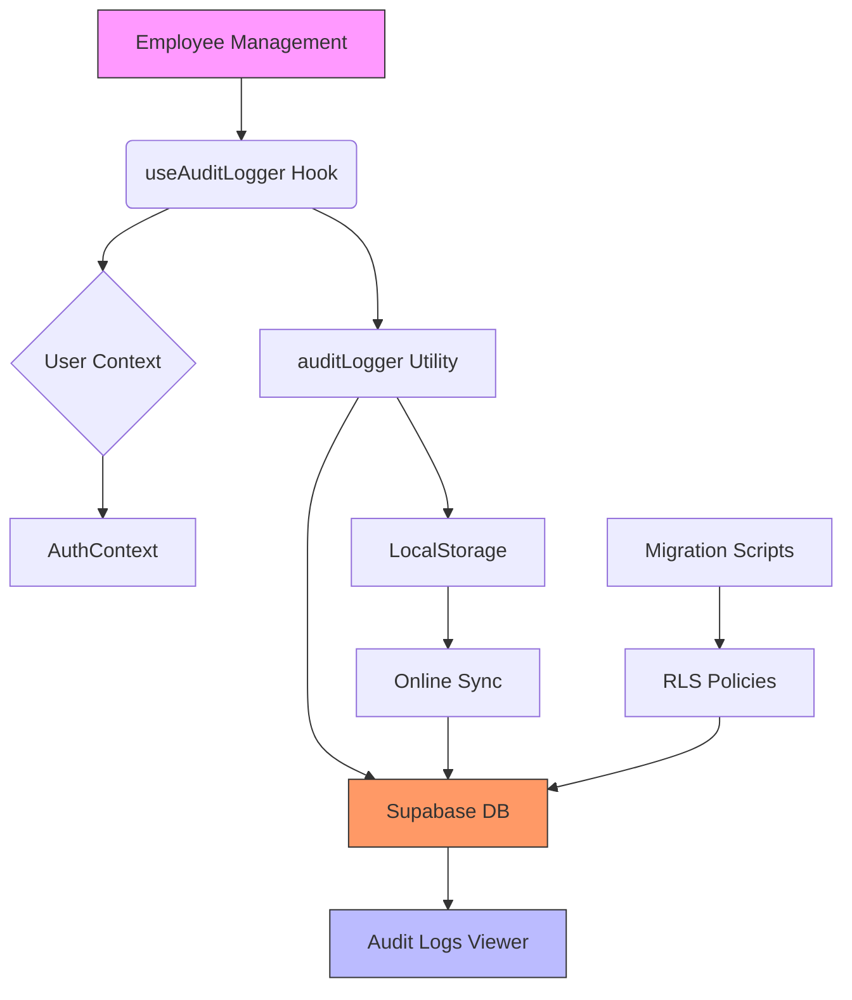
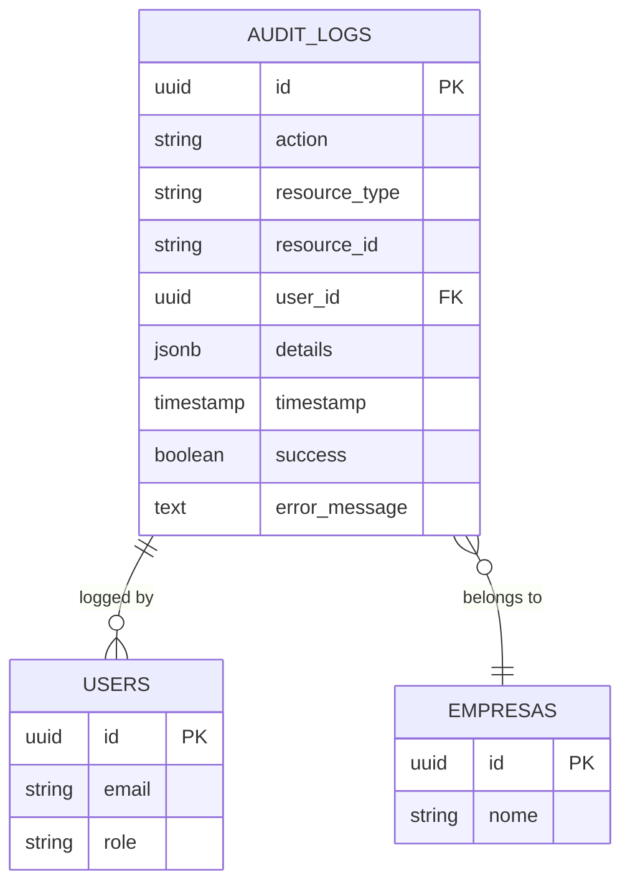
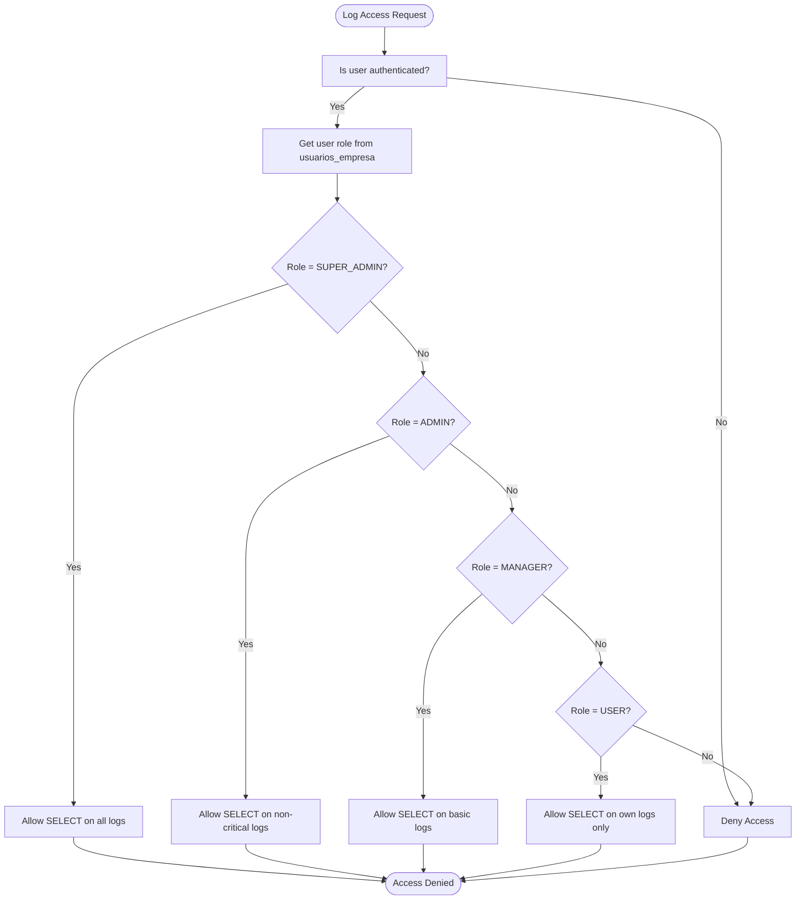
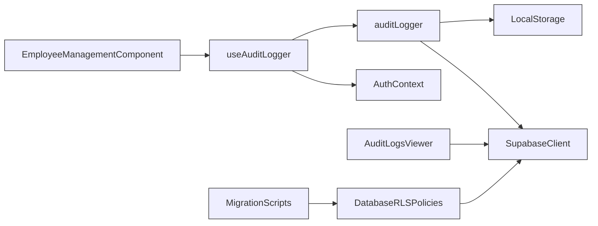

# Audit Logging System

<cite>
**Referenced Files in This Document**  
- [auditLogger.ts](file://src/utils/auditLogger.ts)
- [useAuditLogger.ts](file://src/hooks/useAuditLogger.ts)
- [AuditLogsViewer.tsx](file://src/components/AuditLogs/AuditLogsViewer.tsx)
- [20250908000002_fix_audit_log_rls.sql](file://supabase/migrations/20250908000002_fix_audit_log_rls.sql)
</cite>

## Table of Contents
1. [Introduction](#introduction)
2. [Core Components](#core-components)
3. [Architecture Overview](#architecture-overview)
4. [Detailed Component Analysis](#detailed-component-analysis)
5. [Dependency Analysis](#dependency-analysis)
6. [Performance Considerations](#performance-considerations)
7. [Troubleshooting Guide](#troubleshooting-guide)
8. [Conclusion](#conclusion)

## Introduction
The Audit Logging system in the AABB-system provides comprehensive tracking of critical employee lifecycle events including creation, updates, and deactivation. This document details the implementation of the audit logging infrastructure, focusing on the `auditLogger` utility class, the `useAuditLogger` hook integration with authentication context, log storage mechanisms, and access control policies. The system ensures complete audit trails are maintained even during offline operation through local storage synchronization.

## Core Components
The audit logging system consists of three primary components: the `auditLogger` utility class that handles log creation and persistence, the `useAuditLogger` React hook that integrates auditing capabilities into components, and the `AuditLogsViewer` component that enables visualization of audit records. These components work together to provide a robust, secure, and user-friendly audit trail system for monitoring employee management activities.

**Section sources**
- [auditLogger.ts](file://src/utils/auditLogger.ts#L6-L15)
- [useAuditLogger.ts](file://src/hooks/useAuditLogger.ts#L8-L41)
- [AuditLogsViewer.tsx](file://src/components/AuditLogs/AuditLogsViewer.tsx#L15-L205)

## Architecture Overview



**Diagram sources**
- [useAuditLogger.ts](file://src/hooks/useAuditLogger.ts#L8-L41)
- [auditLogger.ts](file://src/utils/auditLogger.ts#L6-L132)
- [20250908000002_fix_audit_log_rls.sql](file://supabase/migrations/20250908000002_fix_audit_log_rls.sql#L0-L24)

## Detailed Component Analysis

### Audit Logger Implementation

The `auditLogger` utility class implements a comprehensive audit logging mechanism that captures employee lifecycle events and securely stores them in the database while providing offline resilience.

#### Class Diagram
```mermaid
classDiagram
class AuditLogger {
+setContext(userId : string, userEmail : string) void
+log(action : string, resourceType : string, resourceId : string, details : Record, success : boolean, errorMessage? : string) Promise~void~
+logEmployeeCreated(employeeId : string, employeeData : any) Promise~void~
+logEmployeeUpdated(employeeId : string, changes : any) Promise~void~
+logEmployeeDeactivated(employeeId : string, reason : string) Promise~void~
+logLoginAttempt(email : string, success : boolean, errorMessage? : string) Promise~void~
+syncPendingLogs() Promise~{synced : number, failed : number}~
-saveToDB(logEntry : AuditLogEntry) Promise~void~
-saveToLocalStorage(logEntry : AuditLogEntry) void
-sanitizeDetails(details : Record) Record
}
class AuditLogEntry {
+action : string
+resource_type : string
+resource_id : string
+user_id? : string
+details : Record~string, any~
+timestamp : string
+success : boolean
+error_message? : string
}
AuditLogger --> AuditLogEntry : "creates"
```

**Diagram sources**
- [auditLogger.ts](file://src/utils/auditLogger.ts#L6-L132)

**Section sources**
- [auditLogger.ts](file://src/utils/auditLogger.ts#L6-L132)

### useAuditLogger Hook Integration

The `useAuditLogger` hook provides a clean interface for components to access audit logging functionality while automatically handling user context injection and offline log synchronization.

#### Sequence Diagram
```mermaid
sequenceDiagram
participant Component as "Employee Management Component"
participant Hook as "useAuditLogger"
participant Auth as "AuthContext"
participant Logger as "auditLogger"
participant DB as "Supabase Database"
participant LocalStorage as "Browser LocalStorage"
Component->>Hook : Call useAuditLogger()
Hook->>Auth : Subscribe to user/permissions
Auth-->>Hook : User & Permissions data
Hook->>Logger : setContext(userId, email)
Hook-->>Component : Return logging functions
Component->>Hook : logEmployeeCreated(employeeId, data)
Hook->>Logger : logEmployeeCreated()
Logger->>Logger : Create AuditLogEntry
Logger->>DB : saveToDB()
alt Success
DB-->>Logger : Success
else Failure
Logger->>LocalStorage : saveToLocalStorage()
LocalStorage-->>Logger : Stored locally
end
Note over DB,LocalStorage : Online status check triggers sync
when online :
Hook->>Logger : syncPendingLogs()
Logger->>LocalStorage : Read pending logs
Logger->>DB : Insert all pending logs
DB-->>Logger : Success/Failure
Logger->>LocalStorage : Clear on success
```

**Diagram sources**
- [useAuditLogger.ts](file://src/hooks/useAuditLogger.ts#L8-L41)
- [auditLogger.ts](file://src/utils/auditLogger.ts#L6-L132)

**Section sources**
- [useAuditLogger.ts](file://src/hooks/useAuditLogger.ts#L8-L41)

### Audit Log Storage and Access Control

The audit logging system stores records in the Supabase database with strict Row-Level Security (RLS) policies that enforce role-based access to log data.

#### Data Model


#### RLS Policy Flowchart


**Diagram sources**
- [20250908000002_fix_audit_log_rls.sql](file://supabase/migrations/20250908000002_fix_audit_log_rls.sql#L0-L24)

**Section sources**
- [20250908000002_fix_audit_log_rls.sql](file://supabase/migrations/20250908000002_fix_audit_log_rls.sql#L0-L24)

## Dependency Analysis

The audit logging system has well-defined dependencies that ensure proper integration with the authentication system and database layer.



**Diagram sources**
- [useAuditLogger.ts](file://src/hooks/useAuditLogger.ts#L8-L41)
- [auditLogger.ts](file://src/utils/auditLogger.ts#L6-L132)
- [AuditLogsViewer.tsx](file://src/components/AuditLogs/AuditLogsViewer.tsx#L15-L205)
- [20250908000002_fix_audit_log_rls.sql](file://supabase/migrations/20250908000002_fix_audit_log_rls.sql#L0-L24)

**Section sources**
- [useAuditLogger.ts](file://src/hooks/useAuditLogger.ts#L8-L41)
- [auditLogger.ts](file://src/utils/auditLogger.ts#L6-L132)
- [AuditLogsViewer.tsx](file://src/components/AuditLogs/AuditLogsViewer.tsx#L15-L205)

## Performance Considerations
The audit logging system is designed with performance optimization in mind. Log entries are created synchronously but persisted asynchronously to avoid blocking the main thread. The system implements automatic batching of pending logs during synchronization, reducing the number of database calls. Sensitive data is automatically redacted before logging to minimize storage requirements and improve security. The local storage queue is capped at 100 entries to prevent excessive browser storage usage.

## Troubleshooting Guide

When encountering issues with audit log delivery, follow this systematic approach:

1. **Verify Online Status**: Check if the application is online using `navigator.onLine`. Offline applications will queue logs in localStorage until connectivity is restored.

2. **Check Local Storage Queue**: Inspect `localStorage.getItem('audit_logs_pending')` to see if logs are being queued due to network issues or database errors.

3. **Validate RLS Policies**: Ensure the appropriate RLS policies are in place, particularly the INSERT policy on audit log tables. The migration script `20250908000002_fix_audit_log_rls.sql` addresses common RLS configuration issues.

4. **Review Error Messages**: Examine console logs for errors from the `saveToDB` method, which may indicate permission issues or database connectivity problems.

5. **Test Manual Sync**: Call `auditLogger.syncPendingLogs()` manually to force synchronization of queued logs.

For audit trail analysis, use the `AuditLogsViewer` component which provides filtering capabilities by action type and supports viewing detailed information about each log entry. The component automatically handles loading states and error conditions, providing a seamless user experience.

**Section sources**
- [auditLogger.ts](file://src/utils/auditLogger.ts#L6-L132)
- [useAuditLogger.ts](file://src/hooks/useAuditLogger.ts#L8-L41)
- [AuditLogsViewer.tsx](file://src/components/AuditLogs/AuditLogsViewer.tsx#L15-L205)
- [20250908000002_fix_audit_log_rls.sql](file://supabase/migrations/20250908000002_fix_audit_log_rls.sql#L0-L24)

## Conclusion
The Audit Logging system in the AABB-system provides a comprehensive solution for tracking employee lifecycle events with robust security and reliability features. By combining the `auditLogger` utility class with the `useAuditLogger` hook, the system ensures consistent logging across the application while automatically handling user context and offline scenarios. The implementation of RLS policies guarantees that audit data is protected according to user roles, maintaining the integrity and confidentiality of sensitive operational information.