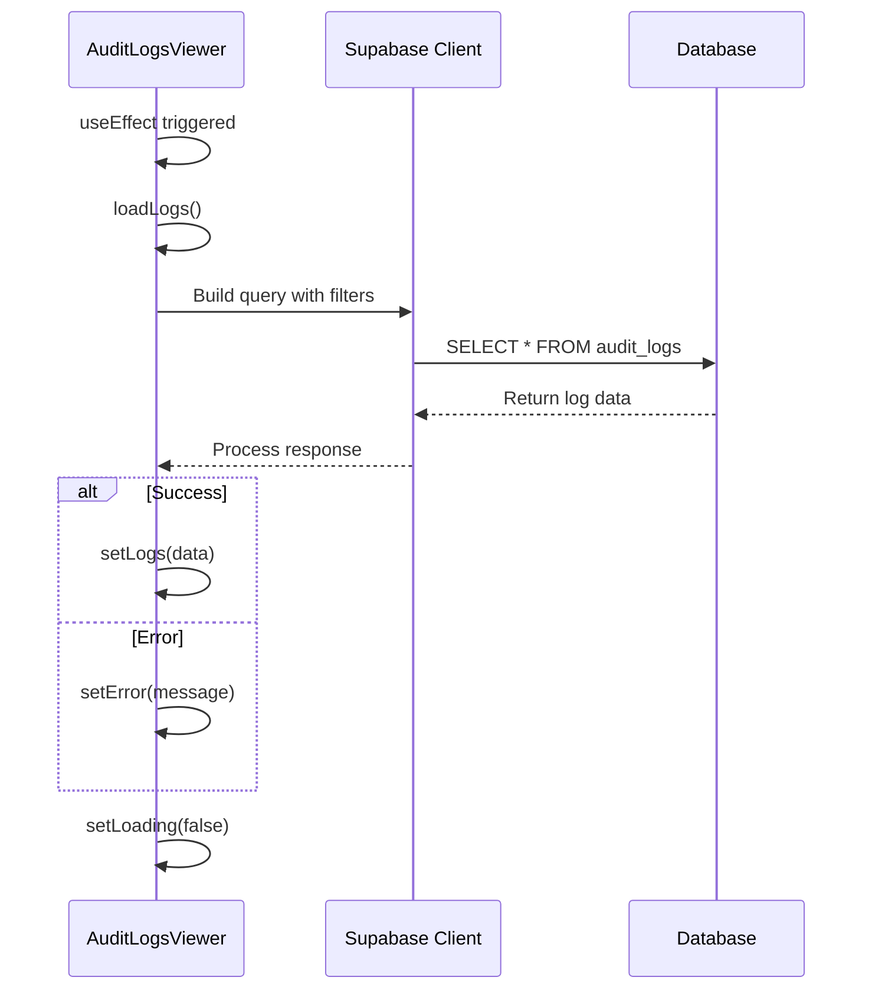
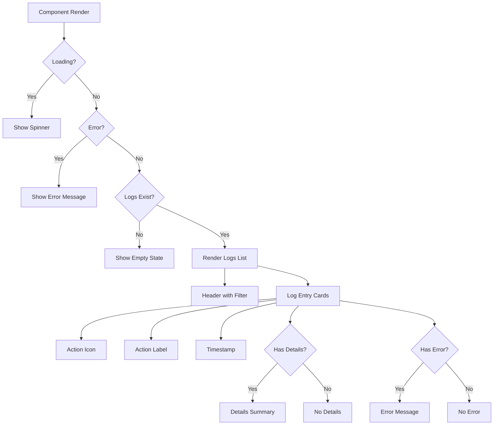

# Audit Logs Viewer

<cite>
**Referenced Files in This Document**  
- [AuditLogsViewer.tsx](file://src/components/AuditLogs/AuditLogsViewer.tsx)
- [auditLogger.ts](file://src/utils/auditLogger.ts)
- [supabase.ts](file://src/lib/supabase.ts)
</cite>

## Table of Contents
1. [Introduction](#introduction)
2. [Core Components](#core-components)
3. [Data Fetching Logic](#data-fetching-logic)
4. [UI Elements and Rendering](#ui-elements-and-rendering)
5. [Error Handling and Loading States](#error-handling-and-loading-states)
6. [Usage Examples](#usage-examples)
7. [Conclusion](#conclusion)

## Introduction

The AuditLogsViewer component provides a comprehensive interface for displaying audit log entries within the AABB-system. It enables administrators and authorized users to monitor system activities, track changes, and investigate security events through a user-friendly UI with filtering capabilities. The component supports optional scoping by employeeId and pagination control via the limit prop, making it suitable for integration into admin panels and employee detail views.

## Core Components

The AuditLogsViewer component is implemented as a React functional component that manages state for logs, loading status, errors, and filter selection. It accepts two props: an optional `employeeId` for scoped log viewing and a `limit` parameter for controlling pagination. The component uses Supabase as its backend service to query the 'audit_logs' table, applying dynamic filters based on user selection and optional employee scoping.

The component's architecture follows a clean separation of concerns, with distinct functions for data fetching (`loadLogs`), action label translation (`getActionLabel`), icon rendering (`getActionIcon`), and timestamp formatting (`formatTimestamp`). This modular design enhances maintainability and allows for easy extension of functionality.

**Section sources**
- [AuditLogsViewer.tsx](file://src/components/AuditLogs/AuditLogsViewer.tsx#L25-L203)

## Data Fetching Logic

The data fetching logic in AuditLogsViewer utilizes the Supabase client to query audit log entries from the 'audit_logs' database table. The component constructs a query that selects all fields, orders results by timestamp in descending order (newest first), and applies a limit based on the component's prop. Two conditional filters can be applied: filtering by `employeeId` (resource_id in the database) when provided, and filtering by action type when a specific filter is selected.

The query construction is handled within the `loadLogs` asynchronous function, which implements proper error handling and state management. When `employeeId` is provided, the query is filtered using `.eq('resource_id', employeeId)` to scope logs to a specific employee. Similarly, when a filter other than 'all' is selected, the query applies `.eq('action', filter)` to show only logs matching the selected action type.

**Diagram sources**
- [AuditLogsViewer.tsx](file://src/components/AuditLogs/AuditLogsViewer.tsx#L45-L78)
- [supabase.ts](file://src/lib/supabase.ts#L25-L36)

**Section sources**
- [AuditLogsViewer.tsx](file://src/components/AuditLogs/AuditLogsViewer.tsx#L45-L78)

## UI Elements and Rendering

The AuditLogsViewer component renders a clean, intuitive interface with several key UI elements. At the top, a header displays the title "Logs de Auditoria" with a shield icon, accompanied by a dropdown filter that allows users to filter logs by action type (e.g., creations, updates, logins). Each log entry is displayed as a card with an appropriate icon based on the action type and success status.

Icons are dynamically rendered using the `getActionIcon` function, which returns different Lucide React icons based on the action type and whether the action was successful. For example, successful employee creation shows a green user icon, while failed actions display a red alert circle. Timestamps are formatted in the pt-BR locale using the `formatTimestamp` function, ensuring date and time are displayed according to Brazilian conventions.

Each log entry includes expandable details via the HTML `
` element, allowing users to view additional information about the log without cluttering the interface. When log details contain data, a "Ver detalhes" summary is displayed, which expands to show the details in a formatted JSON structure within a pre-tag.

**Diagram sources**
- [AuditLogsViewer.tsx](file://src/components/AuditLogs/AuditLogsViewer.tsx#L84-L203)

**Section sources**
- [AuditLogsViewer.tsx](file://src/components/AuditLogs/AuditLogsViewer.tsx#L84-L203)

## Error Handling and Loading States

The component implements robust error handling and loading states to provide feedback during data retrieval. When loading data, the component displays an animated spinner with the message "Carregando logs..." to indicate activity. This loading state is controlled by the `loading` state variable, which is set to true at the beginning of the `loadLogs` function and false in the `finally` block.

If an error occurs during the data fetch operation, the component captures the error and displays it in a dedicated error state. Errors are stored in the `error` state variable and rendered as a red banner with an alert icon and the error message. The error handling gracefully converts any thrown value to a string message, defaulting to "Erro ao carregar logs" if the error is not an instance of Error.

The component also handles empty result sets by displaying a centered message "Nenhum log encontrado" with a shield icon, providing clear feedback when no logs match the current filters.

**Section sources**
- [AuditLogsViewer.tsx](file://src/components/AuditLogs/AuditLogsViewer.tsx#L120-L150)

## Usage Examples

The AuditLogsViewer component can be integrated into various parts of the application, such as admin dashboards or employee detail pages. When used in an admin panel, it can be rendered without the `employeeId` prop to show all audit logs across the system. In an employee detail view, the component can be passed the employee's ID to show only logs related to that specific employee.

The `limit` prop allows controlling the number of logs displayed per page, enabling basic pagination functionality. For example, setting `limit={20}` would display 20 logs at a time, while `limit={100}` would show more entries for power users who need to review extensive activity history.

The `getActionLabel` function maps internal action codes to user-friendly Portuguese labels, enhancing readability for end users. For instance, the internal code "employee_created" is translated to "Funcionário Criado", and "login_success" becomes "Login Realizado". This localization ensures that audit log entries are easily understandable by Portuguese-speaking administrators.

**Section sources**
- [AuditLogsViewer.tsx](file://src/components/AuditLogs/AuditLogsViewer.tsx#L69-L82)
- [auditLogger.ts](file://src/utils/auditLogger.ts#L6-L132)

## Conclusion

The AuditLogsViewer component provides a comprehensive solution for displaying and filtering audit log entries in the AABB-system. Its flexible design supports both system-wide and employee-scoped log viewing, with intuitive filtering and clear visual indicators for different action types and outcomes. The component's integration with Supabase enables real-time access to audit data, while its robust error handling and loading states ensure a smooth user experience. By translating technical action codes into user-friendly Portuguese labels and formatting timestamps according to local conventions, the component delivers a professional, accessible interface for monitoring system activity and maintaining security oversight.