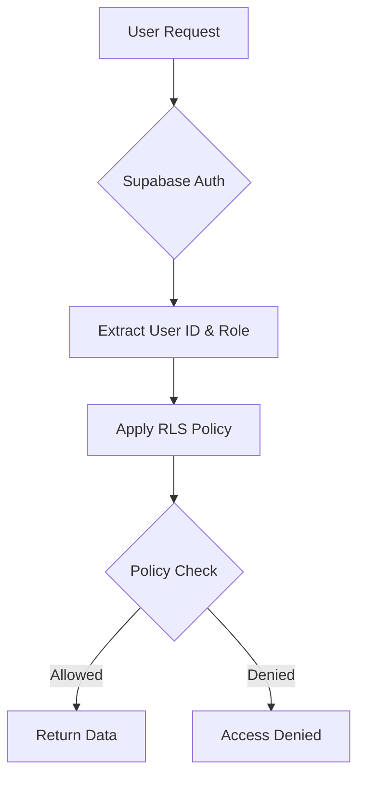
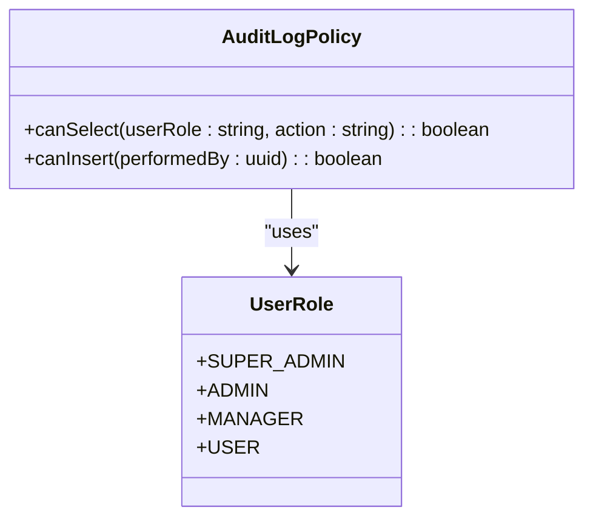
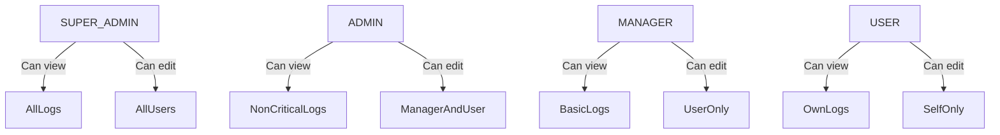
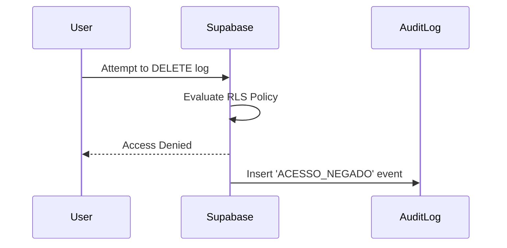
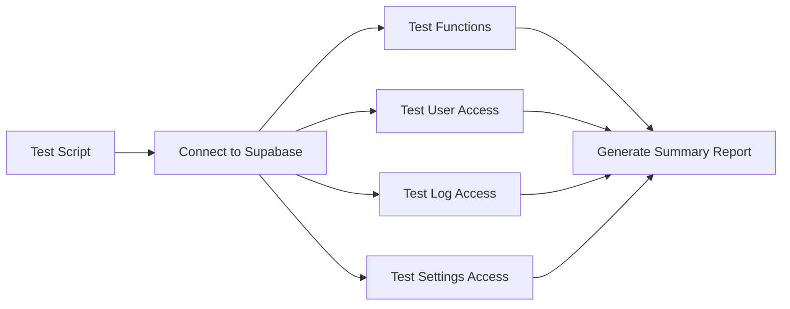

# Security & Access Control

<cite>
**Referenced Files in This Document **   
- [20250119000002_update_rls_policies_hierarchy.sql](file://supabase/migrations/20250119000002_update_rls_policies_hierarchy.sql)
- [20250908000002_fix_audit_log_rls.sql](file://supabase/migrations/20250908000002_fix_audit_log_rls.sql)
- [auditLogger.ts](file://src/utils/auditLogger.ts)
- [useLogsAuditoria.ts](file://src/hooks/useLogsAuditoria.ts)
- [test-rls-policies.js](file://test-rls-policies.js)
</cite>

## Table of Contents
1. [Introduction](#introduction)
2. [Row Level Security (RLS) Overview](#row-level-security-rls-overview)
3. [Audit Log Access Policies](#audit-log-access-policies)
4. [Hierarchical Permission Model](#hierarchical-permission-model)
5. [Policy Enforcement and Integrity Protection](#policy-enforcement-and-integrity-protection)
6. [Migration Script Implementation](#migration-script-implementation)
7. [Testing Policy Enforcement](#testing-policy-enforcement)
8. [Troubleshooting Access Issues](#troubleshooting-access-issues)

## Introduction
This document details the security policies governing audit log access within the AABB-system, with a focus on Row Level Security (RLS) implementation in Supabase. The system enforces strict access controls to ensure that only authorized personnel can view sensitive audit records, particularly those involving critical operations such as employee deactivation or credential changes. The hierarchical permission model enables administrative users at different levels to access logs within their organizational scope while preventing unauthorized access by lower-level users. Additionally, RLS policies are designed to prevent tampering or deletion of audit records, preserving the integrity of the audit trail.

**Section sources**
- [20250119000002_update_rls_policies_hierarchy.sql](file://supabase/migrations/20250119000002_update_rls_policies_hierarchy.sql)
- [20250908000002_fix_audit_log_rls.sql](file://supabase/migrations/20250908000002_fix_audit_log_rls.sql)

## Row Level Security (RLS) Overview
Row Level Security (RLS) in Supabase provides fine-grained control over data access at the row level, ensuring that users can only interact with data they are authorized to see. In the AABB-system, RLS is implemented across multiple tables including `logs_auditoria`, `usuarios_empresa`, and `configuracoes_empresa`. These policies are enforced through PostgreSQL policies that evaluate user roles, organizational context, and specific permissions before allowing SELECT, INSERT, UPDATE, or DELETE operations. The RLS framework integrates with Supabase Auth to dynamically assess the authenticated user's identity and role, applying appropriate restrictions based on predefined rules.

**Diagram sources **
- [20250119000002_update_rls_policies_hierarchy.sql](file://supabase/migrations/20250119000002_update_rls_policies_hierarchy.sql)

**Section sources**
- [20250119000002_update_rls_policies_hierarchy.sql](file://supabase/migrations/20250119000002_update_rls_policies_hierarchy.sql)

## Audit Log Access Policies
The `logs_auditoria` table contains critical audit records that track user actions throughout the system. Access to these logs is strictly controlled via RLS policies that filter visibility based on user role and action sensitivity. The policy for SELECT operations ensures that:
- SUPER_ADMIN users can view all logs
- ADMIN users can access non-critical logs but are restricted from viewing high-sensitivity actions like "MUDANCA_PAPEL_USUARIO" (user role change) or "CONFIGURACAO_SEGURANCA_ALTERADA" (security configuration changed)
- MANAGER users can only see basic activity logs such as login/logout events and permission changes
- USER-level users can only view logs related to their own account activity

Additionally, an INSERT policy allows automatic logging by system triggers while restricting direct insertions to administrators, ensuring that audit records cannot be forged by regular users.

**Diagram sources **
- [20250119000002_update_rls_policies_hierarchy.sql](file://supabase/migrations/20250119000002_update_rls_policies_hierarchy.sql)

**Section sources**
- [20250119000002_update_rls_policies_hierarchy.sql](file://supabase/migrations/20250119000002_update_rls_policies_hierarchy.sql)

## Hierarchical Permission Model
The AABB-system implements a hierarchical permission model where higher-level administrators have broader access rights than lower-level users. This structure is enforced through custom PostgreSQL functions such as `pode_ver_usuario()` and `pode_editar_usuario()`, which evaluate both the requesting user’s role and the target resource’s ownership or classification.

For example:
- SUPER_ADMIN can manage all users and view all logs
- ADMIN can manage MANAGER and USER roles but cannot modify other ADMINs or SUPER_ADMINs
- MANAGER can only manage USER-level accounts
- Regular users can only view their own information and associated logs

This hierarchy extends to audit log access, where each role has clearly defined boundaries on what types of logs they can retrieve, ensuring least-privilege access across the organization.

**Diagram sources **
- [20250119000002_update_rls_policies_hierarchy.sql](file://supabase/migrations/20250119000002_update_rls_policies_hierarchy.sql)

**Section sources**
- [20250119000002_update_rls_policies_hierarchy.sql](file://supabase/migrations/20250119000002_update_rls_policies_hierarchy.sql)

## Policy Enforcement and Integrity Protection
To maintain the integrity of audit records, RLS policies prevent unauthorized modification or deletion of entries in the `logs_auditoria` table. The system uses a combination of database-level constraints and trigger-based automation to ensure logs are immutable once written. Only system processes and elevated administrative roles are permitted to insert records, and no role—including SUPER_ADMIN—is allowed to delete or update existing audit logs.

Furthermore, any attempt to bypass RLS policies results in an automatic denial and generates a secondary audit entry via the `log_acesso_negado()` function, which captures details about the denied operation for forensic review.

**Diagram sources **
- [20250119000002_update_rls_policies_hierarchy.sql](file://supabase/migrations/20250119000002_update_rls_policies_hierarchy.sql)

**Section sources**
- [20250119000002_update_rls_policies_hierarchy.sql](file://supabase/migrations/20250119000002_update_rls_policies_hierarchy.sql)

## Migration Script Implementation
The migration script `20250119000002_update_rls_policies_hierarchy.sql` defines and applies the core RLS policies for audit log access. It creates several helper functions and corresponding policies that enforce role-based access control. Additionally, the script `20250908000002_fix_audit_log_rls.sql` addresses a critical issue where missing INSERT policies were blocking automated audit logging by triggers.

Key components of the migration include:
- Creation of the `pode_ver_usuario()` function to determine if a user can view another user based on role hierarchy
- Definition of the `Logs baseados em hierarquia` policy for selective log access
- Implementation of the `Inserção de logs controlada` policy to allow system-generated audit entries
- Addition of comments for documentation and traceability

These migrations must be applied in sequence to ensure proper enforcement of security policies.

**Section sources**
- [20250119000002_update_rls_policies_hierarchy.sql](file://supabase/migrations/20250119000002_update_rls_policies_hierarchy.sql)
- [20250908000002_fix_audit_log_rls.sql](file://supabase/migrations/20250908000002_fix_audit_log_rls.sql)

## Testing Policy Enforcement
Policy enforcement can be validated using the provided test script `test-rls-policies.js`, which connects to the Supabase instance and performs a series of queries against protected tables. The script verifies:
- Existence of required RLS helper functions
- Proper filtering of user data based on role
- Restricted access to sensitive configuration categories
- Visibility of audit logs according to user privilege level

The test outputs a detailed summary indicating whether each policy is functioning correctly, helping administrators confirm that security controls are active and effective.

**Diagram sources **
- [test-rls-policies.js](file://test-rls-policies.js)

**Section sources**
- [test-rls-policies.js](file://test-rls-policies.js)

## Troubleshooting Access Issues
Common issues with audit log access typically stem from misconfigured RLS policies or incorrect user roles. If users report inability to view expected logs:
1. Verify that the latest RLS migration scripts have been applied
2. Confirm the user’s role is correctly set in the `usuarios_empresa` table
3. Ensure the user belongs to the correct `empresa_id` context
4. Run `test-rls-policies.js` to validate policy behavior
5. Check for JavaScript errors in client-side code that may interfere with Supabase queries

If audit logs fail to write, verify that the `cash_audit_log` table has the proper INSERT policy defined, as missing policies will block trigger-based insertions.

**Section sources**
- [test-rls-policies.js](file://test-rls-policies.js)
- [20250908000002_fix_audit_log_rls.sql](file://supabase/migrations/20250908000002_fix_audit_log_rls.sql)