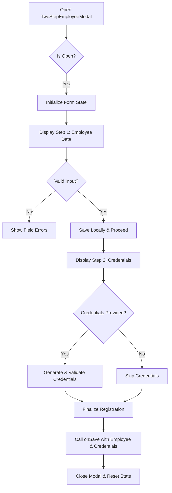
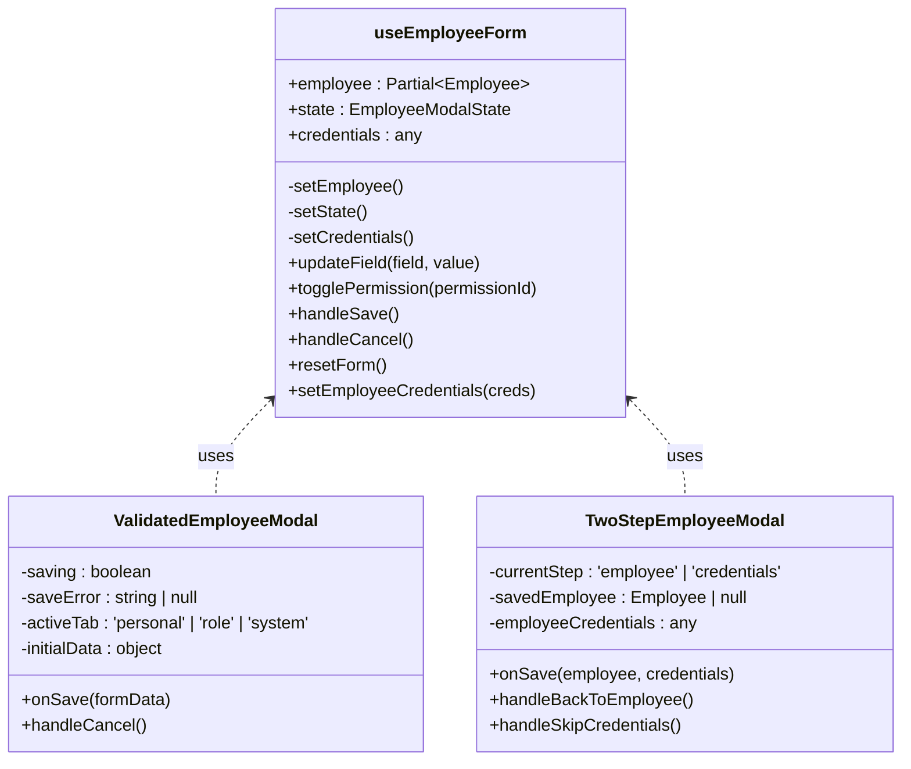
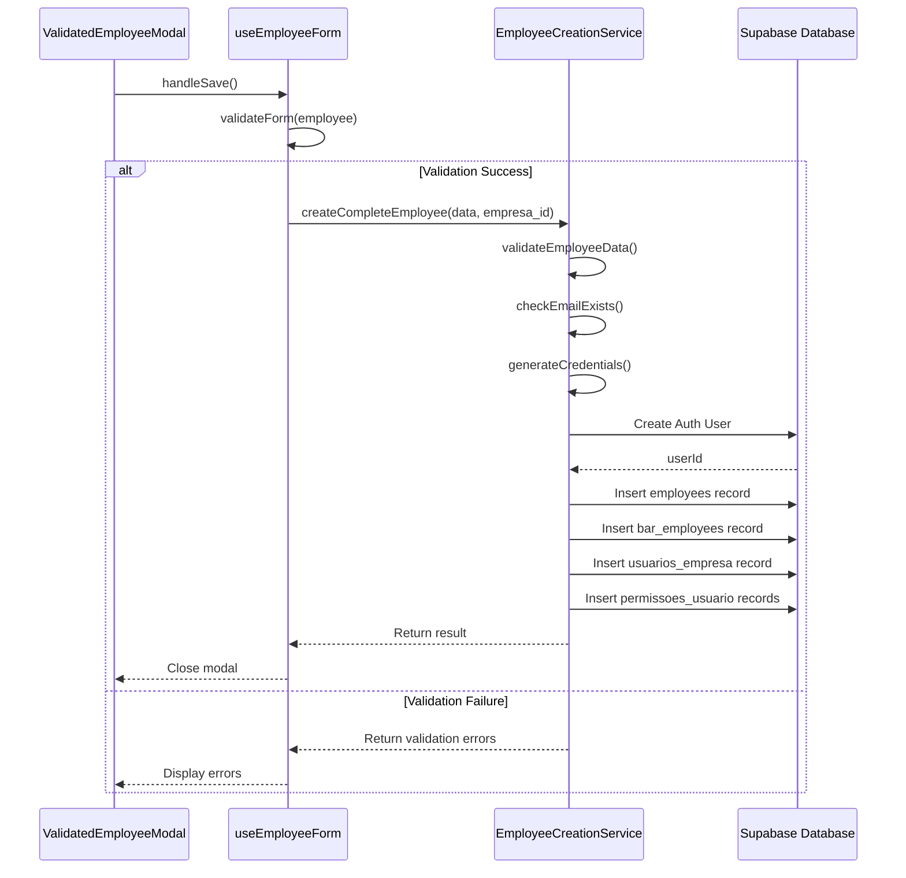

# Employee Creation Workflow

<cite>
**Referenced Files in This Document**   
- [ValidatedEmployeeModal.tsx](file://src/components/EmployeeModal/ValidatedEmployeeModal.tsx)
- [TwoStepEmployeeModal.tsx](file://src/components/EmployeeModal/TwoStepEmployeeModal.tsx)
- [useEmployeeForm.ts](file://src/hooks/useEmployeeForm.ts)
- [employee-creation-service.ts](file://src/services/employee-creation-service.ts)
</cite>

## Table of Contents
1. [Introduction](#introduction)
2. [Single-Step Employee Creation Process](#single-step-employee-creation-process)
3. [Two-Step Employee Creation Process](#two-step-employee-creation-process)
4. [Form Initialization and State Management](#form-initialization-and-state-management)
5. [Validation Handling](#validation-handling)
6. [Service Layer Integration](#service-layer-integration)
7. [Data Flow Example: Modal Submission to Backend Storage](#data-flow-example-modal-submission-to-backend-storage)
8. [Error Recovery Mechanisms](#error-recovery-mechanisms)
9. [Real-Time Feedback Implementation](#real-time-feedback-implementation)
10. [System Access Provisioning and Credential Generation](#system-access-provisioning-and-credential-generation)

## Introduction
The Employee Creation workflow in the AABB-system provides two distinct modal interfaces for creating employee records: a single-step process using `ValidatedEmployeeModal` and a two-step process via `TwoStepEmployeeModal`. Both workflows leverage the `useEmployeeForm` hook for state management and validation, while integrating with the `employee-creation-service.ts` for database persistence and Supabase Row Level Security (RLS) policy enforcement. The system supports both employees with full system access (requiring credentials) and those without login capabilities (internal tracking only). This document details the implementation, data flow, error handling, and configuration options across these creation processes.

## Single-Step Employee Creation Process
The `ValidatedEmployeeModal` component implements a streamlined, tab-based interface for creating or editing employee records in a single step. It organizes input fields into three logical sections: Personal Information, Role and Work, and System Access. Users navigate between tabs to complete different aspects of the employee profile before final submission. The modal displays real-time validation feedback, including errors and warnings, directly within the form interface. Upon submission, it performs comprehensive validation and attempts immediate saving through the service layer. This approach is optimized for scenarios where all necessary information is available upfront and credential generation is either not required or can be handled automatically during the save operation.

**Section sources**
- [ValidatedEmployeeModal.tsx](file://src/components/EmployeeModal/ValidatedEmployeeModal.tsx#L27-L443)

## Two-Step Employee Creation Process
The `TwoStepEmployeeModal` implements a progressive disclosure pattern that separates employee data entry from credential configuration. In the first step, users input basic employee information such as personal details, role, and work preferences. After successful validation of this initial data, the modal transitions to a second step dedicated to configuring system access credentials. This separation allows administrators to create employee records for internal tracking without immediately granting system access, with the option to configure credentials later. The workflow includes explicit navigation controls (Back, Skip Credentials, Finalize Registration) and visual progress indicators to guide users through the process. This approach enhances usability when credential setup requires additional coordination or when some employees should not have login privileges.



**Diagram sources **
- [TwoStepEmployeeModal.tsx](file://src/components/EmployeeModal/TwoStepEmployeeModal.tsx#L18-L293)

**Section sources**
- [TwoStepEmployeeModal.tsx](file://src/components/EmployeeModal/TwoStepEmployeeModal.tsx#L18-L293)

## Form Initialization and State Management
Both employee creation modals utilize the `useEmployeeForm` custom hook for centralized state management. This hook maintains the employee data object, form state (including validity, loading status, and error conditions), and handles updates through callback functions like `updateField` and `togglePermission`. For existing employees being edited, the hook initializes form data from the provided employee object. When creating new employees, it starts with default values. The hook also manages credential state separately, allowing the two-step process to capture credentials independently from the main employee data. State changes trigger automatic re-renders and validation checks, ensuring the UI remains synchronized with the underlying data model throughout the creation process.



**Diagram sources **
- [useEmployeeForm.ts](file://src/hooks/useEmployeeForm.ts#L16-L344)
- [ValidatedEmployeeModal.tsx](file://src/components/EmployeeModal/ValidatedEmployeeModal.tsx#L27-L443)
- [TwoStepEmployeeModal.tsx](file://src/components/EmployeeModal/TwoStepEmployeeModal.tsx#L18-L293)

**Section sources**
- [useEmployeeForm.ts](file://src/hooks/useEmployeeForm.ts#L16-L344)

## Validation Handling
The employee creation workflows implement robust validation at multiple levels. The `useFormValidation` hook (used by `ValidatedEmployeeModal`) provides field-level validation with configurable timing (on change, on blur) and debouncing to prevent excessive processing. It tracks individual field errors and overall form validity, enabling real-time feedback in the UI. The `useEmployeeForm` hook integrates its own validation logic through `useEmployeeValidation`, which validates the complete employee object before submission. Additionally, the backend service performs comprehensive validation of input data, checking requirements like valid email format, CPF structure, and permission configurations. This multi-layered approach ensures data integrity while providing immediate user feedback during form completion.

**Section sources**
- [ValidatedEmployeeModal.tsx](file://src/components/EmployeeModal/ValidatedEmployeeModal.tsx#L27-L443)
- [useEmployeeForm.ts](file://src/hooks/useEmployeeForm.ts#L16-L344)

## Service Layer Integration
The employee creation process integrates with the `employee-creation-service.ts` for database persistence and security enforcement. This service implements a singleton pattern through `EmployeeCreationService.getInstance()` and handles the complete lifecycle of employee creation across multiple related tables in the Supabase database. It enforces Row Level Security (RLS) policies by using appropriate Supabase clients (`supabase` vs `supabaseAdmin`) based on the operation context. The service coordinates transactions across several tables including `employees`, `bar_employees`, `usuarios_empresa`, and `permissoes_usuario`, ensuring referential integrity. It also interacts with Supabase Auth to create authentication records when system access is granted, properly linking the application user to their employee profile.



**Diagram sources **
- [useEmployeeForm.ts](file://src/hooks/useEmployeeForm.ts#L16-L344)
- [employee-creation-service.ts](file://src/services/employee-creation-service.ts#L517-L712)

**Section sources**
- [useEmployeeForm.ts](file://src/hooks/useEmployeeForm.ts#L16-L344)
- [employee-creation-service.ts](file://src/services/employee-creation-service.ts#L517-L712)

## Data Flow Example: Modal Submission to Backend Storage
When a user submits the employee creation form, data flows from the modal through the hook to the service layer and finally to persistent storage. In the single-step process, the `ValidatedEmployeeModal` collects form data via `getFormData()` and passes it to the `onSave` callback. This triggers the `useEmployeeForm` hook's `handleSave` method, which validates the data and calls the `createCompleteEmployee` method on the `EmployeeCreationService`. The service then orchestrates a series of database operations: first validating input data, checking for duplicate emails, generating credentials if needed, creating an authentication user in Supabase Auth, and inserting records into multiple application tables (`employees`, `bar_employees`, `usuarios_empresa`, and `permissoes_usuario`). Each step includes error handling and logging, with the final result propagating back through the call chain to update the UI accordingly.

**Section sources**
- [ValidatedEmployeeModal.tsx](file://src/components/EmployeeModal/ValidatedEmployeeModal.tsx#L27-L443)
- [useEmployeeForm.ts](file://src/hooks/useEmployeeForm.ts#L16-L344)
- [employee-creation-service.ts](file://src/services/employee-creation-service.ts#L517-L712)

## Error Recovery Mechanisms
The employee creation system implements comprehensive error recovery mechanisms to handle various failure scenarios. Network connectivity issues trigger offline fallback behavior where employee data is saved locally using `useOfflineStorage` and automatically synchronized when connectivity is restored. Timeout errors provide informative messages suggesting the operation may have succeeded despite the timeout, advising users to verify results. The service layer employs retry logic through `useRetryOperation` for transient failures. For critical errors during multi-step database operations, the system implements cleanup procedures, such as removing partially created authentication users if subsequent steps fail. Validation errors are clearly communicated to users with specific guidance on correction, while non-critical issues (like mobile access configuration failures) are logged as warnings without blocking the primary save operation.

```mermaid
flowchart TD
A[Save Attempt] --> B{Online?}
B --> |No| C[Save Offline via saveOffline()]
B --> |Yes| D[Execute with Retry Logic]
D --> E{Success?}
E --> |Yes| F[Close Modal]
E --> |No| G{Error Type}
G --> H[Network/Fetch Error]
G --> I[Timeout Error]
G --> J[Validation Error]
G --> K[Database Error]
H --> L[Save Offline as Fallback]
I --> M[Show Warning: Operation May Have Succeeded]
J --> N[Display Field-Specific Errors]
K --> O[Cleanup Partial Records]
L --> P[Notify User & Schedule Sync]
M --> Q[Advise Verification]
N --> R[Highlight Invalid Fields]
O --> S[Show Error Message]
```

**Diagram sources **
- [useEmployeeForm.ts](file://src/hooks/useEmployeeForm.ts#L16-L344)

**Section sources**
- [useEmployeeForm.ts](file://src/hooks/useEmployeeForm.ts#L16-L344)

## Real-Time Feedback Implementation
Both employee creation modals provide extensive real-time feedback to enhance user experience. The `ValidatedEmployeeModal` displays a dynamic validation summary that shows errors, warnings, and success indicators based on current form state. It uses visual cues such as red borders for invalid fields, animated spinners during validation, and green checkmarks when the form is valid. The two-step modal provides progress indication through a step tracker showing "1. Employee Data" and "2. Credentials (Optional)" with appropriate icons and color coding. Both modals display inline error messages for individual fields and general error banners for system-level issues. During submission, they show loading states with animated spinners and disable action buttons to prevent duplicate submissions, providing clear visual feedback about the ongoing operation.

**Section sources**
- [ValidatedEmployeeModal.tsx](file://src/components/EmployeeModal/ValidatedEmployeeModal.tsx#L27-L443)
- [TwoStepEmployeeModal.tsx](file://src/components/EmployeeModal/TwoStepEmployeeModal.tsx#L18-L293)

## System Access Provisioning and Credential Generation
The system provides flexible options for provisioning employee access and generating credentials. When creating an employee, administrators can choose whether the employee should have system access by toggling the "Permitir acesso ao sistema" checkbox. If enabled, the system automatically generates secure credentials including a unique email address and temporary password. The `generateCredentials` method in `employee-creation-service.ts` creates passwords using a fallback algorithm designed for reliability, incorporating lowercase letters and numbers with guaranteed character diversity. For employees with system access, the workflow creates corresponding records in Supabase Auth, links them to application tables, and assigns role-based permissions according to predefined presets. The two-step process explicitly separates this credential generation into a dedicated step, allowing administrators to defer or skip this configuration as needed for employees who only require internal tracking.

**Section sources**
- [employee-creation-service.ts](file://src/services/employee-creation-service.ts#L712-L911)
- [ValidatedEmployeeModal.tsx](file://src/components/EmployeeModal/ValidatedEmployeeModal.tsx#L27-L443)
- [TwoStepEmployeeModal.tsx](file://src/components/EmployeeModal/TwoStepEmployeeModal.tsx#L18-L293)