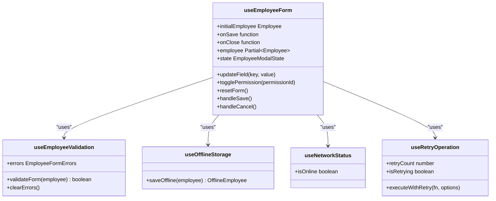
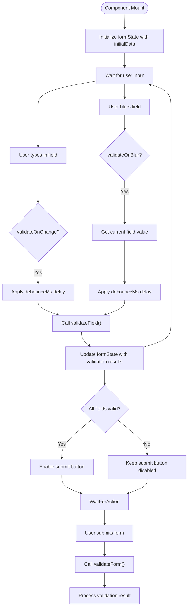
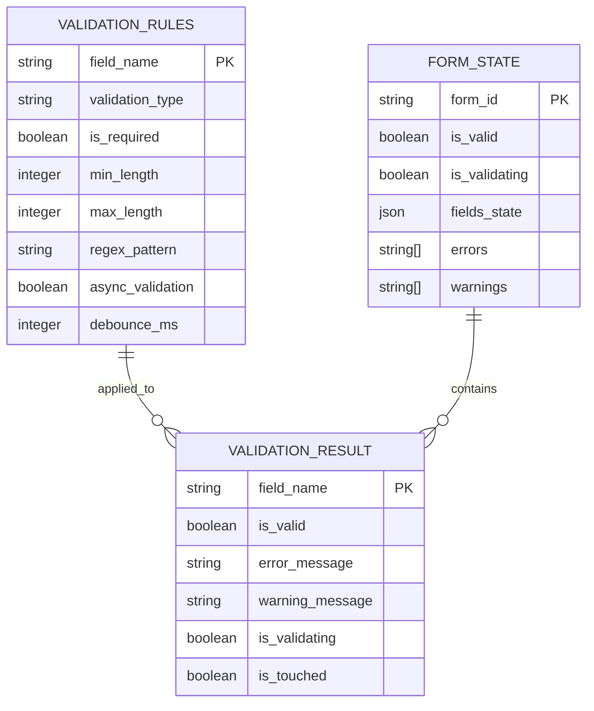
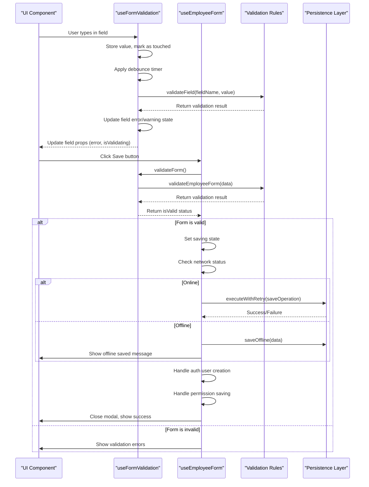

# Form Validation and State Management

<cite>
**Referenced Files in This Document**   
- [useEmployeeForm.ts](file://src/hooks/useEmployeeForm.ts)
- [useFormValidation.ts](file://src/hooks/useFormValidation.ts)
- [validation.ts](file://src/utils/validation.ts)
- [employee.types.ts](file://src/types/employee.types.ts)
- [permissionPresets.ts](file://src/utils/permissionPresets.ts)
</cite>

## Table of Contents
1. [Introduction](#introduction)
2. [Core Components Overview](#core-components-overview)
3. [useEmployeeForm Hook Analysis](#useemployeeform-hook-analysis)
4. [useFormValidation Hook Implementation](#useformvalidation-hook-implementation)
5. [Validation Rules and Error Handling](#validation-rules-and-error-handling)
6. [Integration with UI Components](#integration-with-ui-components)
7. [State Management Flow](#state-management-flow)
8. [Conclusion](#conclusion)

## Introduction
This document provides a comprehensive analysis of the form validation and state management system used in employee creation within the application. It details the implementation of two key hooks: `useEmployeeForm` for managing employee data, permissions, and form state, and `useFormValidation` for handling real-time validation, error tracking, and debounced validation checks. The documentation covers the integration between these systems, validation rule definitions, error aggregation strategies, and how validation results drive UI behavior such as action button states.

The system is designed to provide a robust, user-friendly experience for creating and managing employee records with proper validation, permission management, and offline capability. The architecture separates concerns between state management and validation logic while maintaining tight integration where necessary.

## Core Components Overview
The form validation and state management system consists of several interconnected components that work together to manage employee creation and editing workflows. At its core are two primary hooks: `useEmployeeForm` which manages the overall form state and business logic, and `useFormValidation` which handles input validation and error reporting.

These hooks are supported by utility functions for validation rules, type definitions for employee data structures, and permission presets that define role-based access control. The system is designed with separation of concerns in mind, allowing each component to focus on specific responsibilities while maintaining clear integration points.

The architecture follows React best practices with custom hooks encapsulating complex logic, proper state management using useState and useCallback, and side effect handling through useEffect. This modular approach enables reuse across different parts of the application while maintaining consistency in form behavior and validation standards.

**Section sources**
- [useEmployeeForm.ts](file://src/hooks/useEmployeeForm.ts#L1-L50)
- [useFormValidation.ts](file://src/hooks/useFormValidation.ts#L1-L50)

## useEmployeeForm Hook Analysis
The `useEmployeeForm` hook serves as the central controller for employee form state management, coordinating between data storage, validation, and persistence operations. It accepts three primary parameters: `initialEmployee` for edit mode initialization, `onSave` callback for persistence, and `onClose` for modal dismissal.

The hook maintains two primary state objects: `employee` which stores the current employee data being edited, and `state` which tracks form metadata such as loading status, saving progress, error conditions, and dirty state. This separation allows for efficient rendering and prevents unnecessary re-renders when only metadata changes.

Key functionality includes:
- **updateField**: Updates individual employee properties and marks the form as dirty
- **togglePermission**: Manages permission assignments based on role presets
- **resetForm**: Restores the form to its initial empty state
- **handleSave**: Orchestrates validation, saving (online/offline), and post-save operations
- **handleCancel**: Provides confirmation for unsaved changes

The hook integrates with several supporting hooks including `useEmployeeValidation` for form validation, `useOfflineStorage` for offline capability, `useNetworkStatus` for connectivity detection, and `useRetryOperation` for resilient API calls. This composition pattern keeps the code modular and testable.

Notably, the hook implements sophisticated error handling with multiple fallback strategies. When network connectivity is lost, it automatically saves data offline. For timeout scenarios, it provides appropriate user feedback while attempting to complete operations. This resilience ensures data integrity even in challenging network conditions.

**Diagram sources **
- [useEmployeeForm.ts](file://src/hooks/useEmployeeForm.ts#L16-L344)
- [employee.types.ts](file://src/types/employee.types.ts#L1-L87)

**Section sources**
- [useEmployeeForm.ts](file://src/hooks/useEmployeeForm.ts#L16-L344)

## useFormValidation Hook Implementation
The `useFormValidation` hook provides a comprehensive solution for real-time form validation with debounced checks and error tracking. It implements a sophisticated state management system that tracks both field-level and form-level validation states, enabling rich user feedback and conditional UI behavior.

The hook maintains a `formState` object containing detailed information about each field's value, validation status, error messages, warning messages, and touch state. This granular tracking enables features like showing errors only after a field has been touched or blurred, providing a less intrusive user experience during initial form entry.

Key features of the implementation include:
- **Debounced validation**: Field validation is automatically debounced to prevent excessive processing during rapid typing
- **Configurable validation timing**: Validation can occur on change, on blur, or both, with customizable debounce intervals
- **Comprehensive field tracking**: Each field maintains its value, error state, warning state, validation progress, and touch status
- **Flexible reset capability**: The form can be reset to initial values while preserving configuration options

The hook exposes several utility functions that simplify integration with UI components:
- **getFieldProps**: Returns all necessary props for a form field (value, onChange, onBlur, error, etc.)
- **setFieldValue**: Updates a field's value and triggers validation if configured
- **setFieldTouched**: Marks a field as touched, typically called on blur
- **validateForm**: Performs complete form validation, marking all fields as touched
- **getFormData**: Extracts current form data as a plain object

A critical aspect of the implementation is the debounced validation mechanism, which uses a higher-order function to wrap validation calls with a configurable delay. This prevents performance issues from validating expensive rules on every keystroke while still providing near real-time feedback to users.

**Diagram sources **
- [useFormValidation.ts](file://src/hooks/useFormValidation.ts#L50-L370)
- [validation.ts](file://src/utils/validation.ts#L0-L408)

**Section sources**
- [useFormValidation.ts](file://src/hooks/useFormValidation.ts#L50-L370)

## Validation Rules and Error Handling
The validation system implements a comprehensive set of rules for employee data with both synchronous and asynchronous validation capabilities. Validation rules are defined for critical fields including name, email, CPF, phone, and commission rate, with appropriate error messages and severity levels.

For required fields like name and role, the system uses the `validateRequired` function which checks for null, undefined, empty strings, or empty arrays. Email validation combines format checking with uniqueness verification through an asynchronous call that simulates database lookup. CPF validation implements the official Brazilian algorithm with digit verification, while phone validation ensures proper DDD and length requirements.

The system distinguishes between different types of validation feedback:
- **Errors**: Critical issues that prevent form submission (e.g., missing required fields, invalid formats)
- **Warnings**: Advisory messages about potentially problematic values (e.g., high commission rates)
- **Success indicators**: Positive feedback for valid inputs

Error aggregation occurs at multiple levels. Individual field errors are tracked in the `fields` property of each field's state, while form-level errors are collected in the `errors` array of the form state. The `isValid` computed property determines overall form validity by checking both the presence of field errors and the form's validity flag.

The validation process follows a specific sequence:
1. Field-level validation on change (debounced) or blur
2. Complete form validation on submission attempt
3. Error mapping from validation results to field states
4. Aggregation of errors for display in validation summaries

This multi-layered approach ensures that users receive immediate feedback on individual fields while also getting comprehensive error reporting when attempting to submit incomplete or invalid forms.

**Diagram sources **
- [validation.ts](file://src/utils/validation.ts#L0-L408)
- [useFormValidation.ts](file://src/hooks/useFormValidation.ts#L50-L370)

**Section sources**
- [validation.ts](file://src/utils/validation.ts#L0-L408)

## Integration with UI Components
The validation and state management system integrates seamlessly with UI components through well-defined interfaces that promote reusability and consistency. The primary integration point is the `getFieldProps` function exposed by `useFormValidation`, which returns a standardized set of props for form controls.

UI components consume these props directly, receiving everything needed for two-way binding, validation feedback, and interaction handling:
- **value**: Current field value for controlled components
- **error**: Error message to display when field is invalid and touched
- **warning**: Warning message for advisory feedback
- **isValidating**: Boolean indicating ongoing validation (for loading indicators)
- **onChange**: Handler for value changes
- **onBlur**: Handler for blur events
- **onClearError**: Handler to dismiss specific errors

This pattern eliminates boilerplate code in components and ensures consistent behavior across the application. For example, the `ValidatedField` component can be used uniformly for text inputs, selects, and textareas by simply passing the props from `getFieldProps`.

The system also drives UI state beyond individual fields. The overall `isValid` state determines whether action buttons like "Save" should be enabled, while `isValidating` shows loading indicators during async validation. Error summaries aggregate field-specific errors into a comprehensive list displayed prominently in the form interface.

In the employee creation workflow, this integration enables a smooth user experience:
- Real-time feedback as users type
- Clear visual indication of required fields
- Immediate notification of format errors
- Contextual warnings for unusual values
- Comprehensive error listing on submission attempts
- Appropriate loading states during validation

This tight coupling between state management and presentation ensures that users always have clear guidance on how to successfully complete the employee creation process.

**Section sources**
- [useFormValidation.ts](file://src/hooks/useFormValidation.ts#L307-L347)
- [ValidatedEmployeeModal.tsx](file://src/components/EmployeeModal/ValidatedEmployeeModal.tsx#L0-L445)

## State Management Flow
The state management flow for employee creation follows a well-defined sequence that coordinates data entry, validation, and persistence. The process begins when a user opens the employee creation modal, initializing the `useEmployeeForm` hook with empty default values or pre-populated data for editing existing employees.

As users interact with form fields, the `useFormValidation` hook captures input changes and applies debounced validation according to the configured rules. Field values are stored in the form state, with immediate visual feedback provided through error messages, warning indicators, and success states. The system tracks which fields have been touched to avoid showing errors prematurely.

When users attempt to save the form, the `handleSave` method in `useEmployeeForm` orchestrates the following sequence:
1. Trigger complete form validation through `validateForm`
2. Check validation results and prevent submission if invalid
3. Set saving state to disable the UI during processing
4. Check network connectivity status
5. For online users: execute save operation with retry logic
6. For offline users: save data locally with sync notification
7. Handle authentication user creation if applicable
8. Manage permission persistence for edited employees
9. Provide appropriate success or error feedback
10. Reset form state upon completion

Throughout this flow, the system maintains awareness of "dirty" state, prompting users before discarding unsaved changes. The integration between the two hooks ensures that validation state is always synchronized with data state, preventing inconsistent UI representations.

Error handling is implemented at multiple levels, with specific strategies for different failure modes:
- Network connectivity issues trigger offline saving
- Timeout errors provide informative messages about potential partial processing
- Authentication failures allow form submission to proceed while noting credential issues
- Validation errors prevent submission and highlight problem areas

This comprehensive flow ensures data integrity while providing a resilient user experience that accommodates various operational conditions and edge cases.

**Diagram sources **
- [useEmployeeForm.ts](file://src/hooks/useEmployeeForm.ts#L16-L344)
- [useFormValidation.ts](file://src/hooks/useFormValidation.ts#L50-L370)

**Section sources**
- [useEmployeeForm.ts](file://src/hooks/useEmployeeForm.ts#L16-L344)

## Conclusion
The form validation and state management system for employee creation represents a robust, well-architected solution that balances usability, reliability, and maintainability. By separating concerns between the `useEmployeeForm` hook for business logic and state coordination, and the `useFormValidation` hook for input validation and feedback, the system achieves high modularity and reusability.

Key strengths of the implementation include:
- Comprehensive validation with both synchronous and asynchronous rules
- Resilient error handling with offline fallback capabilities
- Real-time user feedback through debounced validation
- Clear separation of concerns between data management and validation
- Seamless integration with UI components through standardized interfaces
- Role-based permission management with preset configurations

The system effectively addresses common challenges in form management, including handling complex validation scenarios, providing meaningful user feedback, managing asynchronous operations, and ensuring data integrity across varying network conditions. Its design follows React best practices with proper use of hooks, memoization, and state management patterns.

Future enhancements could include more sophisticated error recovery mechanisms, enhanced accessibility features, and expanded analytics for form usage patterns. However, the current implementation provides a solid foundation that meets the core requirements for employee creation and management within the application.

**Section sources**
- [useEmployeeForm.ts](file://src/hooks/useEmployeeForm.ts#L1-L344)
- [useFormValidation.ts](file://src/hooks/useFormValidation.ts#L1-L370)