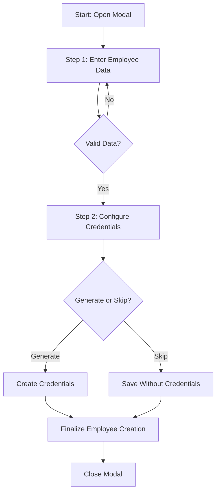
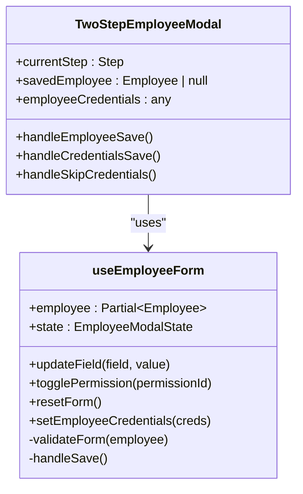
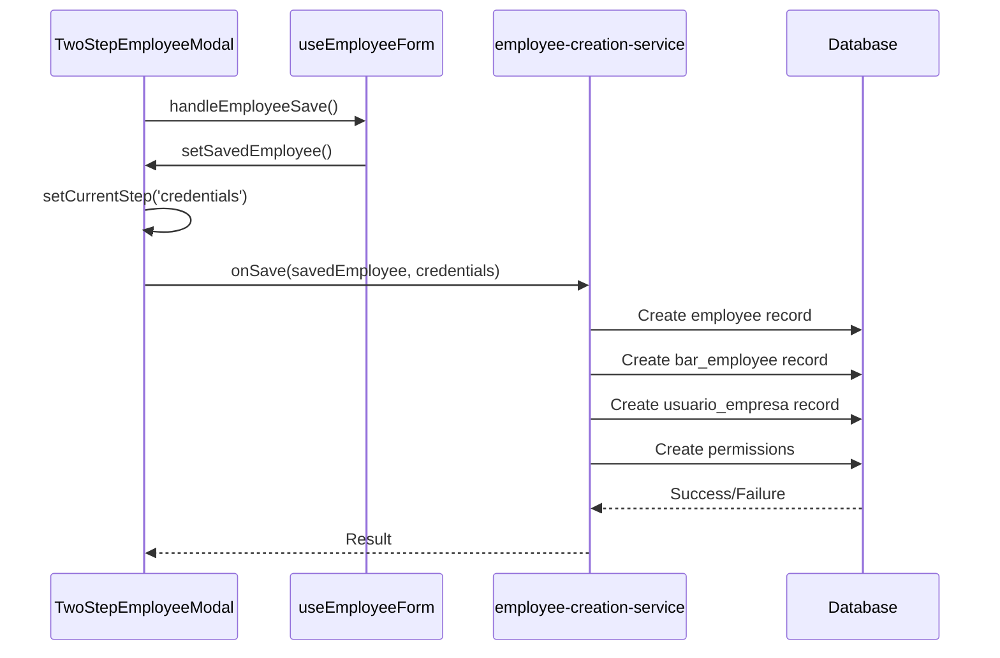
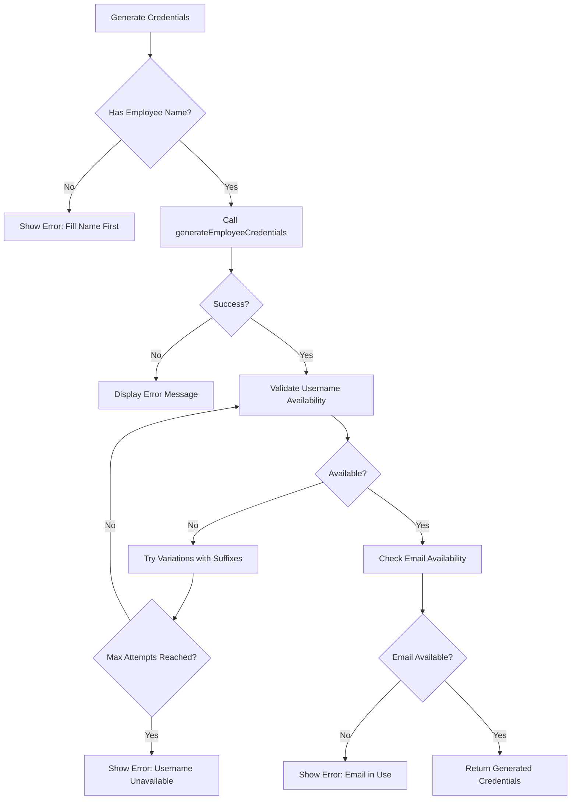

# Two-Step Employee Creation with Credentials

<cite>
**Referenced Files in This Document**
- [TwoStepEmployeeModal.tsx](file://src/components/EmployeeModal/TwoStepEmployeeModal.tsx)
- [useEmployeeForm.ts](file://src/hooks/useEmployeeForm.ts)
- [CredentialsSection.tsx](file://src/components/EmployeeModal/CredentialsSection.tsx)
- [credentialsGenerator.ts](file://src/utils/credentialsGenerator.ts)
- [employee-creation-service.ts](file://src/services/employee-creation-service.ts)
</cite>

## Table of Contents
1. [Introduction](#introduction)
2. [Workflow Overview](#workflow-overview)
3. [State Management](#state-management)
4. [UseEmployeeForm Hook Integration](#useemployeefrom-hook-integration)
5. [OnSave Callback and Data Persistence](#onsave-callback-and-data-persistence)
6. [Progress Indicator and Navigation](#progress-indicator-and-navigation)
7. [Credentials Generation and Error Handling](#credentials-generation-and-error-handling)
8. [Final Save Process](#final-save-process)

## Introduction
The TwoStepEmployeeModal implements a two-phase employee creation workflow that separates basic employee data entry from optional credentials configuration. This approach allows administrators to register employees for internal tracking without immediately granting system access, while providing a seamless path to full onboarding when needed. The modal guides users through a structured process with clear visual indicators and robust error handling.

**Section sources**
- [TwoStepEmployeeModal.tsx](file://src/components/EmployeeModal/TwoStepEmployeeModal.tsx#L18-L293)

## Workflow Overview
The employee creation process consists of two distinct steps:
1. **Employee Data Entry**: Collects essential employee information including personal details, role, and permissions.
2. **Credentials Configuration**: Optionally generates or configures authentication credentials for system access.

The workflow begins with the employee data entry step as the default view. After validating and saving the employee information, the user progresses to the credentials configuration step. At this stage, they can either generate secure credentials automatically, define custom credentials manually, or skip credential setup entirely. The modal maintains context throughout the process, ensuring data integrity between steps.

**Diagram sources**
- [TwoStepEmployeeModal.tsx](file://src/components/EmployeeModal/TwoStepEmployeeModal.tsx#L18-L293)

**Section sources**
- [TwoStepEmployeeModal.tsx](file://src/components/EmployeeModal/TwoStepEmployeeModal.tsx#L18-L293)

## State Management
The TwoStepEmployeeModal manages its state through three key variables:
- `currentStep`: Tracks the active step in the workflow ('employee' or 'credentials')
- `savedEmployee`: Stores the employee data after successful completion of the first step
- `employeeCredentials`: Holds the generated or configured credentials during the second step

These state variables work in concert to maintain data continuity across the workflow. When transitioning from the employee data step to the credentials step, the completed employee information is preserved in `savedEmployee`, preventing data loss during navigation. The `currentStep` variable controls which content is displayed and determines the available actions in the modal footer.

**Section sources**
- [TwoStepEmployeeModal.tsx](file://src/components/EmployeeModal/TwoStepEmployeeModal.tsx#L18-L293)

## UseEmployeeForm Hook Integration
The TwoStepEmployeeModal integrates with the useEmployeeForm hook to manage form state and validation. This custom hook provides comprehensive functionality for employee data management, including:
- Form field updates and state synchronization
- Real-time validation with error reporting
- Permission toggling and role-based preset application
- Offline storage capabilities for network resilience

During the first step, the hook validates all required fields before allowing progression. It tracks both general errors and field-specific validation issues, displaying appropriate feedback to the user. The hook's validation system ensures data integrity by preventing submission of incomplete or malformed employee records.

**Diagram sources**
- [useEmployeeForm.ts](file://src/hooks/useEmployeeForm.ts#L16-L344)
- [TwoStepEmployeeModal.tsx](file://src/components/EmployeeModal/TwoStepEmployeeModal.tsx#L18-L293)

**Section sources**
- [useEmployeeForm.ts](file://src/hooks/useEmployeeForm.ts#L16-L344)
- [TwoStepEmployeeModal.tsx](file://src/components/EmployeeModal/TwoStepEmployeeModal.tsx#L18-L293)

## OnSave Callback and Data Persistence
The onSave callback serves as the final integration point that combines employee data with generated credentials. When the user completes the credentials step, the modal invokes this callback with both the saved employee object and the credentials configuration. This unified payload enables downstream services to create a complete employee record with associated authentication accounts.

The persistence process involves multiple database operations coordinated through the employee-creation-service. These operations include creating records in the employees, bar_employees, usuarios_empresa, and permissions tables, while also establishing authentication accounts in Supabase Auth. The service implements transactional safety with fallback mechanisms to ensure data consistency even in the event of partial failures.

**Diagram sources**
- [TwoStepEmployeeModal.tsx](file://src/components/EmployeeModal/TwoStepEmployeeModal.tsx#L18-L293)
- [employee-creation-service.ts](file://src/services/employee-creation-service.ts#L517-L712)

**Section sources**
- [TwoStepEmployeeModal.tsx](file://src/components/EmployeeModal/TwoStepEmployeeModal.tsx#L18-L293)
- [employee-creation-service.ts](file://src/services/employee-creation-service.ts#L517-L712)

## Progress Indicator and Navigation
The modal features a visual progress indicator that clearly communicates the current step and overall workflow status. The indicator uses color-coded icons and labels to distinguish between completed and pending steps. In the employee data step, the first step appears as active (blue), while the credentials step appears as pending (gray). When navigating to the credentials step, the first step displays a completion checkmark (green), and the second step becomes active (blue).

Navigation controls are context-sensitive and appear in the modal footer. In the first step, users see a "Cancel" button and a "Next" button that advances to credentials configuration. In the second step, navigation includes a "Back" button for returning to employee data, a "Skip Credentials" option, and a "Finalize Registration" button for completing the process. This design prevents accidental data loss while maintaining workflow flexibility.

**Section sources**
- [TwoStepEmployeeModal.tsx](file://src/components/EmployeeModal/TwoStepEmployeeModal.tsx#L18-L293)

## Credentials Generation and Error Handling
The credentials generation process offers both automatic and manual configuration options. The automatic generator creates secure usernames based on the employee's name and CPF, along with strong temporary passwords meeting security requirements. For manual configuration, the system validates username format and password strength, providing real-time feedback to guide users toward secure choices.

Error handling occurs at multiple levels throughout the workflow. During credential generation, the system checks for username and email conflicts, preventing duplicate accounts. If generation fails due to validation issues or system errors, descriptive messages guide users toward resolution. The modal also handles network connectivity issues by leveraging offline storage capabilities, ensuring data is not lost during temporary outages.

**Diagram sources**
- [CredentialsSection.tsx](file://src/components/EmployeeModal/CredentialsSection.tsx#L19-L402)
- [credentialsGenerator.ts](file://src/utils/credentialsGenerator.ts#L202-L222)

**Section sources**
- [CredentialsSection.tsx](file://src/components/EmployeeModal/CredentialsSection.tsx#L19-L402)
- [credentialsGenerator.ts](file://src/utils/credentialsGenerator.ts#L202-L222)

## Final Save Process
The final save process orchestrates the persistent storage of both employee data and authentication credentials. When the user confirms completion, the system initiates a coordinated sequence of database operations through the employee-creation-service. This service follows a specific execution order: first creating the core employee record, then establishing the authentication account, followed by related records in specialized tables.

The process includes comprehensive error handling with fallback mechanisms. If authentication account creation fails due to database trigger issues, the system attempts an alternative pathway without metadata. Email confirmation is handled automatically when possible, ensuring new accounts are immediately usable. Throughout the process, detailed logging captures execution time, success status, and any warnings, providing visibility into system behavior for troubleshooting and optimization.

**Section sources**
- [employee-creation-service.ts](file://src/services/employee-creation-service.ts#L517-L712)
- [TwoStepEmployeeModal.tsx](file://src/components/EmployeeModal/TwoStepEmployeeModal.tsx#L18-L293)