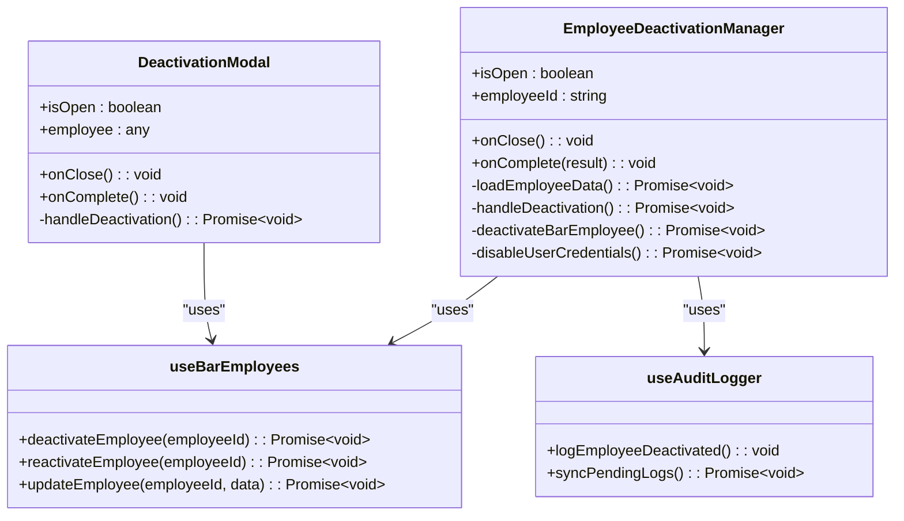
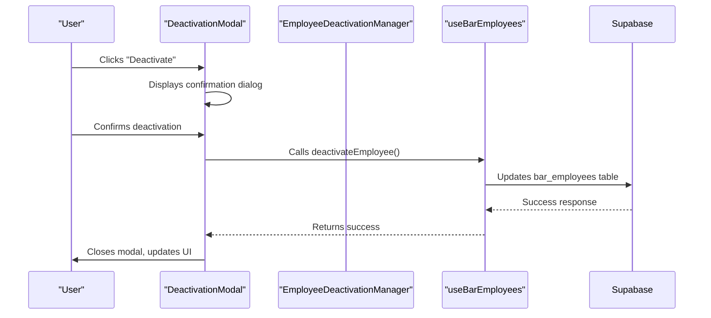
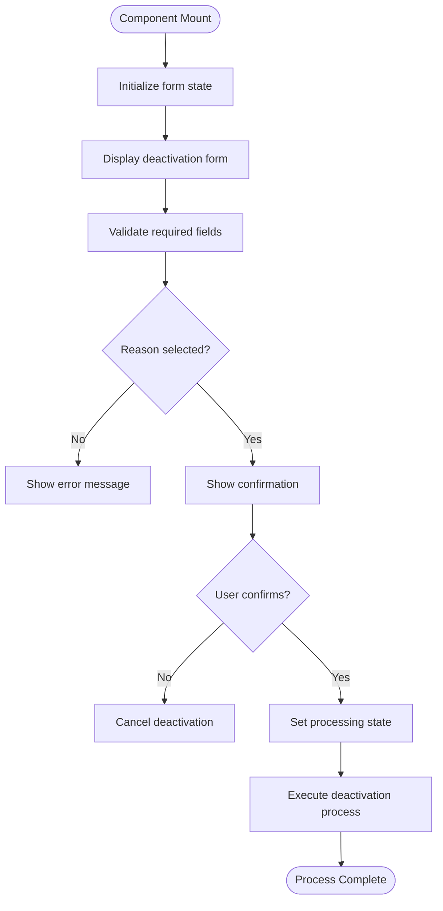
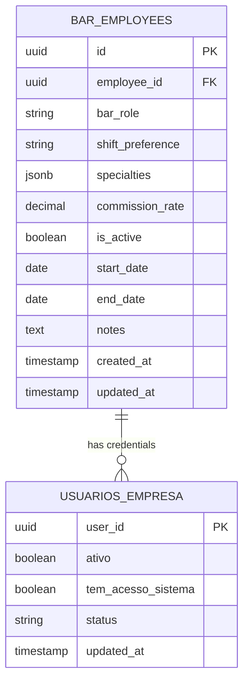
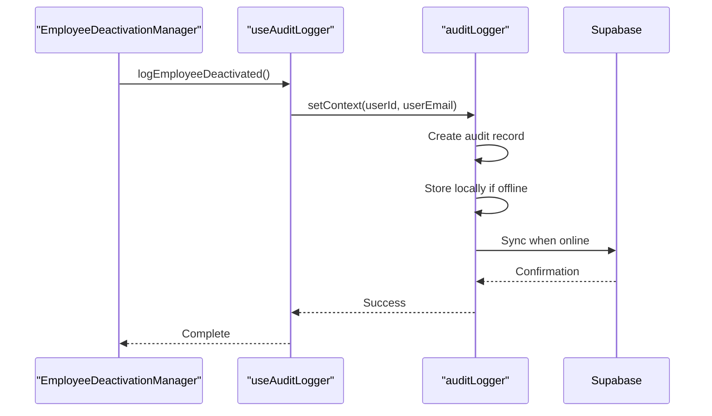

# Employee Deactivation Process

<cite>
**Referenced Files in This Document **   
- [DeactivationModal.tsx](file://src/components/EmployeeLifecycle/DeactivationModal.tsx)
- [EmployeeDeactivationManager.tsx](file://src/components/EmployeeLifecycle/EmployeeDeactivationManager.tsx)
- [useBarEmployees.ts](file://src/hooks/useBarEmployees.ts)
- [useAuditLogger.ts](file://src/hooks/useAuditLogger.ts)
</cite>

## Table of Contents
1. [Introduction](#introduction)
2. [Core Components Overview](#core-components-overview)
3. [UI Interaction Flow](#ui-interaction-flow)
4. [State Management and Form Validation](#state-management-and-form-validation)
5. [Backend Service Calls and Soft Delete Pattern](#backend-service-calls-and-soft-delete-pattern)
6. [Credential Invalidation Mechanisms](#credential-invalidation-mechanisms)
7. [Audit Logging Implementation](#audit-logging-implementation)
8. [Integration with Real-Time Employee Lists](#integration-with-real-time-employee-lists)
9. [Error Recovery Strategies](#error-recovery-strategies)
10. [Conclusion](#conclusion)

## Introduction
The Employee Deactivation Process in the AABB-system provides a comprehensive mechanism for temporarily or permanently deactivating employees through a structured workflow. This document details the implementation of temporary deactivation using the `DeactivationModal` and `EmployeeDeactivationManager` components, covering UI interactions, state management, backend service calls, soft-delete patterns, credential invalidation, audit logging, and integration with real-time employee lists.

**Section sources**
- [DeactivationModal.tsx](file://src/components/EmployeeLifecycle/DeactivationModal.tsx#L1-L198)
- [EmployeeDeactivationManager.tsx](file://src/components/EmployeeLifecycle/EmployeeDeactivationManager.tsx#L1-L544)

## Core Components Overview
The employee deactivation functionality is implemented through two primary components: `DeactivationModal` for simple deactivation scenarios and `EmployeeDeactivationManager` for comprehensive deactivation workflows. These components work in conjunction with hooks like `useBarEmployees` and `useAuditLogger` to manage state, validate forms, handle backend communications, and maintain audit trails.

**Diagram sources **
- [DeactivationModal.tsx](file://src/components/EmployeeLifecycle/DeactivationModal.tsx#L32-L196)
- [EmployeeDeactivationManager.tsx](file://src/components/EmployeeLifecycle/EmployeeDeactivationManager.tsx#L1-L544)
- [useBarEmployees.ts](file://src/hooks/useBarEmployees.ts#L34-L568)
- [useAuditLogger.ts](file://src/hooks/useAuditLogger.ts#L8-L41)

**Section sources**
- [DeactivationModal.tsx](file://src/components/EmployeeLifecycle/DeactivationModal.tsx#L1-L198)
- [EmployeeDeactivationManager.tsx](file://src/components/EmployeeLifecycle/EmployeeDeactivationManager.tsx#L1-L544)

## UI Interaction Flow
The deactivation process begins with either the `DeactivationModal` or `EmployeeDeactivationManager`, both providing user interfaces for initiating employee deactivation. The `DeactivationModal` offers a streamlined interface with essential fields, while the `EmployeeDeactivationManager` provides a multi-step workflow with additional options and validation.

The interaction flow follows these steps:
1. User initiates deactivation from an employee management interface
2. Modal opens with employee information displayed
3. User selects deactivation reason, effective date, and options
4. System validates form inputs before submission
5. Confirmation step ensures intentional action
6. Processing state indicates operation progress
7. Completion feedback confirms successful deactivation

**Diagram sources **
- [DeactivationModal.tsx](file://src/components/EmployeeLifecycle/DeactivationModal.tsx#L32-L196)
- [EmployeeDeactivationManager.tsx](file://src/components/EmployeeLifecycle/EmployeeDeactivationManager.tsx#L1-L544)
- [useBarEmployees.ts](file://src/hooks/useBarEmployees.ts#L34-L568)

**Section sources**
- [DeactivationModal.tsx](file://src/components/EmployeeLifecycle/DeactivationModal.tsx#L1-L198)
- [EmployeeDeactivationManager.tsx](file://src/components/EmployeeLifecycle/EmployeeDeactivationManager.tsx#L1-L544)

## State Management and Form Validation
The deactivation components implement robust state management using React's useState hook to track form data, processing states, and error conditions. The `DeactivationModal` maintains state for deactivation reasons, effective dates, credential disabling options, and notes.

Form validation includes:
- Mandatory reason selection (demissao, pedido_demissao, licenca, afastamento, suspensao, fim_contrato, outros)
- Date validation for effective deactivation date
- Conditional validation based on credential disabling option
- Error handling with user-friendly messages

The `EmployeeDeactivationManager` extends this with additional state for multi-step workflows, including confirmation, options selection, processing, and completion states.

**Diagram sources **
- [DeactivationModal.tsx](file://src/components/EmployeeLifecycle/DeactivationModal.tsx#L32-L196)
- [EmployeeDeactivationManager.tsx](file://src/components/EmployeeLifecycle/EmployeeDeactivationManager.tsx#L1-L544)

**Section sources**
- [DeactivationModal.tsx](file://src/components/EmployeeLifecycle/DeactivationModal.tsx#L1-L198)
- [EmployeeDeactivationManager.tsx](file://src/components/EmployeeLifecycle/EmployeeDeactivationManager.tsx#L1-L544)

## Backend Service Calls and Soft Delete Pattern
The deactivation process implements a soft-delete pattern by updating the `is_active` field in the `bar_employees` table rather than removing records. When a user initiates deactivation, the system performs the following database operations:

1. Updates the `bar_employees` table setting `is_active` to false
2. Sets the `end_date` field to the specified effective date
3. Appends deactivation notes to the existing notes field with timestamp, reason, and additional notes
4. Updates the `updated_at` timestamp

This approach preserves historical data while marking employees as inactive, allowing for potential reactivation and maintaining data integrity for reporting purposes.

**Diagram sources **
- [DeactivationModal.tsx](file://src/components/EmployeeLifecycle/DeactivationModal.tsx#L32-L196)
- [supabase/migrations/20250102000001_employees_management_module.sql](file://supabase/migrations/20250102000001_employees_management_module.sql#L1-L403)

**Section sources**
- [DeactivationModal.tsx](file://src/components/EmployeeLifecycle/DeactivationModal.tsx#L1-L198)
- [EmployeeDeactivationManager.tsx](file://src/components/EmployeeLifecycle/EmployeeDeactivationManager.tsx#L1-L544)

## Credential Invalidation Mechanisms
When deactivating an employee, the system provides the option to invalidate their system credentials. If the "Desativar acesso ao sistema" checkbox is selected, the system performs the following actions:

1. Updates the `usuarios_empresa` table setting `ativo` to false, `tem_acesso_sistema` to false, and status to 'desativado'
2. For permanent deactivation, uses Supabase Admin API to update the user's auth record with a future `banned_until` date
3. Updates user metadata with deactivation information including date and reason
4. Preserves user data while preventing authentication

The credential invalidation is conditional and can be skipped if the employee is being temporarily deactivated without immediate access revocation.

**Section sources**
- [DeactivationModal.tsx](file://src/components/EmployeeLifecycle/DeactivationModal.tsx#L1-L198)
- [EmployeeDeactivationManager.tsx](file://src/components/EmployeeLifecycle/EmployeeDeactivationManager.tsx#L1-L544)

## Audit Logging Implementation
The deactivation process integrates with the `useAuditLogger` hook to maintain comprehensive audit trails. When an employee is deactivated, the system logs the event through the audit logger, capturing:

- Employee ID and identifying information
- Deactivation type (temporary or permanent)
- Reason for deactivation
- Effective date
- Whether credentials were disabled
- Operator who performed the action
- Timestamp of the event

The audit logger automatically synchronizes pending logs when the system detects an online connection, ensuring that all actions are recorded even during temporary connectivity issues.

**Diagram sources **
- [EmployeeDeactivationManager.tsx](file://src/components/EmployeeLifecycle/EmployeeDeactivationManager.tsx#L1-L544)
- [useAuditLogger.ts](file://src/hooks/useAuditLogger.ts#L8-L41)

**Section sources**
- [EmployeeDeactivationManager.tsx](file://src/components/EmployeeLifecycle/EmployeeDeactivationManager.tsx#L1-L544)
- [useAuditLogger.ts](file://src/hooks/useAuditLogger.ts#L8-L41)

## Integration with Real-Time Employee Lists
The deactivation process seamlessly integrates with real-time employee lists through the `useBarEmployees` hook. After successful deactivation, the system automatically refreshes the employee list to reflect the updated status. The hook provides several key functions:

- `deactivateEmployee()`: Initiates the deactivation process
- `reactivateEmployee()`: Reverses deactivation when needed
- `filterEmployees()`: Filters active/inactive employees
- `getStats()`: Provides statistics including active/inactive counts

The hook implements caching mechanisms to improve performance, storing employee lists and statistics locally and refreshing them after CRUD operations. It also handles error recovery, attempting to load data from cache when network requests fail.

**Section sources**
- [useBarEmployees.ts](file://src/hooks/useBarEmployees.ts#L34-L568)
- [EmployeeDeactivationManager.tsx](file://src/components/EmployeeLifecycle/EmployeeDeactivationManager.tsx#L1-L544)

## Error Recovery Strategies
The deactivation system implements comprehensive error recovery strategies to ensure reliability and data consistency. When a deactivation request fails, the system:

1. Catches and displays user-friendly error messages
2. Maintains form state to allow retry without data loss
3. Logs errors for diagnostic purposes
4. Implements retry mechanisms through the `useErrorRecovery` hook
5. Provides fallback options when certain services are unavailable

The `useErrorRecovery` hook wraps database operations with recovery logic, attempting to save pending operations locally when offline and synchronizing them when connectivity is restored. This ensures that deactivation requests are not lost due to temporary network issues.

**Section sources**
- [DeactivationModal.tsx](file://src/components/EmployeeLifecycle/DeactivationModal.tsx#L1-L198)
- [EmployeeDeactivationManager.tsx](file://src/components/EmployeeLifecycle/EmployeeDeactivationManager.tsx#L1-L544)
- [useBarEmployees.ts](file://src/hooks/useBarEmployees.ts#L34-L568)

## Conclusion
The Employee Deactivation Process in the AABB-system provides a robust, user-friendly mechanism for managing employee status changes. Through the coordinated operation of `DeactivationModal`, `EmployeeDeactivationManager`, and supporting hooks, the system implements a comprehensive soft-delete pattern with proper credential management, audit logging, and error recovery. The integration with real-time employee lists ensures immediate visibility of status changes, while the modular design allows for future enhancements and customization.