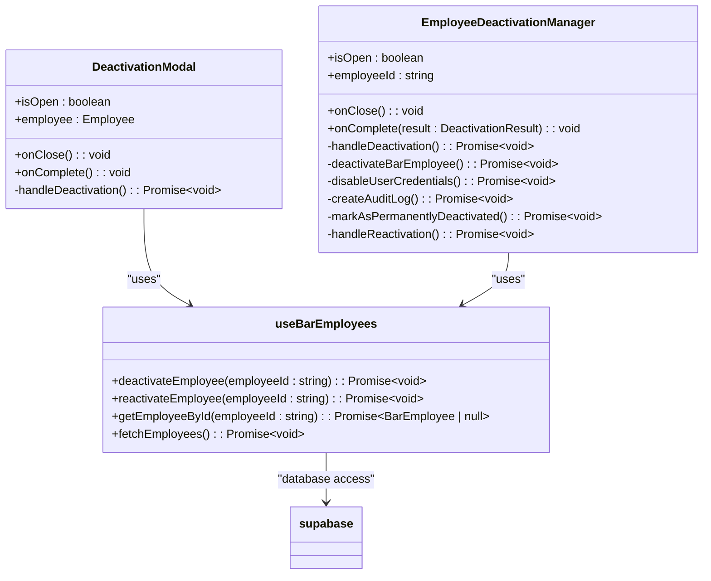
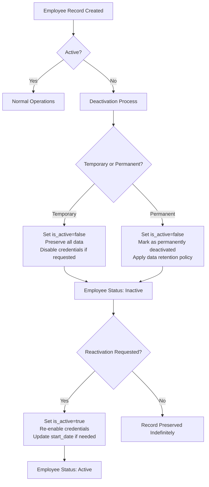
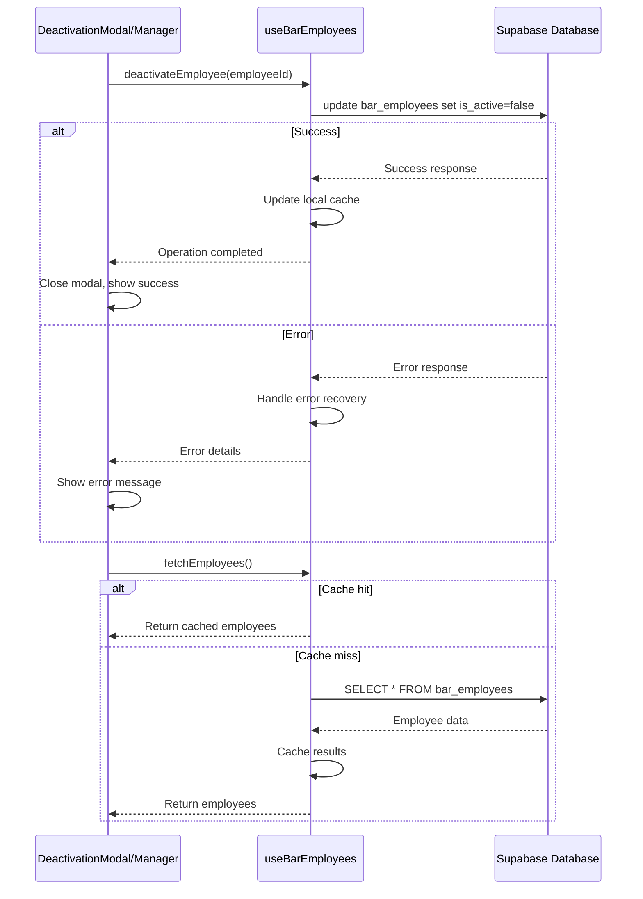
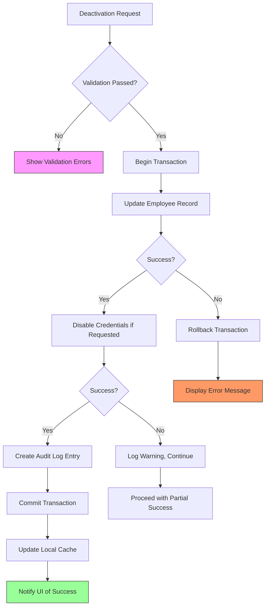

# Employee Lifecycle Management

<cite>
**Referenced Files in This Document **   
- [DeactivationModal.tsx](file://src/components/EmployeeLifecycle/DeactivationModal.tsx)
- [EmployeeDeactivationManager.tsx](file://src/components/EmployeeLifecycle/EmployeeDeactivationManager.tsx)
- [useBarEmployees.ts](file://src/hooks/useBarEmployees.ts)
- [20250102000001_employees_management_module.sql](file://supabase/migrations/20250102000001_employees_management_module.sql)
- [20250102000003_bar_customers_module.sql](file://supabase/migrations/20250102000003_bar_customers_module.sql)
</cite>

## Table of Contents
1. [Introduction](#introduction)
2. [Employee Lifecycle Overview](#employee-lifecycle-overview)
3. [Core Components](#core-components)
4. [State Transitions and Data Retention](#state-transitions-and-data-retention)
5. [Integration with useBarEmployees Hook](#integration-with-usebaremployees-hook)
6. [Error Handling and Audit Logging](#error-handling-and-audit-logging)

## Introduction
The Employee Lifecycle Management system in the AABB-system provides comprehensive functionality for managing employee states throughout their employment period. This document details the complete lifecycle operations including activation, deactivation (temporary/permanent), and removal workflows. The system implements soft delete patterns, credential disabling, and audit logging through the DeactivationModal and EmployeeDeactivationManager components. The documentation also covers integration with the useBarEmployees hook for real-time list updates and error handling during lifecycle operations.

## Employee Lifecycle Overview
The employee lifecycle in the AABB-system follows a structured workflow that manages employee states from onboarding to offboarding. The system supports three primary states: active, inactive (temporarily or permanently deactivated), and removed (soft-deleted). Each state transition is carefully managed through dedicated components and hooks that ensure data integrity, security, and auditability.

The lifecycle begins with employee activation, where new employees are created in the system with appropriate roles and permissions. During employment, employees can be temporarily deactivated for reasons such as leave or suspension, or permanently deactivated upon termination. The system distinguishes between temporary and permanent deactivation, with different implications for data retention and access rights.

When an employee is deactivated, the system performs several critical operations: updating the employee's status in the bar_employees table, optionally disabling their system credentials, and creating audit logs of the action. The system maintains historical data while preventing further access to system functionality. Reactivation is supported for temporarily deactivated employees, restoring their access and status.

```mermaid
stateDiagram-v2
[*] --> Active
Active --> TemporarilyDeactivated : Temporary Deactivation
Active --> PermanentlyDeactivated : Permanent Deactivation
TemporarilyDeactivated --> Active : Reactivation
PermanentlyDeactivated --> Removed : Removal
TemporarilyDeactivated --> Removed : Removal
state Active {
[*] --> Active
}
state TemporarilyDeactivated {
[*] --> TemporarilyDeactivated
}
state PermanentlyDeactivated {
[*] --> PermanentlyDeactivated
}
state Removed {
[*] --> Removed
}
```

**Diagram sources **
- [EmployeeDeactivationManager.tsx](file://src/components/EmployeeLifecycle/EmployeeDeactivationManager.tsx#L1-L544)
- [DeactivationModal.tsx](file://src/components/EmployeeLifecycle/DeactivationModal.tsx#L1-L199)

**Section sources**
- [EmployeeDeactivationManager.tsx](file://src/components/EmployeeLifecycle/EmployeeDeactivationManager.tsx#L1-L544)
- [DeactivationModal.tsx](file://src/components/EmployeeLifecycle/DeactivationModal.tsx#L1-L199)

## Core Components
The Employee Lifecycle Management system is built around two core components: DeactivationModal and EmployeeDeactivationManager. These components work together to provide a comprehensive interface for managing employee deactivation and reactivation workflows.

The DeactivationModal component provides a simple interface for deactivating employees with basic options. It allows administrators to specify the reason for deactivation, effective date, whether to disable system credentials, and add notes. When submitted, the modal updates the employee's status in the bar_employees table by setting is_active to false and recording the end_date. If requested, it also disables the employee's credentials in the usuarios_empresa table by setting ativo and tem_acesso_sistema to false.

The EmployeeDeactivationManager component offers a more comprehensive interface with advanced options for both temporary and permanent deactivation. It includes additional features such as responsibility transfer mechanisms, notification options, and detailed audit logging. The manager component performs multiple operations during deactivation: updating the employee record, disabling credentials if requested, creating audit logs, and marking the deactivation type. For permanent deactivations, it sets a special status flag to distinguish them from temporary deactivations.

Both components implement soft delete patterns rather than hard deletion, preserving employee data for historical and compliance purposes while preventing further access to system functionality. This approach ensures data integrity and allows for potential reactivation when appropriate.



**Diagram sources **
- [DeactivationModal.tsx](file://src/components/EmployeeLifecycle/DeactivationModal.tsx#L1-L199)
- [EmployeeDeactivationManager.tsx](file://src/components/EmployeeLifecycle/EmployeeDeactivationManager.tsx#L1-L544)
- [useBarEmployees.ts](file://src/hooks/useBarEmployees.ts#L1-L569)

**Section sources**
- [DeactivationModal.tsx](file://src/components/EmployeeLifecycle/DeactivationModal.tsx#L1-L199)
- [EmployeeDeactivationManager.tsx](file://src/components/EmployeeLifecycle/EmployeeDeactivationManager.tsx#L1-L544)

## State Transitions and Data Retention
The employee lifecycle management system implements specific state transitions in the bar_employees table to track employee status changes. When an employee is deactivated, the system updates the is_active field to false and sets the end_date to the specified effective date. The notes field is appended with deactivation information including the date, reason, and any additional notes.

For temporary deactivations, the system preserves all employee data and relationships, allowing for straightforward reactivation. The employee's record remains intact, and their credentials can be re-enabled when they return to work. This approach supports scenarios such as medical leave, sabbaticals, or temporary suspensions.

Permanent deactivations follow a similar pattern but include additional markers to distinguish them from temporary deactivations. The system sets a special status flag (permanently_deactivated) and may apply different data retention policies. In some cases, sensitive information may be masked or anonymized after a specified period while maintaining the employment history for compliance purposes.

The system implements a data retention policy that preserves employee records indefinitely for auditing and compliance purposes. Historical data is never hard-deleted, ensuring that employment records remain available for reference. However, access to this data is restricted based on user permissions and role-based access control.



**Diagram sources **
- [20250102000003_bar_customers_module.sql](file://supabase/migrations/20250102000003_bar_customers_module.sql#L1-L304)
- [20250102000001_employees_management_module.sql](file://supabase/migrations/20250102000001_employees_management_module.sql#L1-L403)
- [EmployeeDeactivationManager.tsx](file://src/components/EmployeeLifecycle/EmployeeDeactivationManager.tsx#L1-L544)

**Section sources**
- [20250102000003_bar_customers_module.sql](file://supabase/migrations/20250102000003_bar_customers_module.sql#L1-L304)
- [EmployeeDeactivationManager.tsx](file://src/components/EmployeeLifecycle/EmployeeDeactivationManager.tsx#L1-L544)

## Integration with useBarEmployees Hook
The Employee Lifecycle Management system integrates closely with the useBarEmployees hook to provide real-time updates to employee lists and maintain data consistency across the application. The hook serves as the central interface for all employee-related operations, connecting the UI components with the underlying database.

The useBarEmployees hook exposes several key functions that support lifecycle management: createEmployee, updateEmployee, deactivateEmployee, reactivateEmployee, and getEmployeeById. These functions handle the communication with the Supabase database, including error recovery and caching mechanisms. When an employee is deactivated or reactivated through the DeactivationModal or EmployeeDeactivationManager, these actions are routed through the corresponding functions in the useBarEmployees hook.

The hook implements a caching strategy to improve performance and reduce database load. It maintains a local cache of employee data that is updated after each operation. When an employee is deactivated, the hook updates both the database and the local cache, ensuring that all components using the hook immediately reflect the current state. This approach enables real-time list updates without requiring manual refreshes.

The hook also handles the mapping between the normalized employee data structure and the denormalized format used in the bar_employees table. Since employee information such as name, CPF, email, and phone are stored in the notes field as text rather than separate columns, the hook parses and reconstructs this data when reading from and writing to the database.



**Diagram sources **
- [useBarEmployees.ts](file://src/hooks/useBarEmployees.ts#L1-L569)
- [DeactivationModal.tsx](file://src/components/EmployeeLifecycle/DeactivationModal.tsx#L1-L199)
- [EmployeeDeactivationManager.tsx](file://src/components/EmployeeLifecycle/EmployeeDeactivationManager.tsx#L1-L544)

**Section sources**
- [useBarEmployees.ts](file://src/hooks/useBarEmployees.ts#L1-L569)

## Error Handling and Audit Logging
The Employee Lifecycle Management system implements comprehensive error handling and audit logging to ensure reliability and accountability. Both the DeactivationModal and EmployeeDeactivationManager components include robust error handling mechanisms that capture and display errors to users while maintaining system stability.

When a deactivation operation fails, the components catch the error and display a user-friendly message in the UI. The error handling process includes validation checks, network error recovery, and database transaction management. For example, if a database update fails due to a constraint violation or network issue, the system will display an appropriate error message and allow the user to retry the operation.

The system implements audit logging through multiple mechanisms. The EmployeeDeactivationManager creates explicit audit log entries that record the deactivation event, including the employee ID, action type, reason, effective date, and other relevant details. These logs are stored separately from the employee records to ensure they cannot be modified or deleted along with the employee data.

Additionally, the system leverages database-level auditing through triggers and RLS (Row Level Security) policies. The migration files show the implementation of RLS policies that control access to employee data based on user roles and authentication status. These policies ensure that only authorized users can perform deactivation operations and view sensitive employee information.

The audit trail includes both successful and failed operations, providing a complete record of all lifecycle management activities. This comprehensive logging supports compliance requirements, facilitates troubleshooting, and enables forensic analysis if needed.



**Diagram sources **
- [EmployeeDeactivationManager.tsx](file://src/components/EmployeeLifecycle/EmployeeDeactivationManager.tsx#L1-L544)
- [DeactivationModal.tsx](file://src/components/EmployeeLifecycle/DeactivationModal.tsx#L1-L199)
- [20250102000001_employees_management_module.sql](file://supabase/migrations/20250102000001_employees_management_module.sql#L1-L403)

**Section sources**
- [EmployeeDeactivationManager.tsx](file://src/components/EmployeeLifecycle/EmployeeDeactivationManager.tsx#L1-L544)
- [DeactivationModal.tsx](file://src/components/EmployeeLifecycle/DeactivationModal.tsx#L1-L199)