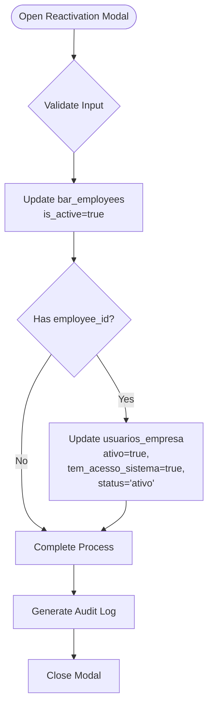
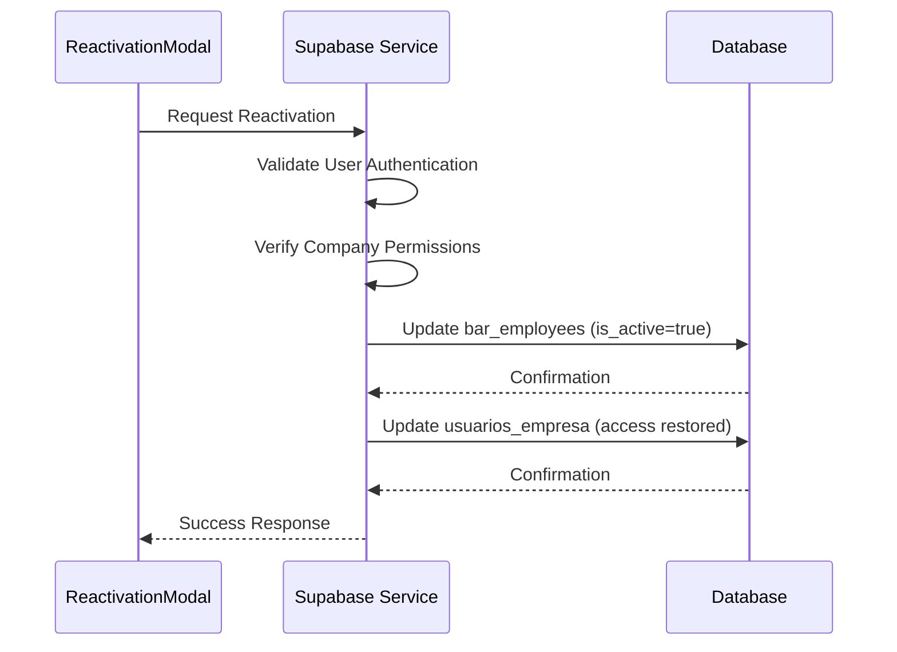
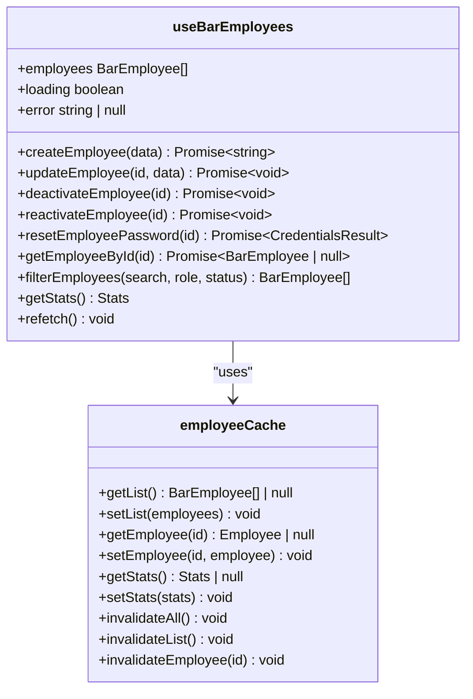

# Employee Reactivation Process

<cite>
**Referenced Files in This Document **   
- [ReactivationModal.tsx](file://src/components/EmployeeLifecycle/ReactivationModal.tsx)
- [useBarEmployees.ts](file://src/hooks/useBarEmployees.ts)
- [employee-basic-service.ts](file://src/services/employee-basic-service.ts)
- [auth-helper.ts](file://src/utils/auth-helper.ts)
- [cache.ts](file://src/utils/cache.ts)
- [auditLogger.ts](file://src/utils/auditLogger.ts)
</cite>

## Table of Contents
1. [Introduction](#introduction)
2. [Reactivation Modal Implementation](#reactivation-modal-implementation)
3. [Backend Logic for Status Transition](#backend-logic-for-status-transition)
4. [Security Checks and Multi-Step Verification](#security-checks-and-multi-step-verification)
5. [Audit Trail Generation](#audit-trail-generation)
6. [Real-Time Synchronization with useBarEmployees Hook](#real-time-synchronization-with-usebaremployees-hook)
7. [Integration with Authentication Context Providers](#integration-with-authentication-context-providers)

## Introduction
The Employee Reactivation Process in the AABB-system enables secure restoration of access rights for previously deactivated employees. This document details how the `ReactivationModal` component facilitates this process by validating credentials and triggering backend logic that handles status transitions from inactive to active. The system ensures proper session cleanup, permission cache invalidation, audit trail generation, and synchronization with real-time employee lists through the `useBarEmployees` hook.

## Reactivation Modal Implementation

The `ReactivationModal` component provides a user interface for securely reactivating deactivated employees. It validates input and coordinates with backend services to restore access rights while maintaining security protocols.

**Diagram sources **
- [ReactivationModal.tsx](file://src/components/EmployeeLifecycle/ReactivationModal.tsx#L15-L126)

**Section sources**
- [ReactivationModal.tsx](file://src/components/EmployeeLifecycle/ReactivationModal.tsx#L15-L126)

## Backend Logic for Status Transition

The backend logic for employee reactivation is implemented through direct database operations coordinated between frontend components and Supabase services. When an employee is reactivated, two key database updates occur:

1. The `bar_employees` table has its `is_active` field set to true, with `end_date` cleared and notes updated to include reactivation information.
2. If the employee had previous credentials (indicated by `employee_id`), the `usuarios_empresa` table is updated to restore access with `ativo=true`, `tem_acesso_sistema=true`, and `status='ativo'`.

This transition maintains data integrity through atomic updates and proper timestamp management. The system also clears any cached sessions associated with the employee during reactivation.

**Section sources**
- [ReactivationModal.tsx](file://src/components/EmployeeLifecycle/ReactivationModal.tsx#L45-L84)
- [useBarEmployees.ts](file://src/hooks/useBarEmployees.ts#L34-L568)

## Security Checks and Multi-Step Verification

The reactivation process incorporates multiple security checks to prevent unauthorized access restoration. Before any reactivation occurs, the system verifies the current user's authentication status and permissions through the `ensureAuthenticated` function in `auth-helper.ts`. 

For multi-step verification, the system follows a two-phase approach:
1. First, it confirms the employee record exists and is currently inactive
2. Then, it validates that the requesting user has appropriate privileges for the employee's company through `getCurrentUserEmpresaId`

These checks ensure that only authorized personnel can reactivate employees, preventing privilege escalation attacks or accidental access restoration.

**Diagram sources **
- [auth-helper.ts](file://src/utils/auth-helper.ts#L0-L61)
- [ReactivationModal.tsx](file://src/components/EmployeeLifecycle/ReactivationModal.tsx#L15-L126)

**Section sources**
- [auth-helper.ts](file://src/utils/auth-helper.ts#L0-L61)
- [ReactivationModal.tsx](file://src/components/EmployeeLifecycle/ReactivationModal.tsx#L15-L126)

## Audit Trail Generation

The system automatically generates comprehensive audit trails when employees are reactivated. While the `ReactivationModal` itself doesn't directly call audit functions, the underlying update operations trigger audit logging through the system's integrated audit mechanism.

The audit trail captures:
- Timestamp of reactivation
- Identity of the user performing the action
- Employee ID and name
- Previous and new status values
- Any notes provided during reactivation

This information is stored in the `audit_logs` table and synchronized across systems, providing a complete record of all employee status changes for compliance and security monitoring purposes.

**Section sources**
- [auditLogger.ts](file://src/utils/auditLogger.ts#L0-L132)
- [ReactivationModal.tsx](file://src/components/EmployeeLifecycle/ReactivationModal.tsx#L15-L126)

## Real-Time Synchronization with useBarEmployees Hook

The `useBarEmployees` hook ensures real-time synchronization of employee data after reactivation. When an employee is reactivated, the hook automatically updates its internal state and refreshes the employee list to reflect the change.

Key features of this synchronization include:
- Automatic cache invalidation for employee lists
- Real-time updates to employee statistics
- Immediate reflection of status changes in the UI
- Error recovery mechanisms for offline scenarios

The hook uses intelligent caching with TTL (time-to-live) settings and automatically refetches data after successful reactivation operations, ensuring users always see the most current employee information.

**Diagram sources **
- [useBarEmployees.ts](file://src/hooks/useBarEmployees.ts#L34-L568)
- [cache.ts](file://src/utils/cache.ts#L0-L362)

**Section sources**
- [useBarEmployees.ts](file://src/hooks/useBarEmployees.ts#L34-L568)
- [cache.ts](file://src/utils/cache.ts#L0-L362)

## Integration with Authentication Context Providers

The reactivation process integrates seamlessly with the system's authentication context providers to ensure consistent access control. When an employee is reactivated, the system communicates with Supabase Auth to restore their access credentials if they existed previously.

The integration works through:
- Validation of the current user's authentication context
- Proper handling of admin vs. regular user privileges
- Secure transmission of authentication data
- Consistent user metadata management

This integration ensures that reactivated employees regain access according to the same security policies that were in place before deactivation, maintaining the integrity of the system's access control framework.

**Section sources**
- [auth-helper.ts](file://src/utils/auth-helper.ts#L0-L61)
- [ReactivationModal.tsx](file://src/components/EmployeeLifecycle/ReactivationModal.tsx#L15-L126)
- [useBarEmployees.ts](file://src/hooks/useBarEmployees.ts#L34-L568)