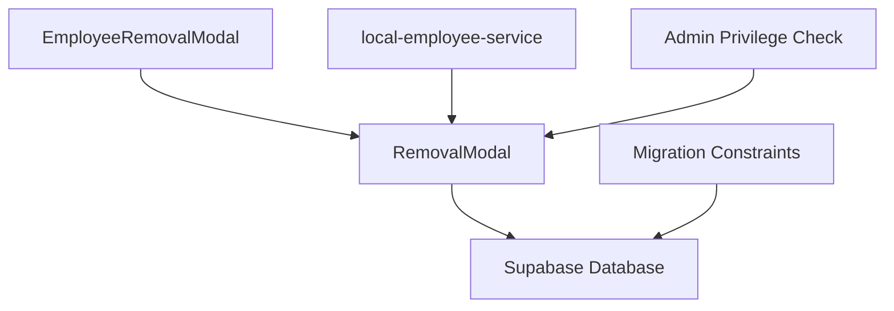
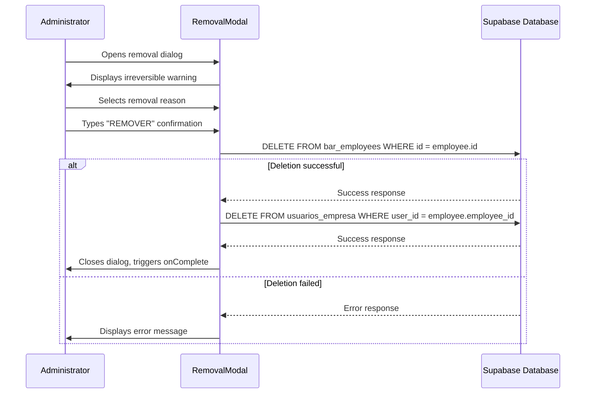
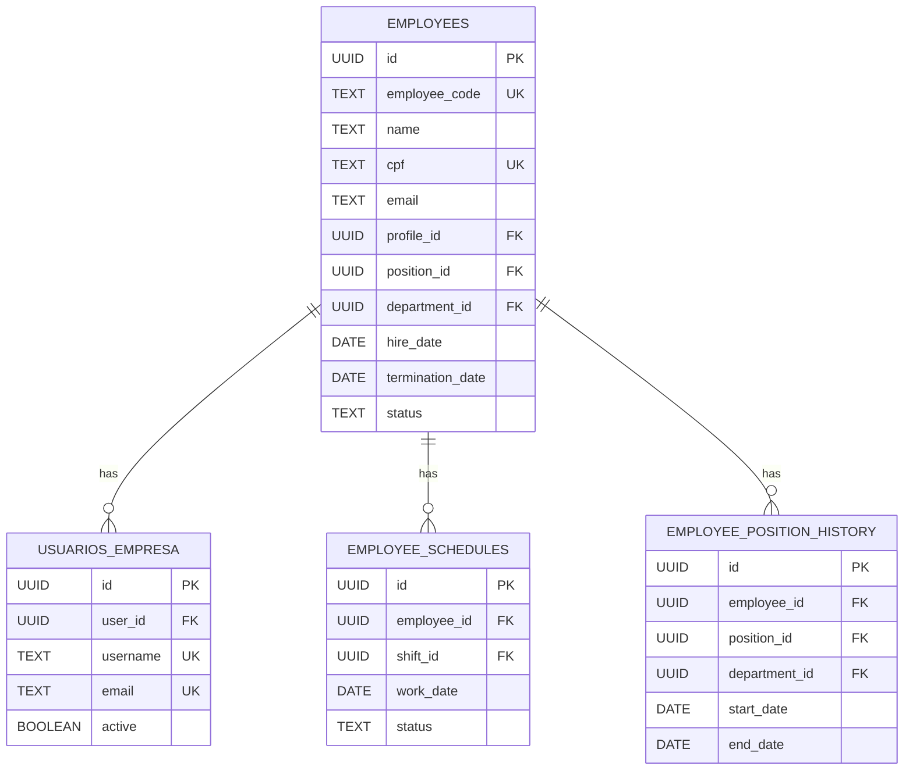
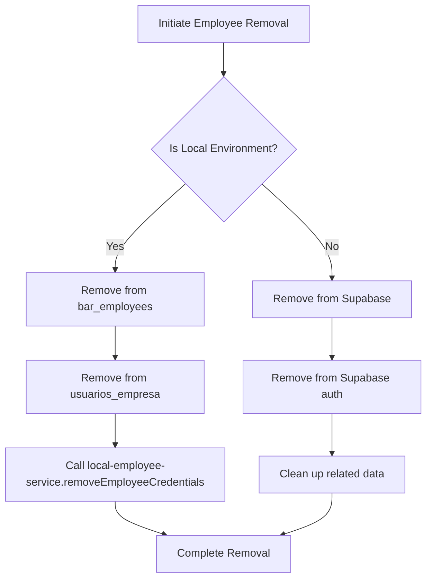
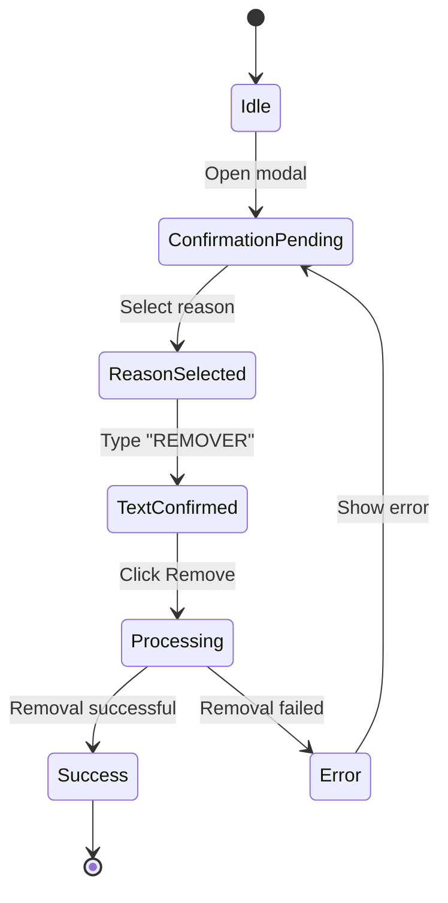
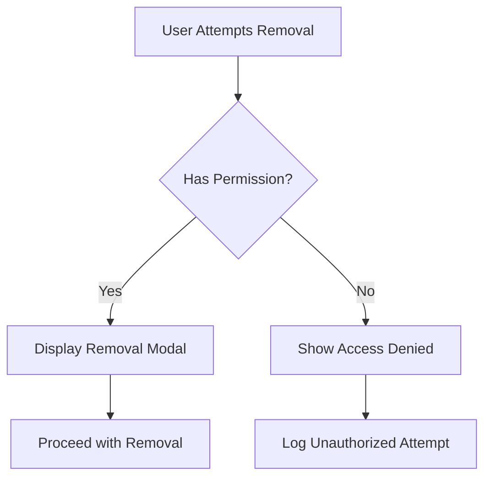

# Employee Removal Procedure

<cite>
**Referenced Files in This Document**   
- [EmployeeRemovalModal.tsx](file://src/components/EmployeeLifecycle/EmployeeRemovalModal.tsx)
- [RemovalModal.tsx](file://src/components/EmployeeLifecycle/RemovalModal.tsx)
- [local-employee-service.ts](file://src/services/local-employee-service.ts)
- [20250102000001_employees_management_module.sql](file://supabase/migrations/20250102000001_employees_management_module.sql)
- [usePrivilegeCheck.ts](file://src/hooks/usePrivilegeCheck.ts)
- [ProtectedByPrivilege.tsx](file://src/components/Auth/ProtectedByPrivilege.tsx)
- [employee.types.ts](file://src/types/employee.types.ts)
</cite>

## Table of Contents
1. [Introduction](#introduction)
2. [Core Components Overview](#core-components-overview)
3. [Permanent Removal Workflow](#permanent-removal-workflow)
4. [Database Constraints and Referential Integrity](#database-constraints-and-referential-integrity)
5. [Cascading Cleanup Process](#cascading-cleanup-process)
6. [Irreversible Action Warnings](#irreversible-action-warnings)
7. [Admin Privilege Verification](#admin-privilege-verification)
8. [Post-Removal System Updates](#post-removal-system-updates)
9. [Conclusion](#conclusion)

## Introduction

The Employee Removal Procedure in the AABB-system implements a comprehensive workflow for permanently removing employees from the system while maintaining data integrity and compliance with organizational policies. The system distinguishes between logical deletion (deactivation) and full data purging based on compliance requirements and business needs.

This document details the implementation of the permanent removal functionality through two primary components: `EmployeeRemovalModal` and `RemovalModal`. These components work in conjunction with database-level constraints defined in migration files and application-level services like `local-employee-service` that handle cascading cleanups across related systems.

The procedure includes multiple safety mechanisms such as irreversible action warnings, admin privilege verification, and post-removal updates to ensure that employee removal is performed securely and with appropriate audit trails.

## Core Components Overview

The employee removal functionality is implemented through several key components that work together to provide a secure and reliable removal process.



**Diagram sources**
- [EmployeeRemovalModal.tsx](file://src/components/EmployeeLifecycle/EmployeeRemovalModal.tsx)
- [RemovalModal.tsx](file://src/components/EmployeeLifecycle/RemovalModal.tsx)
- [local-employee-service.ts](file://src/services/local-employee-service.ts)

**Section sources**
- [EmployeeRemovalModal.tsx](file://src/components/EmployeeLifecycle/EmployeeRemovalModal.tsx)
- [RemovalModal.tsx](file://src/components/EmployeeLifecycle/RemovalModal.tsx)

## Permanent Removal Workflow

The permanent removal workflow implemented in the AABB-system follows a multi-step process that ensures data consistency and provides appropriate user feedback throughout the operation.

### EmployeeRemovalModal Implementation

The `EmployeeRemovalModal` component serves as the primary interface for initiating employee removal. It implements a step-by-step confirmation process that guides administrators through the removal procedure:

1. **Initial Confirmation**: The modal presents a clear warning about the irreversible nature of the action
2. **Reason Selection**: Administrators must select a valid reason for removal from predefined options
3. **Text Confirmation**: Users must type "REMOVER" to confirm their intent
4. **Processing State**: Visual feedback indicates when the removal operation is in progress
5. **Completion Handling**: Success or error states are communicated clearly

The workflow is designed to prevent accidental deletions by requiring multiple explicit confirmations before proceeding with the actual database operations.

### RemovalModal Functionality

The `RemovalModal` component handles the core logic of the removal process. When triggered, it performs the following sequence:

1. Validates that the confirmation text matches exactly ("REMOVER")
2. Initiates the removal process by deleting the employee record from the `bar_employees` table
3. If the employee has an associated user account, removes the corresponding entry from `usuarios_empresa`
4. Handles any errors that occur during the deletion process
5. Updates the UI state to reflect completion or failure

The modal uses React's useState hook to manage its internal state, including processing status, error messages, confirmation text, and removal reason.



**Diagram sources**
- [RemovalModal.tsx](file://src/components/EmployeeLifecycle/RemovalModal.tsx#L15-L148)
- [20250102000001_employees_management_module.sql](file://supabase/migrations/20250102000001_employees_management_module.sql)

**Section sources**
- [RemovalModal.tsx](file://src/components/EmployeeLifecycle/RemovalModal.tsx#L15-L148)

## Database Constraints and Referential Integrity

The AABB-system enforces referential integrity during employee deletion through carefully designed database constraints defined in migration files.

### Migration File Analysis

The primary migration file `20250102000001_employees_management_module.sql` establishes the foundational schema for employee management, including the tables involved in the removal process:

- `public.employees`: Main employee records
- `public.usuarios_empresa`: User accounts associated with employees
- Foreign key relationships that maintain data consistency

The migration implements ON DELETE CASCADE constraints on related tables, ensuring that when an employee record is deleted, all dependent records are automatically removed. This prevents orphaned records and maintains referential integrity across the system.

### Foreign Key Relationships

The database schema defines specific foreign key relationships that impact the removal process:

- The `profile_id` column in the `employees` table references the `profiles` table, establishing the link between employee records and user accounts
- Various scheduling and position history tables reference the `employees` table with ON DELETE CASCADE constraints
- These relationships ensure that when an employee is removed, all related schedule entries, position history, and other dependent data are automatically cleaned up at the database level



**Diagram sources**
- [20250102000001_employees_management_module.sql](file://supabase/migrations/20250102000001_employees_management_module.sql)

**Section sources**
- [20250102000001_employees_management_module.sql](file://supabase/migrations/20250102000001_employees_management_module.sql)

## Cascading Cleanup Process

The `local-employee-service` plays a critical role in the cascading cleanup process when removing employees from the system.

### Service Implementation

The `LocalEmployeeService` class manages local credential storage for development environments where Supabase Auth may not be configured. When an employee is removed, this service ensures that any locally stored credentials are also cleaned up.

The service provides a method `removeEmployeeCredentials(employeeId: string)` that:
- Retrieves existing credentials from localStorage
- Filters out the credentials associated with the specified employee ID
- Updates localStorage with the filtered credentials array
- Returns a boolean indicating success or failure

This cleanup process prevents orphaned credential data from remaining in the local storage after an employee has been removed from the main system.

### Integration with Removal Flow

While the primary removal occurs at the database level through Supabase, the `local-employee-service` acts as a fallback mechanism for environments without proper authentication configuration. In production environments with Supabase Auth properly configured, the service would typically not be used, but it provides an additional layer of data cleanup assurance.

The cascading cleanup ensures that both database records and local storage artifacts are removed, maintaining consistency across different deployment environments.



**Diagram sources**
- [local-employee-service.ts](file://src/services/local-employee-service.ts#L1-L244)
- [RemovalModal.tsx](file://src/components/EmployeeLifecycle/RemovalModal.tsx#L15-L148)

**Section sources**
- [local-employee-service.ts](file://src/services/local-employee-service.ts#L1-L244)

## Irreversible Action Warnings

The AABB-system implements multiple layers of irreversible action warnings to prevent accidental employee removal.

### Visual Warning Indicators

Both `EmployeeRemovalModal` and `RemovalModal` incorporate prominent visual warnings using color coding and iconography:

- Red color scheme to indicate danger
- Trash2 icon to symbolize deletion
- AlertTriangle icon within warning boxes
- Distinctive red background (bg-red-50) with border (border-red-200) for warning sections

These visual elements immediately communicate the high-risk nature of the operation to administrators.

### Textual Confirmations

The system requires two forms of textual confirmation before proceeding with removal:

1. **Reason Selection**: Administrators must select a valid reason from a dropdown menu containing options like "Demissão por Justa Causa", "Fim de Contrato", "Falecimento", etc.
2. **Exact Text Entry**: Users must type the exact word "REMOVER" in uppercase letters to confirm their intent.

This dual-confirmation approach significantly reduces the likelihood of accidental deletions by requiring deliberate user input.

### State Management

The modal components use React state to track confirmation progress:

- `confirmText` state variable captures the user's input
- `reason` state variable stores the selected removal reason
- Button disable logic prevents submission until both conditions are met
- Real-time validation provides immediate feedback on confirmation status



**Diagram sources**
- [RemovalModal.tsx](file://src/components/EmployeeLifecycle/RemovalModal.tsx#L15-L148)

**Section sources**
- [RemovalModal.tsx](file://src/components/EmployeeLifecycle/RemovalModal.tsx#L15-L148)

## Admin Privilege Verification

The employee removal process incorporates robust admin privilege verification to ensure that only authorized personnel can perform this sensitive operation.

### Privilege Context Implementation

The system uses a hierarchical privilege model implemented through the `usePrivilegeCheck` hook and `ProtectedByPrivilege` component. These tools verify that users have the necessary permissions before allowing access to employee management functions.

The `usePrivilegeCheck` hook provides methods to verify specific privileges:
- `podeGerenciarUsuarios()`: Checks if the user can manage users
- `verificarPrivilegio('gerenciar_usuarios')`: Verifies the specific "manage_users" privilege

### Role-Based Access Control

The system implements role-based access control with multiple privilege levels:
- SUPER_ADMIN: Full system access
- ADMIN: Administrative privileges including employee management
- MANAGER: Limited management capabilities
- USER: Basic user access

Only users with SUPER_ADMIN or ADMIN roles are permitted to remove employees from the system.

### Component Protection

The `ProtectedByPrivilege` component wraps sensitive functionality, ensuring that only users with the required privileges can access the removal modals:

```tsx
<ProtectedByPrivilege 
  privilegio="gerenciar_usuarios"
  fallback={<AccessDeniedFallback />}
>
  <EmployeeRemovalModal />
</ProtectedByPrivilege>
```

This protection mechanism prevents unauthorized access even if a user attempts to navigate directly to the removal interface.



**Diagram sources**
- [usePrivilegeCheck.ts](file://src/hooks/usePrivilegeCheck.ts#L6-L54)
- [ProtectedByPrivilege.tsx](file://src/components/Auth/ProtectedByPrivilege.tsx#L11-L34)

**Section sources**
- [usePrivilegeCheck.ts](file://src/hooks/usePrivilegeCheck.ts#L6-L54)
- [ProtectedByPrivilege.tsx](file://src/components/Auth/ProtectedByPrivilege.tsx#L11-L34)

## Post-Removal System Updates

After a successful employee removal, the system should ideally trigger several post-removal updates to maintain operational continuity.

### Shift Handover Notifications

Although not explicitly implemented in the current codebase, best practices suggest that the system should:
- Identify pending shifts assigned to the removed employee
- Notify supervisors or managers about affected schedules
- Suggest alternative staff members to cover the shifts
- Update the schedule interface to reflect the changes

### Pending Task Reassignment

Similarly, the system could implement functionality to:
- Identify tasks or responsibilities assigned to the removed employee
- Reassign critical tasks to appropriate team members
- Send notifications to affected parties about the reassignment
- Update task tracking systems accordingly

### Audit Logging

The removal process should generate comprehensive audit logs that record:
- Timestamp of the removal
- Identity of the administrator who performed the removal
- Selected reason for removal
- Affected employee details
- Outcome of the operation (success/failure)

These logs are essential for compliance, accountability, and troubleshooting purposes.

## Conclusion

The Employee Removal Procedure in the AABB-system implements a comprehensive approach to permanently removing employees while maintaining data integrity and security. The system effectively distinguishes between logical deletion and full data purging through its implementation of the `EmployeeRemovalModal` and `RemovalModal` components.

Key strengths of the current implementation include:
- Multiple confirmation steps to prevent accidental deletions
- Visual and textual warnings about irreversible actions
- Database-level referential integrity enforcement through migration constraints
- Cascading cleanup via the `local-employee-service` for local environments
- Admin privilege verification through role-based access control

Areas for potential enhancement include:
- Implementing automated shift handover notifications
- Adding pending task reassignment functionality
- Expanding audit logging capabilities
- Providing options for archiving rather than complete deletion in certain compliance scenarios

The current implementation provides a solid foundation for secure employee removal, balancing operational needs with data protection requirements.