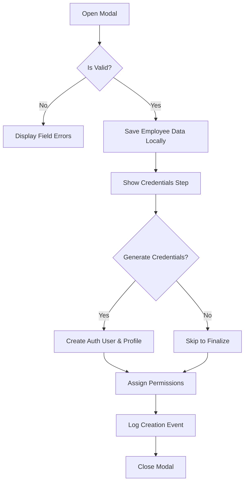
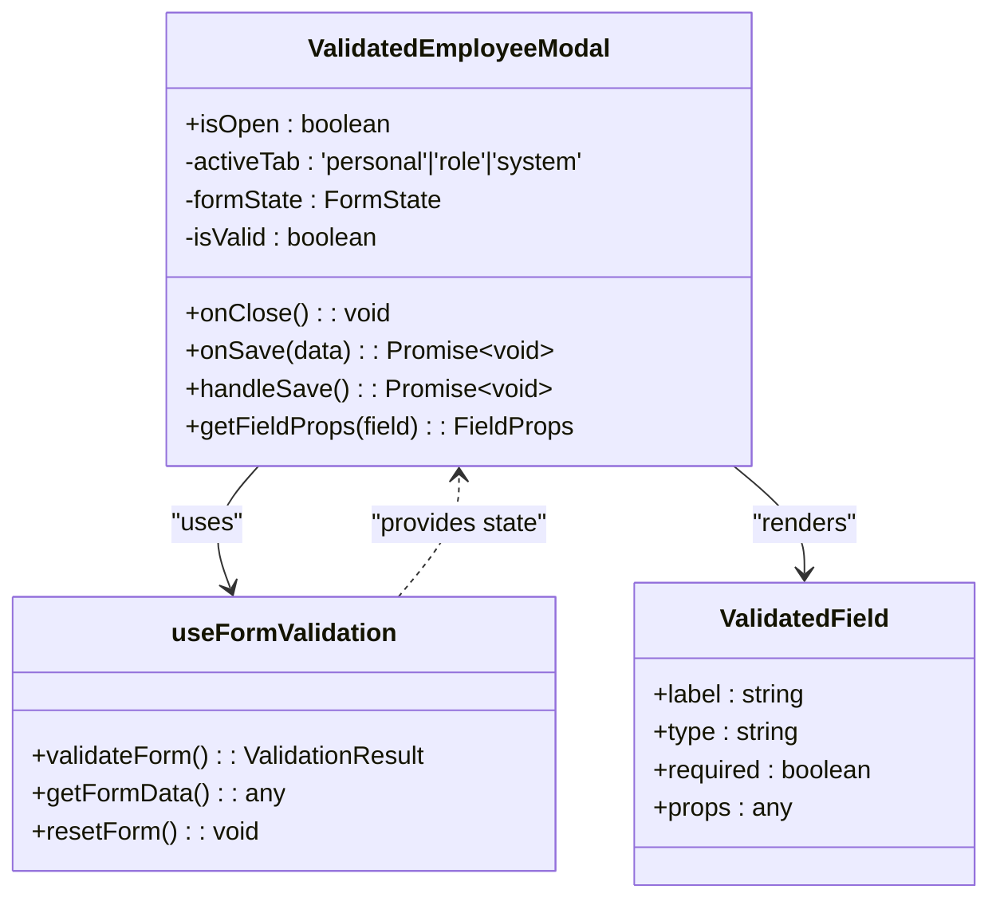
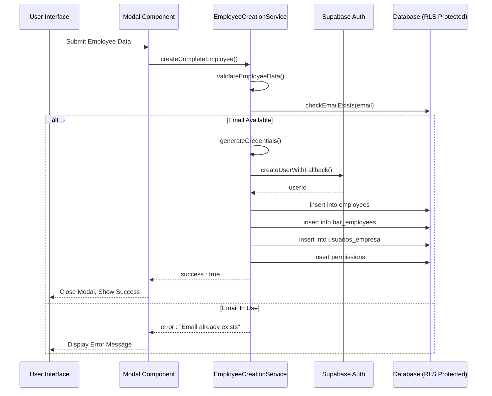
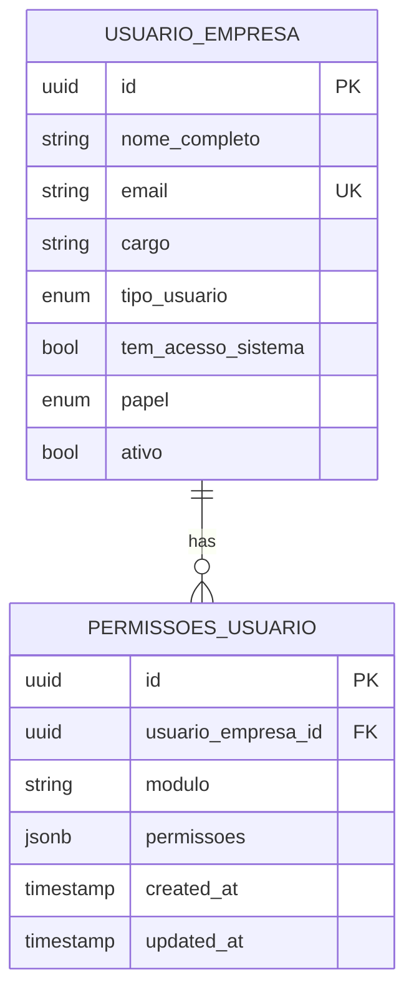
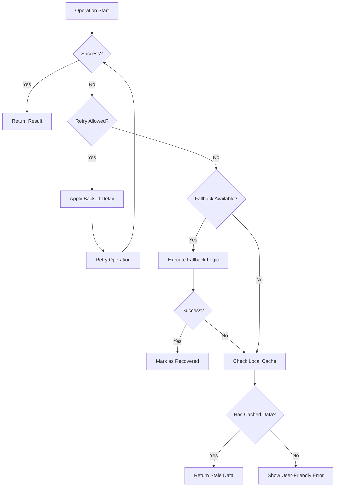

# Employee Management

<cite>
**Referenced Files in This Document**   
- [TwoStepEmployeeModal.tsx](file://src/components/EmployeeModal/TwoStepEmployeeModal.tsx)
- [ValidatedEmployeeModal.tsx](file://src/components/EmployeeModal/ValidatedEmployeeModal.tsx)
- [employee-creation-service.ts](file://src/services/employee-creation-service.ts)
- [useAuditLogger.ts](file://src/hooks/useAuditLogger.ts)
- [errorRecovery.ts](file://src/utils/errorRecovery.ts)
</cite>

## Table of Contents
1. [Introduction](#introduction)
2. [End-to-End Employee Workflow](#end-to-end-employee-workflow)
3. [Modal Implementation and User Experience](#modal-implementation-and-user-experience)
4. [Service Layer and Supabase Integration](#service-layer-and-supabase-integration)
5. [Hierarchical Permission Model](#hierarchical-permission-model)
6. [Audit Logging and Security](#audit-logging-and-security)
7. [Error Handling and Recovery](#error-handling-and-recovery)
8. [Conclusion](#conclusion)

## Introduction
The Employee Management system within the AABB-system provides a comprehensive solution for managing employee lifecycle operations including creation, editing, deactivation, and removal. The system features two distinct modal workflows—single-step and two-step—for handling employee data entry with robust validation, real-time feedback, and permission assignment. Built on Supabase with Row Level Security (RLS), the service layer ensures secure, multitenant data isolation while supporting hierarchical roles and audit logging. This document details the end-to-end workflow, component implementation, service integration, and error recovery mechanisms that ensure reliability and usability.

## End-to-End Employee Workflow
The employee management system supports full lifecycle operations through a structured workflow that begins with data entry and concludes with secure credentialing and audit logging. For new employees, the process starts with either the `ValidatedEmployeeModal` for single-step creation or the `TwoStepEmployeeModal` for phased setup. During creation, users input personal information, role assignments, and system access preferences. Upon submission, the `employeeCreationService` orchestrates database insertion across multiple tables (`employees`, `bar_employees`, `usuarios_empresa`) while enforcing RLS policies. If system access is granted, credentials are automatically generated and stored securely via Supabase Auth. Editing existing employees follows a similar flow but pre-populates fields from existing records. Deactivation and removal are handled through dedicated modals that update status flags and revoke access while preserving audit trails. Throughout all operations, real-time validation prevents invalid submissions and guides users toward successful completion.

**Section sources**
- [TwoStepEmployeeModal.tsx](file://src/components/EmployeeModal/TwoStepEmployeeModal.tsx#L18-L293)
- [ValidatedEmployeeModal.tsx](file://src/components/EmployeeModal/ValidatedEmployeeModal.tsx#L27-L443)
- [employee-creation-service.ts](file://src/services/employee-creation-service.ts#L0-L2238)

## Modal Implementation and User Experience
The system implements two primary modal components to support flexible employee creation: `TwoStepEmployeeModal` and `ValidatedEmployeeModal`. These components provide distinct user experiences tailored to different operational needs while maintaining consistent validation and feedback mechanisms.

### Two-Step Employee Modal
The `TwoStepEmployeeModal` enables a phased approach where basic employee data is collected first, followed by optional credential configuration. This separation improves usability by reducing cognitive load during initial data entry. The modal enforces form validity before allowing progression to the second step, ensuring only validated data advances. Users can skip credential creation, resulting in an internal-only record without login capability. Real-time feedback is provided through inline error messages and a progress indicator showing current stage.

**Diagram sources**
- [TwoStepEmployeeModal.tsx](file://src/components/EmployeeModal/TwoStepEmployeeModal.tsx#L18-L293)

### Single-Step Validated Modal
The `ValidatedEmployeeModal` consolidates all inputs into a tabbed interface with three sections: Personal Information, Role & Work, and System Access. Each field benefits from immediate validation triggered on change and blur events, powered by `useFormValidation`. Tabs allow focused editing while dynamic content updates reflect role-based permission presets. When "Allow System Access" is enabled, the UI displays auto-assigned permissions based on job function (e.g., manager receives full access). Validation summaries highlight errors and warnings above the footer, guiding correction before submission.

**Diagram sources**
- [ValidatedEmployeeModal.tsx](file://src/components/EmployeeModal/ValidatedEmployeeModal.tsx#L27-L443)

**Section sources**
- [TwoStepEmployeeModal.tsx](file://src/components/EmployeeModal/TwoStepEmployeeModal.tsx#L18-L293)
- [ValidatedEmployeeModal.tsx](file://src/components/EmployeeModal/ValidatedEmployeeModal.tsx#L27-L443)

## Service Layer and Supabase Integration
The `employee-creation-service.ts` file contains the core business logic responsible for persisting employee data across multiple database tables while enforcing security policies through Supabase RLS. The service uses a singleton pattern via `EmployeeCreationService.getInstance()` to maintain consistent state and logging configuration.

### Core Creation Process
The `createCompleteEmployee` method coordinates the entire creation sequence:
1. Validates input data using schema rules
2. Checks for email conflicts via `checkEmailExists`
3. Generates secure credentials when needed
4. Creates Supabase Auth user with metadata
5. Inserts records into `employees`, `bar_employees`, and `usuarios_empresa`
6. Assigns module-specific permissions
7. Logs success or recovers from partial failures

Each operation is wrapped in `executeWithErrorHandling` which standardizes error classification and retry behavior. The service intelligently selects between Supabase client and Admin API based on availability, preferring the Admin API for elevated privileges when configured.

### Supabase RLS Compliance
To comply with Row Level Security, all database operations include tenant context via `empresa_id`. The service respects policy constraints by:
- Using authenticated sessions for regular operations
- Falling back to service role (Admin API) when necessary
- Ensuring all inserts reference the correct enterprise scope
- Validating ownership before updates or deletions

This layered approach allows seamless operation under strict RLS enforcement while maintaining data isolation across tenants.

**Diagram sources**
- [employee-creation-service.ts](file://src/services/employee-creation-service.ts#L0-L2238)

**Section sources**
- [employee-creation-service.ts](file://src/services/employee-creation-service.ts#L0-L2238)

## Hierarchical Permission Model
The system implements a granular, role-based permission model that maps job functions to specific module-level privileges. Permissions are structured hierarchically across functional domains such as bar operations, kitchen management, cashier duties, reporting, inventory, customer relations, settings, and mobile app access.

### Role-to-Privilege Mapping
Each employee role (waiter, cook, cashier, supervisor, manager, admin) has a predefined permission preset defined in `ROLE_PRESETS`. These presets determine default access levels upon creation:
- **Waiter**: View and manage orders, access menu and customer lists
- **Cook**: Monitor kitchen orders, update preparation status
- **Barman**: Manage drink orders, view bar inventory
- **Supervisor**: Full operational access plus team oversight
- **Manager**: All supervisor rights plus reporting and configuration
- **Admin**: Full system control including user management

When a user selects a role in the modal, the corresponding preset automatically populates the permissions list. Users may customize these permissions post-creation using the permission editor.

### Module-Level Permissions
Permissions are defined per module with five action types:
- **View**: Read-only access
- **Create**: Add new entries
- **Edit**: Modify existing data
- **Delete**: Remove records
- **Manage**: Full administrative control

These permissions are stored in the `permissoes_usuario` table linked to `usuario_empresa_id`, enabling fine-grained access control enforced by Supabase RLS policies at query time.

**Diagram sources**
- [employee-creation-service.ts](file://src/services/employee-creation-service.ts#L0-L2238)

**Section sources**
- [employee-creation-service.ts](file://src/services/employee-creation-service.ts#L0-L2238)

## Audit Logging and Security
All employee operations are audited using the `useAuditLogger` hook, which integrates with a centralized `auditLogger` utility to capture critical events. This ensures traceability and compliance with security requirements.

### Audit Events Tracked
The following actions trigger audit log entries:
- Employee creation (`logEmployeeCreated`)
- Employee updates (`logEmployeeUpdated`)
- Deactivation events (`logEmployeeDeactivated`)
- Login attempts (`logLoginAttempt`)

Each log entry includes contextual metadata such as user ID, email, timestamp, and operation details. The logger automatically synchronizes pending logs when network connectivity is restored, ensuring no events are lost during offline operation.

### Secure Credential Handling
Credentials are generated using cryptographically sound methods that avoid ambiguous characters and enforce complexity rules. Temporary passwords are marked for forced change on first login. The system supports both direct creation via Admin API and fallback registration paths to handle edge cases like trigger failures.

Sensitive operations like password resets and user deletions require elevated privileges and are logged accordingly. The use of Supabase's Admin API for critical operations ensures these actions bypass restrictive RLS policies while remaining within controlled execution contexts.

**Section sources**
- [useAuditLogger.ts](file://src/hooks/useAuditLogger.ts#L8-L41)
- [employee-creation-service.ts](file://src/services/employee-creation-service.ts#L0-L2238)

## Error Handling and Recovery
The system employs a comprehensive error recovery strategy using the `errorRecovery` utilities to handle transient failures, network issues, and validation conflicts gracefully.

### Common Issues Addressed
#### Credential Conflicts
When duplicate emails are detected during creation, the service returns a clear error message preventing account duplication. The `checkEmailExists` method queries the `usuarios_empresa` table to enforce uniqueness across enterprises.

#### Permission Persistence Bugs
To prevent loss of custom permission changes, the service explicitly saves modified permissions via `saveCustomPermissions` after successful edits. This ensures overrides to role presets are preserved even if subsequent operations fail.

#### Creation Failure Recovery
In case of partial failure (e.g., employee created but Auth user fails), the system uses cleanup routines like `cleanupAuthUserSafely` to remove orphaned records. Failed operations are queued locally via `localStorage` for later synchronization using `syncPendingOperations`.

### Retry and Fallback Mechanisms
Critical operations use `withRetry` and `withFallback` wrappers that:
- Attempt up to 5 retries with exponential backoff
- Switch to alternative methods (e.g., Admin API vs client)
- Fall back to local storage when offline
- Return meaningful error messages via `getErrorMessage`

This layered resilience ensures high availability even under adverse conditions.

**Diagram sources**
- [errorRecovery.ts](file://src/utils/errorRecovery.ts#L0-L445)

**Section sources**
- [errorRecovery.ts](file://src/utils/errorRecovery.ts#L0-L445)
- [employee-creation-service.ts](file://src/services/employee-creation-service.ts#L0-L2238)

## Conclusion
The Employee Management system in the AABB-system delivers a robust, secure, and user-friendly experience for managing staff throughout their lifecycle. By combining intuitive modal interfaces with a resilient backend service layer, it supports both simple and complex workflows while enforcing data integrity and security. The integration with Supabase RLS ensures tenant isolation and compliance, while audit logging and error recovery mechanisms enhance reliability. Future enhancements could include bulk import/export, advanced reporting, and biometric authentication, building upon this solid foundation.