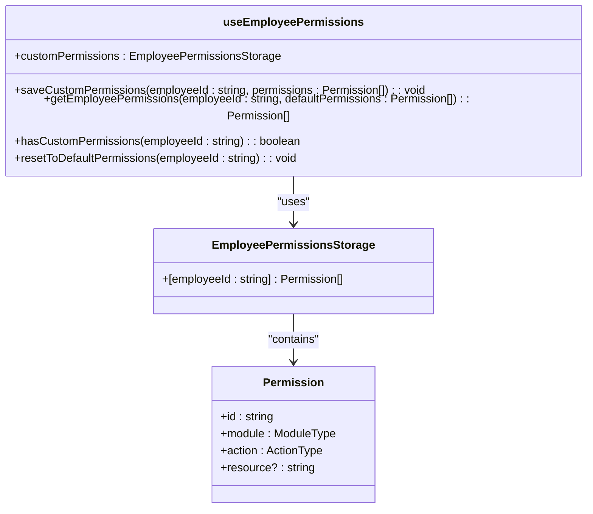
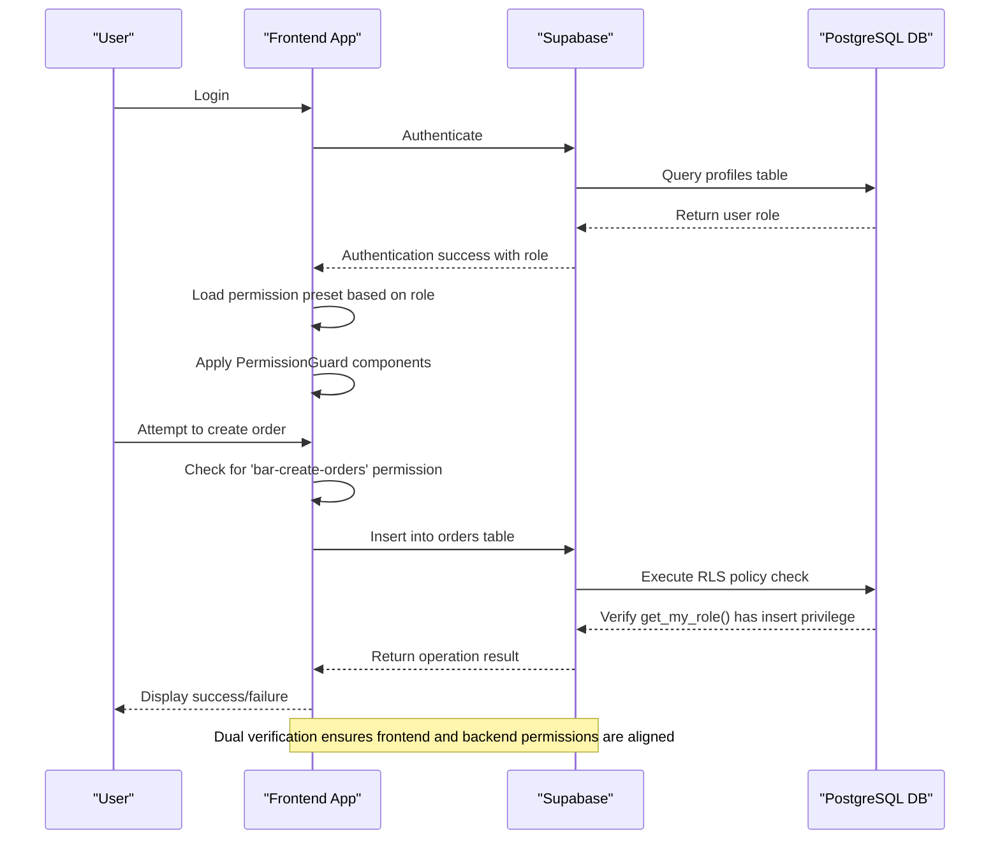
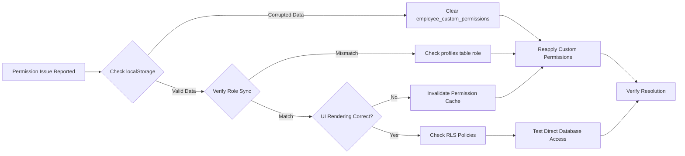

# Frontend-Backend Permission Mapping

<cite>
**Referenced Files in This Document**   
- [useEmployeePermissions.ts](file://src/hooks/useEmployeePermissions.ts)
- [permission-presets.ts](file://src/services/permission-presets.ts)
- [20250729000000_initial_schema.sql](file://supabase/migrations/20250729000000_initial_schema.sql)
- [employee.types.ts](file://src/types/employee.types.ts)
</cite>

## Table of Contents
1. [Introduction](#introduction)
2. [Permission Architecture Overview](#permission-architecture-overview)
3. [Frontend Permission Management](#frontend-permission-management)
4. [Backend Row Level Security Implementation](#backend-row-level-security-implementation)
5. [Permission Synchronization Flow](#permission-synchronization-flow)
6. [Troubleshooting Permission Issues](#troubleshooting-permission-issues)
7. [Best Practices for Permission Consistency](#best-practices-for-permission-consistency)
8. [Conclusion](#conclusion)

## Introduction
This document details the synchronization mechanism between frontend permission objects and backend Row Level Security (RLS) policies in the AABB-system. The system implements a comprehensive security model where frontend permissions defined as string-based identifiers are mapped to database-level RLS policies enforced by Supabase. The integration ensures that user interface access controls align with data access restrictions at the database layer, providing defense in depth for application security.

The architecture centers around role-based access control (RBAC) with hierarchical roles and customizable permissions. Frontend components use permission hooks to determine UI visibility and functionality, while Supabase RLS policies enforce data access rules at the PostgreSQL level. This dual-layer approach ensures that even if frontend controls are bypassed, unauthorized data access is prevented at the database level.

**Section sources**
- [useEmployeePermissions.ts](file://src/hooks/useEmployeePermissions.ts#L1-L59)
- [permission-presets.ts](file://src/services/permission-presets.ts#L1-L564)

## Permission Architecture Overview
The AABB-system implements a multi-layered permission architecture that synchronizes client-side permission state with server-side database policies. At the core of this system is the alignment between frontend Permission objects and backend RLS policies, ensuring consistent access control across the entire stack.

The architecture follows a role-based model with predefined permission presets for different employee roles (garcom, barman, gerente, etc.). Each role has a hierarchy level that determines administrative capabilities and access scope. The system supports both default role permissions and customized permissions for individual employees, allowing flexibility while maintaining security standards.

```mermaid
graph TB
subgraph "Frontend Layer"
A[User Interface]
B[PermissionGuard Components]
C[useEmployeePermissions Hook]
D[localStorage Storage]
end
subgraph "Backend Layer"
E[Supabase Auth]
F[Database Tables]
G[RLS Policies]
H[get_my_role() Function]
end
A --> B --> C --> D
C --> E
E --> H
H --> G
G --> F
C --> |Permission Check| G
style A fill:#f9f,stroke:#333
style B fill:#f9f,stroke:#333
style C fill:#f9f,stroke:#333
style D fill:#f9f,stroke:#333
style E fill:#bbf,stroke:#333
style F fill:#bbf,stroke:#333
style G fill:#bbf,stroke:#333
style H fill:#bbf,stroke:#333
```

**Diagram sources**
- [useEmployeePermissions.ts](file://src/hooks/useEmployeePermissions.ts#L1-L59)
- [permission-presets.ts](file://src/services/permission-presets.ts#L1-L564)
- [20250729000000_initial_schema.sql](file://supabase/migrations/20250729000000_initial_schema.sql#L1-L174)

**Section sources**
- [useEmployeePermissions.ts](file://src/hooks/useEmployeePermissions.ts#L1-L59)
- [permission-presets.ts](file://src/services/permission-presets.ts#L1-L564)
- [20250729000000_initial_schema.sql](file://supabase/migrations/20250729000000_initial_schema.sql#L1-L174)

## Frontend Permission Management
The frontend permission system is managed through the `useEmployeePermissions` hook, which provides a React interface for handling employee-specific permissions. This hook manages both default role-based permissions and custom overrides stored in localStorage, creating a flexible permission model that can accommodate special access requirements.

The hook exposes four primary functions: `saveCustomPermissions`, `getEmployeePermissions`, `hasCustomPermissions`, and `resetToDefaultPermissions`. These functions allow the application to persist custom permission sets for individual employees while falling back to default role permissions when no customizations exist. Permissions are stored under the key 'employee_custom_permissions' in localStorage, enabling persistence across browser sessions.



**Diagram sources**
- [useEmployeePermissions.ts](file://src/hooks/useEmployeePermissions.ts#L7-L59)
- [employee.types.ts](file://src/types/employee.types.ts#L24-L29)

**Section sources**
- [useEmployeePermissions.ts](file://src/hooks/useEmployeePermissions.ts#L1-L59)
- [employee.types.ts](file://src/types/employee.types.ts#L24-L29)

## Backend Row Level Security Implementation
The backend implements Row Level Security (RLS) policies in Supabase to enforce data access rules at the database level. These policies are defined in SQL migrations and leverage the `get_my_role()` function to determine the current user's role based on their profile in the public.profiles table.

The initial schema migration establishes foundational RLS policies that differentiate between admin users and authenticated users. Admins have full access to all tables through policies that check if `public.get_my_role() = 'admin'`, while regular authenticated users have read-only access to most data. More granular policies are applied to specific modules like cash management and employee systems in subsequent migrations.

```mermaid
flowchart TD
A[User Request] --> B{Is User Authenticated?}
B --> |No| C[Deny Access]
B --> |Yes| D[Execute get_my_role()]
D --> E{Role Check}
E --> |Admin| F[Full Table Access]
E --> |Authenticated| G[Read-Only Access]
E --> |Employee Role| H[Role-Specific Access]
F --> I[Allow Operation]
G --> J[Allow SELECT Only]
H --> K[Apply Module-Specific Rules]
I --> L[Database Operation]
J --> L
K --> L
L --> M[Return Result]
style C fill:#fdd,stroke:#f00
style F fill:#dfd,stroke:#0a0
style G fill:#ffd,stroke:#dd0
style H fill:#ffd,stroke:#dd0
```

**Diagram sources**
- [20250729000000_initial_schema.sql](file://supabase/migrations/20250729000000_initial_schema.sql#L158-L170)

**Section sources**
- [20250729000000_initial_schema.sql](file://supabase/migrations/20250729000000_initial_schema.sql#L1-L174)

## Permission Synchronization Flow
The synchronization between frontend permissions and backend RLS policies follows a well-defined flow that ensures consistency across layers. When a user logs in, the system retrieves their role from the profiles table and applies the corresponding permission preset from the frontend configuration. This creates a unified permission context that governs both UI rendering and API request authorization.

For example, the frontend permission 'bar-create-orders' maps to backend RLS policies that allow INSERT operations on the orders table for users with appropriate roles. The `useEmployeePermissions` hook determines whether the current user should see the order creation interface, while the database RLS policy enforces that only authorized users can actually create records.



**Diagram sources**
- [useEmployeePermissions.ts](file://src/hooks/useEmployeePermissions.ts#L1-L59)
- [permission-presets.ts](file://src/services/permission-presets.ts#L1-L564)
- [20250729000000_initial_schema.sql](file://supabase/migrations/20250729000000_initial_schema.sql#L1-L174)

**Section sources**
- [useEmployeePermissions.ts](file://src/hooks/useEmployeePermissions.ts#L1-L59)
- [permission-presets.ts](file://src/services/permission-presets.ts#L1-L564)
- [20250729000000_initial_schema.sql](file://supabase/migrations/20250729000000_initial_schema.sql#L1-L174)

## Troubleshooting Permission Issues
Permission persistence issues can occur due to localStorage conflicts or cache invalidation problems. Common symptoms include users losing custom permissions after page refresh or role changes not being reflected in the UI. The primary troubleshooting steps involve checking localStorage integrity, verifying role synchronization between frontend and backend, and ensuring proper cache invalidation.

When investigating permission issues, first verify that the 'employee_custom_permissions' item in localStorage contains valid JSON data. Corrupted or malformed JSON can prevent the `useEmployeePermissions` hook from loading custom permissions correctly. Clearing this storage item and reapplying permissions often resolves the issue.

Cache-related problems typically manifest as stale permission states where UI elements don't reflect current role assignments. This occurs when the frontend permission context isn't properly refreshed after role changes. Implementing proper cache invalidation strategies, such as clearing permission caches on authentication events or role updates, prevents these inconsistencies.



**Section sources**
- [useEmployeePermissions.ts](file://src/hooks/useEmployeePermissions.ts#L1-L59)
- [CORRECAO_PERSISTENCIA_PERMISSOES.md](file://CORRECAO_PERSISTENCIA_PERMISSOES.md)

## Best Practices for Permission Consistency
Maintaining consistency between frontend role presets and backend security policies requires adherence to several best practices. First, always update both frontend permission configurations and backend RLS policies simultaneously when introducing new features or modifying access requirements. This prevents discrepancies where the UI suggests functionality is available when the database will reject the operation.

Implement automated testing that verifies permission mappings across layers. Tests should confirm that frontend permission checks align with actual database access capabilities for each role. The existing permission-presets.test.ts file provides a foundation for these validations, ensuring that role hierarchies and permission assignments remain intact.

Use descriptive naming conventions for permissions that clearly indicate their purpose and scope. Frontend permission strings like 'bar-create-orders' should directly correspond to the operations they enable, making it easier to trace their implementation in both frontend components and backend policies.

Finally, establish a change management process for permission modifications that includes reviews by both frontend and backend developers. This collaborative approach ensures that security considerations are addressed holistically rather than in isolation, reducing the risk of creating security gaps or usability issues.

**Section sources**
- [permission-presets.ts](file://src/services/permission-presets.ts#L1-L564)
- [permission-presets.test.ts](file://src/services/__tests__/permission-presets.test.ts#L1-L386)

## Conclusion
The AABB-system implements a robust permission mapping architecture that effectively synchronizes frontend permission objects with backend Row Level Security policies. By leveraging the `useEmployeePermissions` hook for client-side state management and Supabase RLS for server-side data protection, the system achieves defense in depth for access control.

The integration between the frontend permission system and database policies ensures that user interface capabilities align with actual data access rights, preventing scenarios where users can see functionality they cannot actually use. This alignment is maintained through careful coordination of role definitions, permission presets, and policy configurations across both layers.

For optimal security and usability, maintain strict synchronization between frontend permission definitions and backend RLS policies, implement comprehensive testing of permission flows, and follow established best practices for permission management and change control.