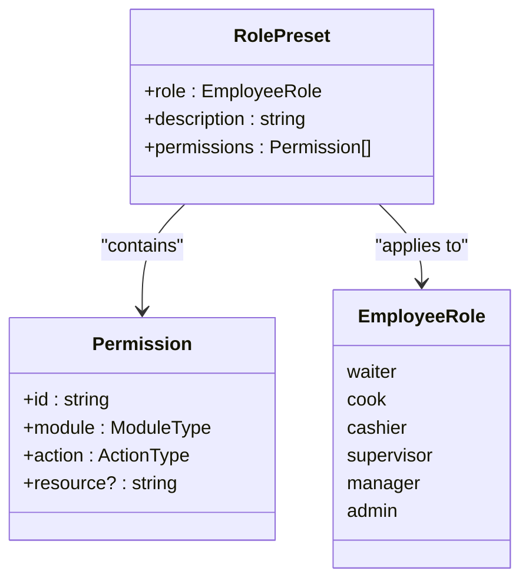
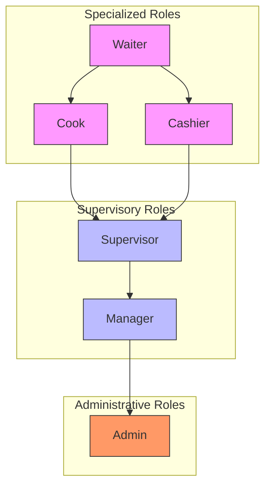
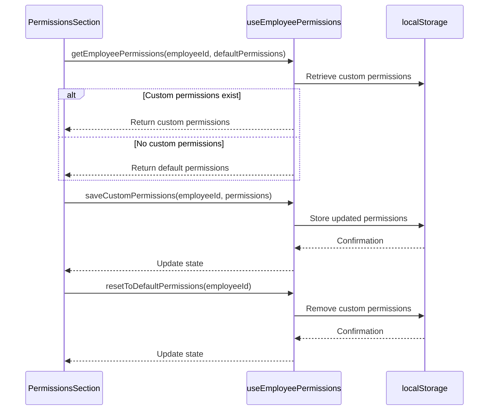
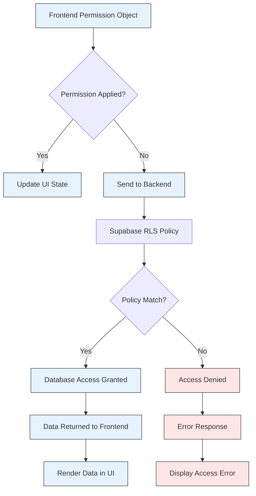

# Permission Assignment System

<cite>
**Referenced Files in This Document **   
- [permissionPresets.ts](file://src/utils/permissionPresets.ts)
- [useEmployeePermissions.ts](file://src/hooks/useEmployeePermissions.ts)
- [PermissionsSection.tsx](file://src/components/EmployeeModal/PermissionsSection.tsx)
- [employee.types.ts](file://src/types/employee.types.ts)
- [20250116000001_multitenant_auth_system.sql](file://supabase/migrations/20250116000001_multitenant_auth_system.sql)
- [20250119000002_update_rls_policies_hierarchy.sql](file://supabase/migrations/20250119000002_update_rls_policies_hierarchy.sql)
</cite>

## Table of Contents
1. [Introduction](#introduction)
2. [Role-Based Permission Presets](#role-based-permission-presets)
3. [Hierarchical Privilege Model](#hierarchical-privilege-model)
4. [PermissionsSection UI Component](#permissionssection-ui-component)
5. [Frontend-Backend Permission Mapping](#frontend-backend-permission-mapping)
6. [Troubleshooting Permission Persistence](#troubleshooting-permission-persistence)
7. [Conclusion](#conclusion)

## Introduction
The Permission Assignment system in the AABB-system implements a comprehensive role-based access control (RBAC) mechanism that combines predefined permission presets with customizable permissions. This document details the architecture and functionality of the permission system, focusing on the ROLE_PRESETS implementation, the useEmployeePermissions hook, and the PermissionsSection UI component. The system enables administrators to efficiently manage employee access rights while maintaining security through backend Row Level Security (RLS) policies.

## Role-Based Permission Presets
The ROLE_PRESETS object in permissionPresets.ts defines a hierarchical set of permission configurations for different employee roles within the organization. Each preset automatically configures module-level permissions based on the selected role, providing a standardized approach to access control.

**Diagram sources **
- [permissionPresets.ts](file://src/utils/permissionPresets.ts#L10-L83)
- [employee.types.ts](file://src/types/employee.types.ts#L20-L57)

When a user selects a role such as "bar_role" (waiter), the system automatically configures permissions across multiple modules including dashboard, app-garcom, bar, and customers. For example, selecting the waiter role grants:
- View access to the bar module
- Create and edit permissions for orders
- Access to the app-garcom mobile application
- Customer management capabilities

This automated configuration ensures consistency in permission assignment while reducing administrative overhead.

**Section sources**
- [permissionPresets.ts](file://src/utils/permissionPresets.ts#L10-L83)
- [employee.types.ts](file://src/types/employee.types.ts#L20-L57)

## Hierarchical Privilege Model
The permission system implements a hierarchical privilege model where higher-level roles inherit permissions from lower-level roles while adding additional capabilities. The hierarchy progresses from specialized roles (waiter, cook) to supervisory roles (supervisor, manager) and finally to administrative roles (admin).

The model is implemented through the ROLE_PRESETS configuration, where each subsequent role includes all relevant permissions from previous roles while adding new ones. For instance, a manager has all permissions of a supervisor plus additional settings-view capability, while an admin has full management access across all modules.

This hierarchical approach enables organizations to implement principle of least privilege while allowing for natural career progression within the system. The model also supports temporary role elevation for specific tasks without permanently changing an employee's permission set.

**Diagram sources **
- [permissionPresets.ts](file://src/utils/permissionPresets.ts#L10-L83)
- [20250119000002_update_rls_policies_hierarchy.sql](file://supabase/migrations/20250119000002_update_rls_policies_hierarchy.sql#L1-L250)

**Section sources**
- [permissionPresets.ts](file://src/utils/permissionPresets.ts#L10-L83)
- [20250119000002_update_rls_policies_hierarchy.sql](file://supabase/migrations/20250119000002_update_rls_policies_hierarchy.sql#L1-L250)

## PermissionsSection UI Component
The PermissionsSection component provides a user interface for managing employee permissions, integrating with the useEmployeePermissions hook to enable dynamic permission toggling and preset resets.

### Interaction with useEmployeePermissions Hook
The PermissionsSection component leverages the useEmployeePermissions hook to manage custom permissions state and persistence. The hook provides four key functions:

**Diagram sources **
- [useEmployeePermissions.ts](file://src/hooks/useEmployeePermissions.ts#L7-L59)
- [PermissionsSection.tsx](file://src/components/EmployeeModal/PermissionsSection.tsx#L12-L278)

The component displays permissions grouped by module (bar, kitchen, cashier, etc.), with visual indicators showing the percentage of active permissions per module. When a user selects a role, the component automatically applies the corresponding ROLE_PRESET and updates the display accordingly.

For waiter roles, the component highlights mobile app access capabilities, specifically for the app-garcom application. This includes information about device limits, synchronization, and offline access capabilities.

Custom permissions are managed through the localStorage mechanism, allowing administrators to modify individual permissions while maintaining the ability to reset to role-based defaults. The component visually indicates when permissions have been customized and provides a reset button to restore the original preset.

**Section sources**
- [useEmployeePermissions.ts](file://src/hooks/useEmployeePermissions.ts#L7-L59)
- [PermissionsSection.tsx](file://src/components/EmployeeModal/PermissionsSection.tsx#L12-L278)

## Frontend-Backend Permission Mapping
The frontend permission objects are mapped to backend RLS (Row Level Security) policies to enforce access controls at the database level. This mapping ensures that frontend permissions are not just UI restrictions but are enforced throughout the application stack.

The system uses Supabase's RLS framework, with policies defined in SQL migration files that correspond to the frontend permission structure. The 20250116000001_multitenant_auth_system.sql migration establishes the foundational RLS policies for multi-tenancy, ensuring users can only access data belonging to their company.

**Diagram sources **
- [20250116000001_multitenant_auth_system.sql](file://supabase/migrations/20250116000001_multitenant_auth_system.sql#L1-L217)
- [permissionPresets.ts](file://src/utils/permissionPresets.ts#L10-L83)

The mapping between frontend permissions and backend policies follows a consistent pattern:
- Module names in frontend permissions correspond directly to database tables or API endpoints
- Actions (view, create, edit, delete, manage) map to SQL operations (SELECT, INSERT, UPDATE, DELETE)
- Resources specify particular data subsets or operational scopes

This systematic mapping ensures that permission changes in the frontend are properly reflected in backend security policies, maintaining consistency across the application layers.

**Section sources**
- [20250116000001_multitenant_auth_system.sql](file://supabase/migrations/20250116000001_multitenant_auth_system.sql#L1-L217)
- [permissionPresets.ts](file://src/utils/permissionPresets.ts#L10-L83)

## Troubleshooting Permission Persistence
Permission persistence issues may occur due to several factors, primarily related to localStorage handling and backend synchronization. The following guidance addresses common problems and their solutions.

### Common Issues and Solutions
| Issue | Symptoms | Root Cause | Solution |
|------|---------|-----------|----------|
| Permissions not saving | Changes disappear after page refresh | localStorage write failure | Check browser storage permissions and quota |
| Custom permissions not applying | Default preset always loaded | localStorage read error | Clear corrupted storage entries |
| Reset function not working | Cannot revert to role defaults | State synchronization issue | Refresh page after reset |
| Mobile app access missing | App-garcom features unavailable | Role-specific configuration error | Verify waiter role assignment |

The useEmployeePermissions hook includes error handling for localStorage operations, logging any parsing or storage errors to the console. However, if localStorage becomes corrupted or reaches capacity limits, permission persistence will fail.

To resolve permission persistence issues:
1. Clear the 'employee_custom_permissions' item from localStorage
2. Verify the browser has sufficient storage quota available
3. Check for JavaScript errors in the console during permission operations
4. Ensure the employee record has a valid ID before saving custom permissions

The system's fallback behavior ensures that even if custom permissions cannot be loaded, the default role-based presets will be applied, maintaining basic functionality while preventing complete access denial.

**Section sources**
- [useEmployeePermissions.ts](file://src/hooks/useEmployeePermissions.ts#L7-L59)
- [CORRECAO_PERSISTENCIA_PERMISSOES.md](file://CORRECAO_PERSISTENCIA_PERMISSOES.md)

## Conclusion
The Permission Assignment system in the AABB-system provides a robust framework for managing employee access rights through role-based presets and customizable permissions. The integration between the ROLE_PRESETS configuration, useEmployeePermissions hook, and PermissionsSection UI component creates a seamless experience for administrators while maintaining security through backend RLS policies. The hierarchical privilege model supports organizational structures and career progression, while the localStorage-based persistence allows for flexible permission management. Understanding the mapping between frontend permission objects and backend security policies is essential for troubleshooting and maintaining system integrity.