# Role-Based Permission Presets

<cite>
**Referenced Files in This Document**   
- [permissionPresets.ts](file://src/utils/permissionPresets.ts)
- [employee.types.ts](file://src/types/employee.types.ts)
- [permission-presets.ts](file://src/services/permission-presets.ts)
- [usePermissions.ts](file://src/hooks/usePermissions.ts)
</cite>

## Table of Contents
1. [Introduction](#introduction)
2. [Role Preset Structure](#role-preset-structure)
3. [Employee Role Mappings](#employee-role-mappings)
4. [Permission System Implementation](#permission-system-implementation)
5. [Custom Role Extension Guide](#custom-role-extension-guide)
6. [Common Issues and Troubleshooting](#common-issues-and-troubleshooting)
7. [Conclusion](#conclusion)

## Introduction
The AABB-system implements a comprehensive role-based permission system that controls access to various modules and actions based on employee roles. This document details the ROLE_PRESETS configuration, explaining how each employee role maps to specific permissions that govern their access to system functionality. The system ensures proper segregation of duties while providing appropriate access levels for operational efficiency.

**Section sources**
- [permissionPresets.ts](file://src/utils/permissionPresets.ts#L10-L83)
- [employee.types.ts](file://src/types/employee.types.ts#L49-L53)

## Role Preset Structure
The RolePreset object defines the permission structure for each employee role in the system. Each preset contains three core components:

- **id**: Unique identifier for the permission entry
- **module**: System module to which the permission applies (e.g., bar, kitchen, cashier)
- **action**: Type of action permitted (view, create, edit, delete, manage, access)
- **resource** (optional): Specific resource within the module that the permission targets

The RolePreset interface is defined as follows:
```typescript
interface RolePreset {
  role: EmployeeRole;
  permissions: Permission[];
  description: string;
}
```

Where Permission is structured with id, module, action, and optional resource fields that collectively define the scope of access for each role.


**Diagram sources**
- [employee.types.ts](file://src/types/employee.types.ts#L24-L29)
- [employee.types.ts](file://src/types/employee.types.ts#L49-L53)

**Section sources**
- [employee.types.ts](file://src/types/employee.types.ts#L24-L29)
- [employee.types.ts](file://src/types/employee.types.ts#L49-L53)

## Employee Role Mappings
Each employee role in the system is mapped to a predefined set of permissions that control access to specific modules and actions. The following sections detail the permission mappings for each role.

### Waiter Role
The waiter role is configured with permissions focused on customer service and order management in the bar area, including access to the mobile app-garcom functionality.

```mermaid
flowchart TD
Waiter["Waiter Role"] --> Bar["Bar Module"]
Waiter --> Customers["Customers Module"]
Waiter --> AppGarcom["App Garçom"]
Bar --> View["View Orders"]
Bar --> Create["Create Orders"]
Bar --> EditOwn["Edit Own Orders"]
Customers --> ViewCust["View Customers"]
Customers --> CreateCust["Create Customers"]
AppGarcom --> Access["Access App"]
AppGarcom --> ManageTables["Manage Tables"]
AppGarcom --> ManageOrders["Manage Orders"]
```



**Diagram sources**
- [permissionPresets.ts](file://src/utils/permissionPresets.ts#L10-L25)

**Section sources**
- [permissionPresets.ts](file://src/utils/permissionPresets.ts#L10-L25)

### Cook Role
The cook role provides access to kitchen operations and inventory viewing, with the ability to update order status in the kitchen monitoring system.


**Diagram sources**
- [permissionPresets.ts](file://src/utils/permissionPresets.ts#L26-L35)

**Section sources**
- [permissionPresets.ts](file://src/utils/permissionPresets.ts#L26-L35)

### Cashier Role
The cashier role grants access to cash management functions and daily sales reporting, along with visibility into bar orders for payment processing.


**Diagram sources**
- [permissionPresets.ts](file://src/utils/permissionPresets.ts#L36-L45)

**Section sources**
- [permissionPresets.ts](file://src/utils/permissionPresets.ts#L36-L45)

### Supervisor Role
The supervisor role provides managerial oversight across multiple operational areas, including bar, kitchen, and customer management, with reporting capabilities.


**Diagram sources**
- [permissionPresets.ts](file://src/utils/permissionPresets.ts#L46-L57)

**Section sources**
- [permissionPresets.ts](file://src/utils/permissionPresets.ts#L46-L57)

### Manager Role
The manager role includes comprehensive management capabilities across all operational areas, with additional access to system settings configuration.


**Diagram sources**
- [permissionPresets.ts](file://src/utils/permissionPresets.ts#L58-L71)

**Section sources**
- [permissionPresets.ts](file://src/utils/permissionPresets.ts#L58-L71)

### Admin Role
The admin role has complete system access, including full management capabilities for all modules and settings configuration.


**Diagram sources**
- [permissionPresets.ts](file://src/utils/permissionPresets.ts#L72-L83)

**Section sources**
- [permissionPresets.ts](file://src/utils/permissionPresets.ts#L72-L83)

## Permission System Implementation
The permission system is implemented through a combination of utility functions and service classes that manage role presets and validate access rights. The system uses the PermissionPresetManager class to handle preset retrieval, validation, and customization.


**Diagram sources**
- [permission-presets.ts](file://src/services/permission-presets.ts#L246-L289)
- [usePermissions.ts](file://src/hooks/usePermissions.ts#L253-L284)

**Section sources**
- [permission-presets.ts](file://src/services/permission-presets.ts#L246-L289)
- [usePermissions.ts](file://src/hooks/usePermissions.ts#L253-L284)

## Custom Role Extension Guide
The system supports extending or modifying permission presets for custom roles through the PermissionPresetManager service. Custom presets can be created by extending existing role configurations with modified permissions.

To create a custom role preset:
1. Use the `createCustomPreset` method with a name, description, base role, and custom permissions
2. The system will merge the custom permissions with the base role's default permissions
3. The resulting preset is stored in the manager's custom presets collection

When modifying existing presets, ensure compatibility with the role hierarchy system, where higher-level roles can manage lower-level roles but not vice versa. Custom presets should maintain logical consistency with the organization's operational requirements and security policies.

**Section sources**
- [permission-presets.ts](file://src/services/permission-presets.ts#L424-L472)

## Common Issues and Troubleshooting
Several common issues may arise when working with role-based permissions in the system:

### Missing Permissions After Role Changes
When an employee's role is changed, their permissions may not automatically update. This occurs because the system caches permission data. To resolve:
- Force a permission refresh by logging out and back in
- Use the `applyPreset` function to explicitly apply the new role's permissions
- Verify that the role change was properly saved in the employee record

### Incorrect Module Mappings
If a user cannot access a module that should be available for their role:
- Verify the role preset configuration in the source code
- Check for typos in module or action names
- Ensure the permission ID matches the expected format
- Validate that the resource field (if used) is correctly specified

### Mobile App Access Issues
For waiter roles experiencing issues with app-garcom access:
- Confirm that the 'app-garcom-access' permission is included in the waiter preset
- Verify that the 'app-garcom-tables' and 'app-garcom-orders' permissions are present
- Check that the mobile device is properly registered in the system

**Section sources**
- [permissionPresets.ts](file://src/utils/permissionPresets.ts#L10-L83)
- [usePermissions.ts](file://src/hooks/usePermissions.ts#L253-L284)

## Conclusion
The role-based permission system in the AABB-system provides a robust framework for controlling access to system functionality based on employee roles. By using predefined presets for waiter, cook, cashier, supervisor, manager, and admin roles, the system ensures appropriate access levels while maintaining security and operational efficiency. The extensible design allows for custom role creation and modification, making the system adaptable to various organizational structures and requirements.