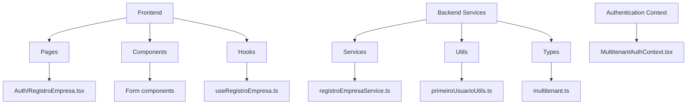
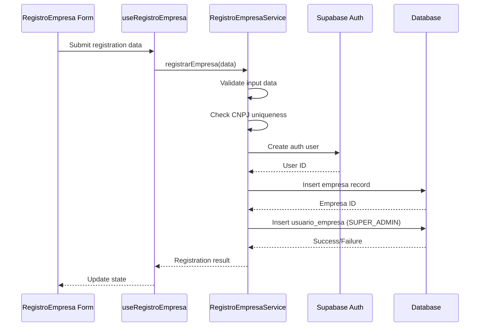
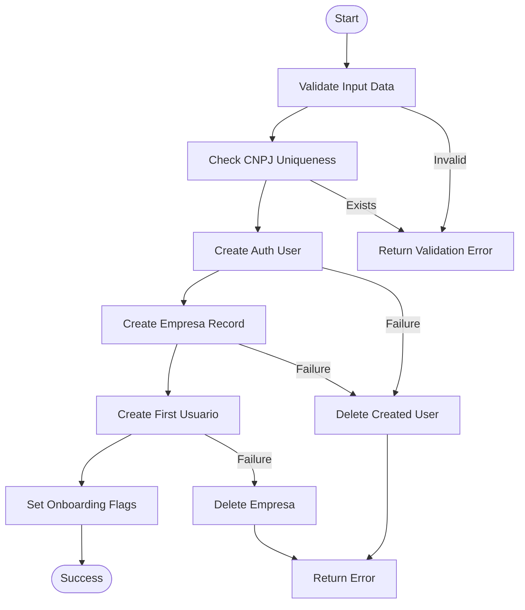
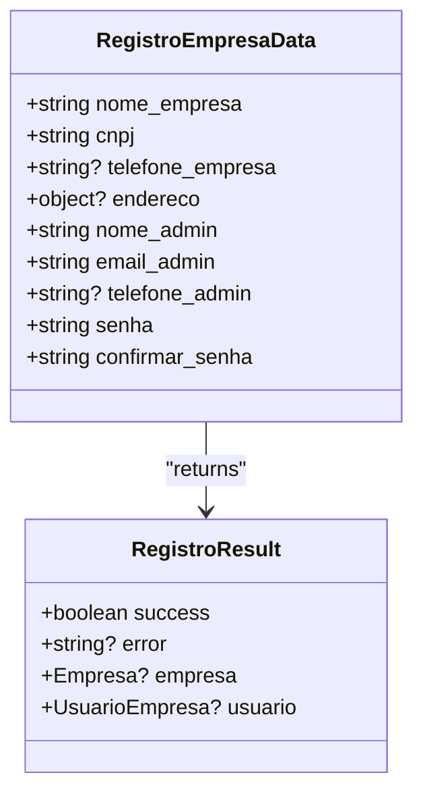
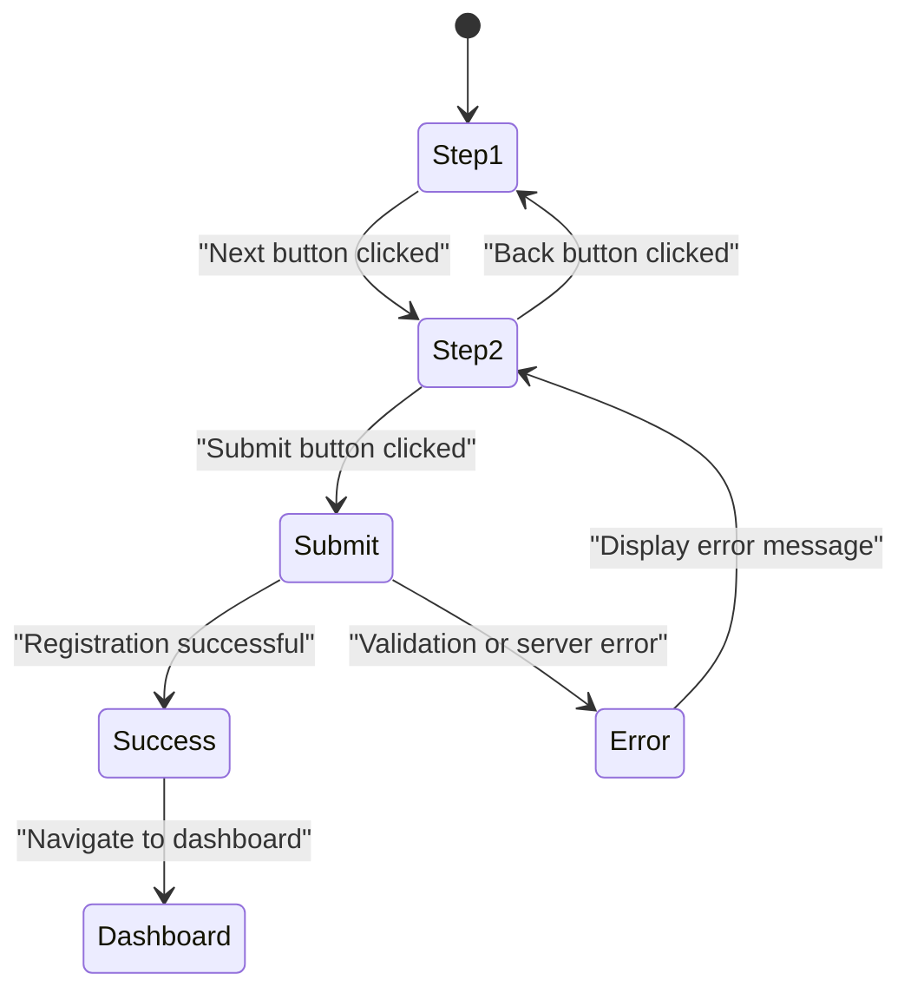
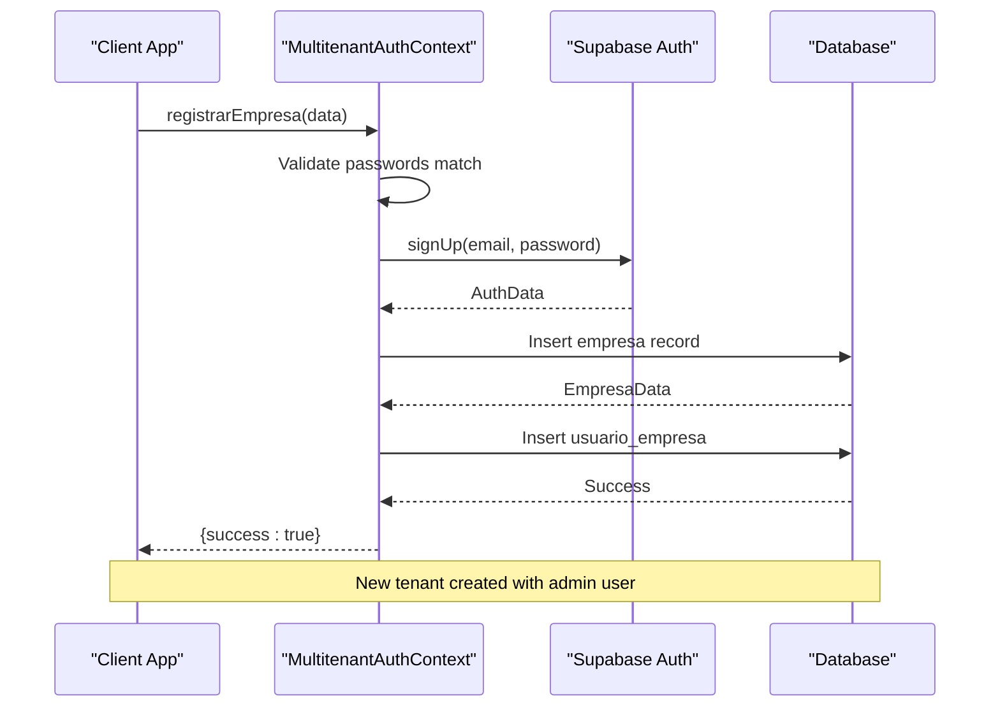
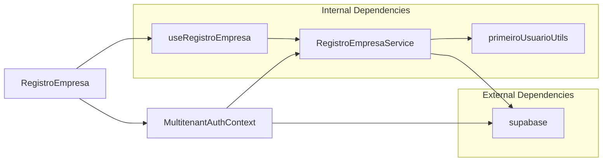

# Company Registration Workflow

<cite>
**Referenced Files in This Document**   
- [registroEmpresaService.ts](file://src/services/registroEmpresaService.ts)
- [RegistroEmpresa.tsx](file://src/pages/Auth/RegistroEmpresa.tsx)
- [MultitenantAuthContext.tsx](file://src/contexts/MultitenantAuthContext.tsx)
- [primeiroUsuarioUtils.ts](file://src/utils/primeiroUsuarioUtils.ts)
- [multitenant.ts](file://src/types/multitenant.ts)
- [create-stela-complete-flow.html](file://create-stela-complete-flow.html)
</cite>

## Table of Contents
1. [Introduction](#introduction)
2. [Project Structure](#project-structure)
3. [Core Components](#core-components)
4. [Architecture Overview](#architecture-overview)
5. [Detailed Component Analysis](#detailed-component-analysis)
6. [Dependency Analysis](#dependency-analysis)
7. [Performance Considerations](#performance-considerations)
8. [Troubleshooting Guide](#troubleshooting-guide)
9. [Conclusion](#conclusion)

## Introduction

The Company Registration Workflow in the AABB-system enables super administrators to create new tenant organizations through a secure, atomic process. This document details the end-to-end flow starting from the RegistroEmpresa form submission, focusing on how the `registrarEmpresa` function in `registroEmpresaService.ts` creates both the empresa record and its first administrator usuario_empresa entry as an atomic operation. The workflow ensures data consistency across the multitenant architecture by leveraging Supabase's authentication system and database triggers.

The registration process is designed to be user-friendly while maintaining strict validation rules for critical fields like CNPJ and email. Upon successful registration, the newly created tenant is immediately accessible within the MultitenantAuthContext, allowing seamless access to the system's functionality. The workflow also includes robust error handling for scenarios such as duplicate CNPJ or email conflicts, providing clear feedback to users.

This documentation also covers programmatic creation of companies using scripts like create-stela-complete-flow.html, which demonstrates how super administrators can bootstrap new companies with predefined configurations and permissions.

## Project Structure

The company registration functionality is distributed across several key directories in the AABB-system:

**Diagram sources**
- [RegistroEmpresa.tsx](file://src/pages/Auth/RegistroEmpresa.tsx)
- [registroEmpresaService.ts](file://src/services/registroEmpresaService.ts)
- [MultitenantAuthContext.tsx](file://src/contexts/MultitenantAuthContext.tsx)

**Section sources**
- [RegistroEmpresa.tsx](file://src/pages/Auth/RegistroEmpresa.tsx)
- [registroEmpresaService.ts](file://src/services/registroEmpresaService.ts)
- [MultitenantAuthContext.tsx](file://src/contexts/MultitenantAuthContext.tsx)

## Core Components

The company registration workflow consists of several core components that work together to create a new tenant organization atomically. The primary component is the `registrarEmpresa` method in the `RegistroEmpresaService` class, which orchestrates the entire registration process. This service validates input data, checks for existing CNPJs, creates authentication records in Supabase Auth, and inserts the empresa record into the database.

The frontend interface is implemented in the `RegistroEmpresa` component, which provides a multi-step form for collecting company and administrator information. This component uses the `useRegistroEmpresa` hook to interact with the registration service, handling loading states and error conditions appropriately.

On the backend, the `MultitenantAuthContext` provides the authentication context that manages user sessions and tenant isolation. When a new company is registered, this context ensures the newly created tenant is properly initialized and accessible.

The `PrimeiroUsuarioUtils` utility class handles the creation of the first administrator user with SUPER_ADMIN privileges, ensuring proper configuration of permissions and settings through database triggers.

**Section sources**
- [registroEmpresaService.ts](file://src/services/registroEmpresaService.ts#L16-L58)
- [RegistroEmpresa.tsx](file://src/pages/Auth/RegistroEmpresa.tsx#L15-L717)
- [MultitenantAuthContext.tsx](file://src/contexts/MultitenantAuthContext.tsx#L165-L239)
- [primeiroUsuarioUtils.ts](file://src/utils/primeiroUsuarioUtils.ts#L34-L81)

## Architecture Overview

The company registration workflow follows a layered architecture that separates concerns between presentation, business logic, and data access layers. The process begins with the user interface collecting registration data, which is then validated and processed by the service layer before being persisted to the database.

**Diagram sources**
- [registroEmpresaService.ts](file://src/services/registroEmpresaService.ts#L16-L58)
- [RegistroEmpresa.tsx](file://src/pages/Auth/RegistroEmpresa.tsx#L15-L717)
- [MultitenantAuthContext.tsx](file://src/contexts/MultitenantAuthContext.tsx#L165-L239)

## Detailed Component Analysis

### Registration Service Analysis

The `RegistroEmpresaService` class implements the core business logic for creating new tenant organizations. Its `registrarEmpresa` method follows a transactional pattern to ensure data consistency across multiple operations.

#### Validation and Uniqueness Checking

**Diagram sources**
- [registroEmpresaService.ts](file://src/services/registroEmpresaService.ts#L16-L58)
- [registroEmpresaService.ts](file://src/services/registroEmpresaService.ts#L60-L166)

**Section sources**
- [registroEmpresaService.ts](file://src/services/registroEmpresaService.ts#L16-L227)

#### Data Structures and Interfaces

The registration process relies on well-defined interfaces to ensure type safety and data integrity. The `RegistroEmpresaData` interface defines the structure of the registration payload:

**Diagram sources**
- [multitenant.ts](file://src/types/multitenant.ts#L227-L246)
- [registroEmpresaService.ts](file://src/services/registroEmpresaService.ts#L5-L10)

### Frontend Form Implementation

The `RegistroEmpresa` component implements a multi-step form that guides users through the registration process. The form collects company information in the first step and administrator details in the second step.

#### Form State Management

**Diagram sources**
- [RegistroEmpresa.tsx](file://src/pages/Auth/RegistroEmpresa.tsx#L15-L717)

**Section sources**
- [RegistroEmpresa.tsx](file://src/pages/Auth/RegistroEmpresa.tsx#L15-L717)

### Authentication Context Integration

The `MultitenantAuthContext` plays a crucial role in the registration workflow by managing the authentication state and tenant isolation. When a new company is registered, the context ensures the newly created tenant is properly initialized.

#### Context Flow

**Diagram sources**
- [MultitenantAuthContext.tsx](file://src/contexts/MultitenantAuthContext.tsx#L165-L239)

**Section sources**
- [MultitenantAuthContext.tsx](file://src/contexts/MultitenantAuthContext.tsx#L165-L239)

## Dependency Analysis

The company registration workflow has several critical dependencies that enable its functionality:

**Diagram sources**
- [registroEmpresaService.ts](file://src/services/registroEmpresaService.ts)
- [RegistroEmpresa.tsx](file://src/pages/Auth/RegistroEmpresa.tsx)
- [MultitenantAuthContext.tsx](file://src/contexts/MultitenantAuthContext.tsx)
- [primeiroUsuarioUtils.ts](file://src/utils/primeiroUsuarioUtils.ts)

**Section sources**
- [registroEmpresaService.ts](file://src/services/registroEmpresaService.ts)
- [RegistroEmpresa.tsx](file://src/pages/Auth/RegistroEmpresa.tsx)
- [MultitenantAuthContext.tsx](file://src/contexts/MultitenantAuthContext.tsx)

## Performance Considerations

The company registration workflow is optimized for performance through several mechanisms:

1. **Atomic Operations**: The registration process minimizes database round trips by batching related operations where possible.
2. **Efficient Validation**: Client-side validation reduces unnecessary server requests by catching errors early.
3. **Caching**: The `MultitenantAuthContext` caches user and company data to avoid redundant database queries after login.
4. **Indexing**: Critical fields like CNPJ and email are indexed in the database to ensure fast uniqueness checks.

The workflow avoids expensive operations during the critical path of registration, delegating non-essential tasks like sending welcome emails to background processes.

## Troubleshooting Guide

Common issues in the company registration workflow include:

**Section sources**
- [registroEmpresaService.ts](file://src/services/registroEmpresaService.ts#L16-L58)
- [MultitenantAuthContext.tsx](file://src/contexts/MultitenantAuthContext.tsx#L165-L239)
- [create-stela-complete-flow.html](file://create-stela-complete-flow.html)

### Duplicate CNPJ Errors
When attempting to register a company with an existing CNPJ, the system returns a specific error message: "CNPJ já cadastrado no sistema". This occurs because the `verificarCNPJExistente` method in `RegistroEmpresaService` performs a uniqueness check before proceeding with registration.

### Email Conflicts
If the administrator's email is already in use, the Supabase Auth system will return an error during the user creation phase. The registration service handles this by rolling back any partial changes and returning an appropriate error message to the client.

### Failed User Creation
In cases where user creation succeeds but company creation fails, the system automatically rolls back by deleting the created user from Supabase Auth. This prevents orphaned authentication records and maintains data consistency.

### Programmatic Registration Issues
When using scripts like `create-stela-complete-flow.html` for programmatic registration, ensure that:
- The Supabase URL and API key are correctly configured
- Required fields are properly populated
- Network connectivity to Supabase is stable
- Rate limits are not exceeded during bulk operations

## Conclusion

The Company Registration Workflow in the AABB-system provides a robust, secure mechanism for creating new tenant organizations. By following an atomic, transactional approach, the system ensures data consistency across the multitenant architecture. The integration between the frontend form, registration service, and authentication context creates a seamless experience for administrators while maintaining strict validation and error handling.

The workflow's design allows for both interactive registration through the web interface and programmatic creation through scripts, providing flexibility for different use cases. Future enhancements could include additional validation rules, improved error recovery mechanisms, and enhanced monitoring of registration attempts for security purposes.