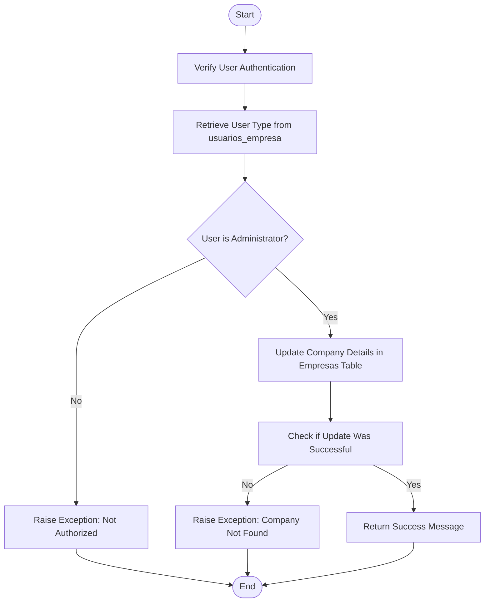
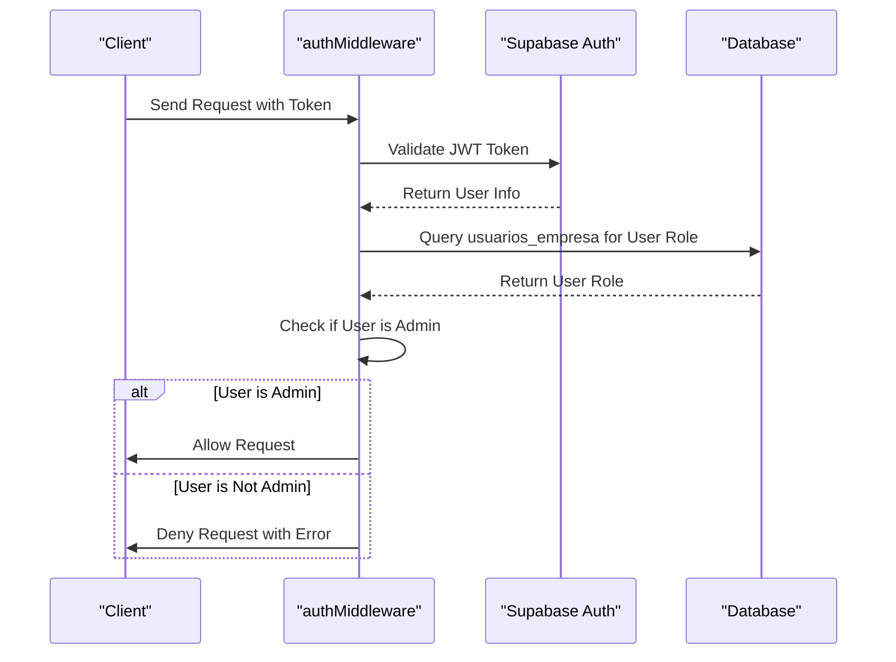

# Cross-Tenant Data Constraints

<cite>
**Referenced Files in This Document **   
- [authMiddleware.ts](file://src/middleware/authMiddleware.ts)
- [authorization-middleware.ts](file://src/services/authorization-middleware.ts)
- [ConfiguracoesEmpresa.tsx](file://src/pages/Auth/ConfiguracoesEmpresa.tsx)
- [20250117000001_add_update_empresa_function.sql](file://supabase/migrations/20250117000001_add_update_empresa_function.sql)
- [CORRECAO_CRIACAO_FUNCIONARIOS.md](file://CORRECAO_CRIACAO_FUNCIONARIOS.md)
</cite>

## Table of Contents
1. [Introduction](#introduction)
2. [Cross-Tenant Consistency and Isolation](#cross-tenant-consistency-and-isolation)
3. [update_empresa Function Implementation](#update_empresa-function-implementation)
4. [Middleware-Level Validations](#middleware-level-validations)
5. [Edge Cases and Constraint Violations](#edge-cases-and-constraint-violations)
6. [Performance Considerations and Indexing Strategies](#performance-considerations-and-indexing-strategies)
7. [Real-World Fixes from CORRECAO_CRIACAO_FUNCIONARIOS.md](#real-world-fixes-from-correcao_criacao_funcionariosmd)

## Introduction
This document details the cross-tenant data constraints within the AABB-system, focusing on maintaining consistency across tenant boundaries while preserving isolation. It covers critical operations such as global user uniqueness checks during registration, the implementation of the `update_empresa` function for scoped company modifications, middleware-level validations to ensure request integrity, handling edge cases involving cross-empresa resource assignments, performance considerations for cross-tenant queries, and indexing strategies on `empresa_id` columns. Additionally, it references real-world fixes documented in CORRECAO_CRIACAO_FUNCIONARIOS.md where constraint violations were addressed.

## Cross-Tenant Consistency and Isolation
The AABB-system enforces strict cross-tenant consistency and isolation to prevent data leakage between different empresas. Each tenant operates within its own isolated environment, ensuring that sensitive information remains protected. Global user uniqueness checks are performed during registration to guarantee that no two users across different tenants share the same credentials. This is achieved through comprehensive validation mechanisms at both the application and database levels.

**Section sources**
- [authorization-middleware.ts](file://src/services/authorization-middleware.ts#L0-L48)
- [authMiddleware.ts](file://src/middleware/authMiddleware.ts#L0-L26)

## update_empresa Function Implementation
The `update_empresa` function allows administrators to modify company details exclusively within their own tenant scope. Implemented as a PostgreSQL function, it verifies the caller's role before permitting any updates. The function ensures that only users with administrative privileges can alter company data, thereby maintaining data integrity and security.

**Diagram sources **
- [20250117000001_add_update_empresa_function.sql](file://supabase/migrations/20250117000001_add_update_empresa_function.sql#L0-L60)

**Section sources**
- [20250117000001_add_update_empresa_function.sql](file://supabase/migrations/20250117000001_add_update_empresa_function.sql#L0-L60)
- [ConfiguracoesEmpresa.tsx](file://src/pages/Auth/ConfiguracoesEmpresa.tsx#L191-L273)

## Middleware-Level Validations
Middleware-level validations in `authMiddleware.ts` intercept incoming requests to ensure that the `empresa_id` parameter matches the authenticated user's context. This prevents unauthorized access to resources belonging to other tenants. The middleware performs several checks, including token validation, user authentication, and permission verification, to enforce robust security policies.

**Diagram sources **
- [authMiddleware.ts](file://src/middleware/authMiddleware.ts#L0-L26)
- [authorization-middleware.ts](file://src/services/authorization-middleware.ts#L0-L48)

**Section sources**
- [authMiddleware.ts](file://src/middleware/authMiddleware.ts#L0-L26)
- [authorization-middleware.ts](file://src/services/authorization-middleware.ts#L0-L48)

## Edge Cases and Constraint Violations
Handling edge cases, such as attempting to assign users from one empresa to resources in another, requires careful consideration. The system must detect and reject such attempts to maintain data integrity. For instance, when creating new employees, the system generates credentials but fails to create corresponding entries in the `usuarios_empresa` table, leading to login issues. These constraint violations are identified and corrected through rigorous testing and debugging processes.

**Section sources**
- [CORRECAO_CRIACAO_FUNCIONARIOS.md](file://CORRECAO_CRIACAO_FUNCIONARIOS.md#L0-L188)

## Performance Considerations and Indexing Strategies
To optimize performance for cross-tenant queries, appropriate indexing strategies are applied to the `empresa_id` column. Indexes enhance query efficiency by allowing faster lookups and reducing the time required to retrieve relevant data. Regular performance audits and optimizations ensure that the system remains responsive even under heavy load conditions.

**Section sources**
- [ConfiguracoesEmpresa.tsx](file://src/pages/Auth/ConfiguracoesEmpresa.tsx#L191-L273)

## Real-World Fixes from CORRECAO_CRIACAO_FUNCIONARIOS.md
The document CORRECAO_CRIACAO_FUNCIONARIOS.md outlines urgent corrections for employee creation issues. Specifically, it addresses the problem where the system simulates credential generation without actually creating users in Supabase Auth or the `usuarios_empresa` table. The recommended solution involves replacing outdated hooks with updated services that handle all necessary database operations, ensuring that newly created employees can successfully log in.

**Section sources**
- [CORRECAO_CRIACAO_FUNCIONARIOS.md](file://CORRECAO_CRIACAO_FUNCIONARIOS.md#L0-L188)