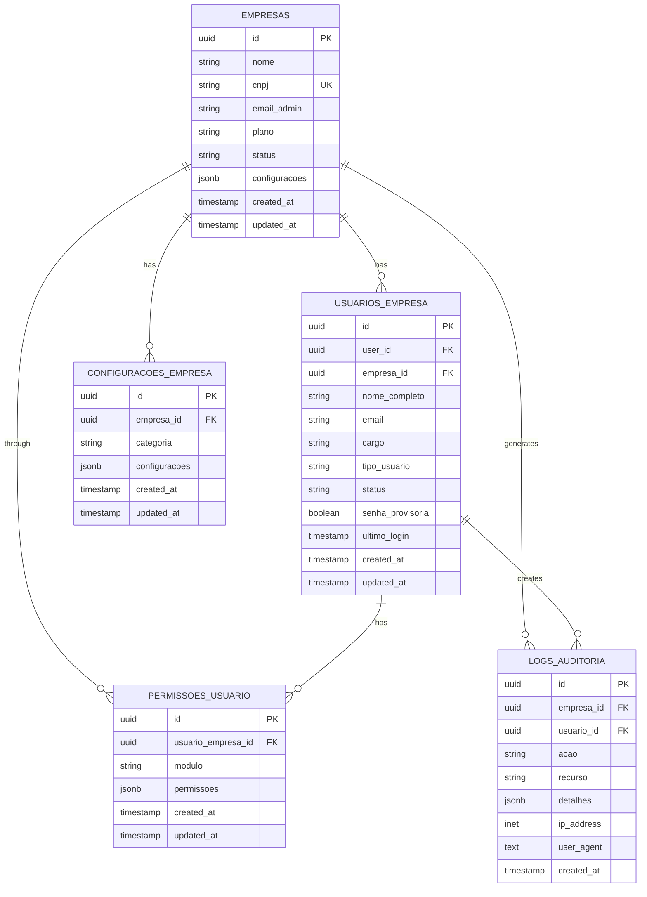
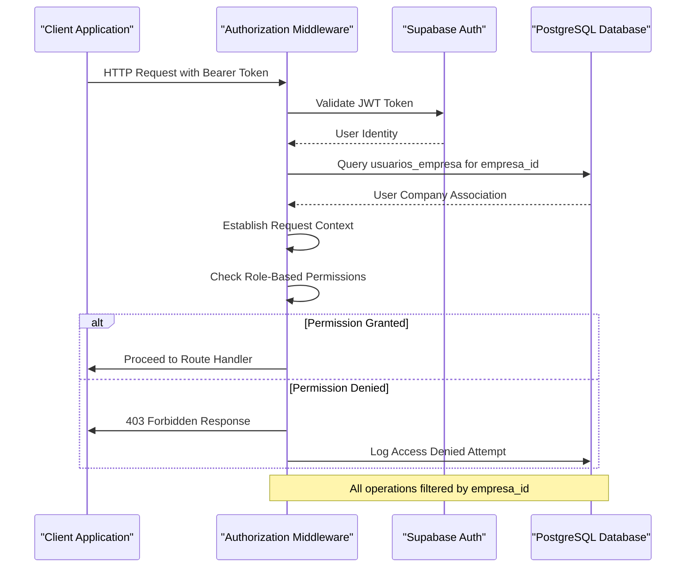
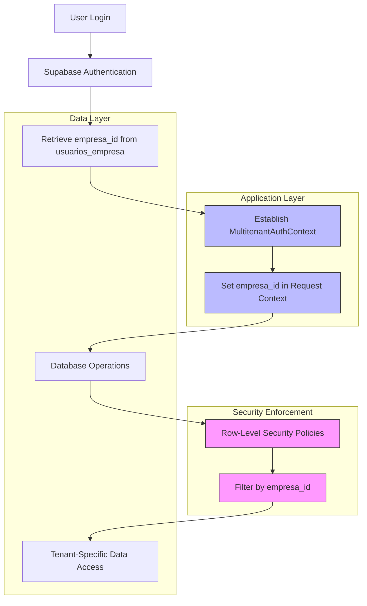

# Multi-Tenant Architecture

<cite>
**Referenced Files in This Document**   
- [MultitenantAuthContext.tsx](file://src/contexts/MultitenantAuthContext.tsx)
- [authorizationMiddleware.ts](file://src/middleware/authorizationMiddleware.ts)
- [registroEmpresaService.ts](file://src/services/registroEmpresaService.ts)
- [20250116000001_multitenant_auth_system.sql](file://supabase/migrations/20250116000001_multitenant_auth_system.sql)
- [20250117000002_fix_empresas_rls_policy.sql](file://supabase/migrations/20250117000002_fix_empresas_rls_policy.sql)
- [20250119000002_update_rls_policies_hierarchy.sql](file://supabase/migrations/20250119000002_update_rls_policies_hierarchy.sql)
</cite>

## Table of Contents
1. [Introduction](#introduction)
2. [Core Isolation Mechanisms](#core-isolation-mechanisms)
3. [Database Schema and Row-Level Security](#database-schema-and-row-level-security)
4. [Application Layer Authentication Context](#application-layer-authentication-context)
5. [Request Interception and Authorization](#request-interception-and-authorization)
6. [Tenant Provisioning Process](#tenant-provisioning-process)
7. [Infrastructure and Deployment Considerations](#infrastructure-and-deployment-considerations)
8. [Scalability and Performance](#scalability-and-performance)
9. [Backup, Recovery, and Monitoring](#backup-recovery-and-monitoring)
10. [System Context Diagrams](#system-context-diagrams)

## Introduction
The AABB-system implements a robust multi-tenant architecture that enables multiple companies (empresas) to share the same application instance while maintaining strict data isolation. This document details the technical implementation of this architecture, focusing on the integration between Supabase's Row-Level Security (RLS) policies and the application's authentication context system. The design ensures that each tenant's data remains completely isolated from others through database-level security policies, application context management, and request interception mechanisms. The architecture supports tenant-specific configurations, hierarchical user roles, and comprehensive audit logging while providing a seamless experience for users across different organizations.

## Core Isolation Mechanisms
The multi-tenant architecture employs a combination of database-level and application-level mechanisms to enforce tenant isolation. At its core, every tenant-specific table contains an `empresa_id` column that establishes ownership of records. This identifier is used by Supabase's Row-Level Security (RLS) policies to restrict data access exclusively to users belonging to the same company. The system automatically determines the current user's empresa_id through the `get_user_empresa_id()` PostgreSQL function, which queries the `usuarios_empresa` table to find the association between the authenticated user and their company. All data operations are filtered through this identifier, ensuring that cross-tenant data access is impossible even if attempted maliciously. The architecture also implements automatic population of the empresa_id field via triggers, preventing accidental or intentional omission during record creation.

**Section sources**
- [20250116000001_multitenant_auth_system.sql](file://supabase/migrations/20250116000001_multitenant_auth_system.sql#L20-L35)
- [ISOLAMENTO_MULTITENANT_CORRIGIDO.md](file://ISOLAMENTO_MULTITENANT_CORRIGIDO.md#L0-L40)

## Database Schema and Row-Level Security
The database schema implements tenant isolation through dedicated tables that store company-specific data, all linked by the empresa_id foreign key. Key tables include `empresas` (company master data), `usuarios_empresa` (user-to-company mappings), `permissoes_usuario` (role-based permissions), `configuracoes_empresa` (tenant-specific configurations), and `logs_auditoria` (audit logs). Each of these tables has RLS policies enabled, with SELECT, INSERT, UPDATE, and DELETE operations restricted based on the current user's empresa_id. The initial migration (20250116000001_multitenant_auth_system.sql) establishes these policies, while subsequent migrations refine them to support hierarchical access control. For example, the policy "Usuários podem ver apenas sua empresa" restricts company data access to only those users associated with that specific empresa_id.

**Diagram sources**
- [20250116000001_multitenant_auth_system.sql](file://supabase/migrations/20250116000001_multitenant_auth_system.sql#L20-L71)

## Application Layer Authentication Context
The application layer manages tenant context through the MultitenantAuthContext, which provides a centralized mechanism for handling authentication state and tenant information. This React context, defined in MultitenantAuthContext.tsx, maintains the current user's profile, associated company data, and permission set. When a user authenticates, the system loads their empresa information and role-based permissions into the context, making this data available throughout the application. The context includes methods for login, logout, and company registration, all of which handle the synchronization between Supabase authentication and the application's tenant-aware data model. The context also manages loading states and authentication status, providing a consistent interface for components to interact with the authentication system without directly accessing low-level APIs.

**Section sources**
- [MultitenantAuthContext.tsx](file://src/contexts/MultitenantAuthContext.tsx#L13-L317)

## Request Interception and Authorization
Authorization middleware intercepts incoming requests to enforce tenant boundaries and role-based access control. The authorizationMiddleware.ts file implements Express middleware functions that authenticate users, validate their permissions, and establish request context. The authenticate function verifies JWT tokens, retrieves the user's empresa_id from the usuarios_empresa table, and attaches user information to the request object. Subsequent authorization checks use this context to enforce access policies based on user roles (PapelUsuario) and privileges (PrivilegiosAdmin). The system implements role-based rate limiting, with different request limits for SUPER_ADMIN, ADMIN, MANAGER, and USER roles. Additionally, the middleware includes comprehensive logging capabilities, recording both successful operations and access denial attempts in the logs_auditoria table for security auditing.

**Diagram sources**
- [authorizationMiddleware.ts](file://src/middleware/authorizationMiddleware.ts#L1-L27)

## Tenant Provisioning Process
New tenants are provisioned through the registroEmpresaService, which orchestrates the creation of a new company and its first administrative user. This process begins with client-side validation of company registration data, including CNPJ format verification and password strength requirements. The service then creates a user account in Supabase Auth and inserts a new record into the empresas table with the provided company details. Immediately following company creation, the first user is registered in the usuarios_empresa table with SUPER_ADMIN privileges, establishing the initial administrative hierarchy. The provisioning process includes safeguards against duplicate CNPJs and ensures data consistency through transactional integrity. Upon successful registration, session storage is updated to trigger onboarding workflows, guiding new administrators through initial system configuration.

**Section sources**
- [registroEmpresaService.ts](file://src/services/registroEmpresaService.ts#L0-L227)

## Infrastructure and Deployment Considerations
The multi-tenant architecture is designed for deployment in cloud environments with shared infrastructure resources. All tenants operate within the same Supabase project, leveraging PostgreSQL schemas and RLS policies for logical separation rather than physical isolation. This approach optimizes resource utilization while maintaining security boundaries. The system requires proper configuration of environment variables, particularly VITE_SUPABASE_URL and VITE_SUPABASE_ANON_KEY, to establish connectivity with the database. Deployment processes must ensure that RLS policies are correctly applied through the migration scripts, with particular attention to the hierarchical access control policies introduced in later migrations. The architecture supports horizontal scaling of application servers, as tenant context is derived from authentication tokens rather than server-side sessions.

## Scalability and Performance
The architecture incorporates several performance optimizations to handle multiple tenants efficiently. Database queries are optimized through strategic indexing on empresa_id columns across all tenant-specific tables, ensuring fast filtering of tenant data. The authorization middleware implements caching for user privilege information, reducing database load by storing role permissions in memory for five minutes. Rate limiting is implemented at the middleware level, with tiered limits based on user roles to prevent abuse while accommodating administrative needs. The system also employs connection pooling through Supabase's managed PostgreSQL service, allowing efficient reuse of database connections across concurrent requests from multiple tenants.

## Backup, Recovery, and Monitoring
Tenant data protection is addressed through a combination of automated backups and monitoring strategies. While the current documentation does not specify per-tenant backup procedures, the architecture's design allows for selective data restoration by filtering on empresa_id. Audit logging is implemented comprehensively through the logs_auditoria table, which records critical operations with tenant context, enabling forensic analysis of security events. Monitoring strategies should focus on tracking authentication patterns, detecting unusual access attempts across tenant boundaries, and alerting on policy violations. The system's RLS policies provide an additional layer of protection during recovery operations, preventing restored data from becoming accessible to unauthorized tenants.

## System Context Diagrams
The following diagram illustrates the complete flow of tenant isolation from user authentication through data access, showing how various components interact to maintain separation between companies.

**Diagram sources**
- [MultitenantAuthContext.tsx](file://src/contexts/MultitenantAuthContext.tsx#L13-L317)
- [authorizationMiddleware.ts](file://src/middleware/authorizationMiddleware.ts#L1-L27)
- [20250116000001_multitenant_auth_system.sql](file://supabase/migrations/20250116000001_multitenant_auth_system.sql#L20-L35)