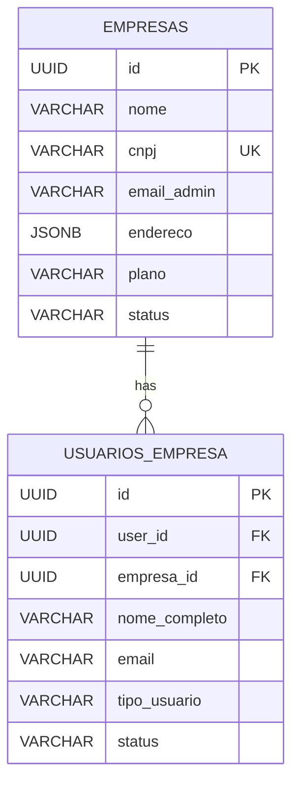

# Row Level Security Policies

<cite>
**Referenced Files in This Document**   
- [20250116000001_multitenant_auth_system.sql](file://supabase/migrations/20250116000001_multitenant_auth_system.sql)
- [20250117000002_fix_empresas_rls_policy.sql](file://supabase/migrations/20250117000002_fix_empresas_rls_policy.sql)
- [20250119000002_update_rls_policies_hierarchy.sql](file://supabase/migrations/20250119000002_update_rls_policies_hierarchy.sql)
- [20250120000001_complete_admin_hierarchy_features.sql](file://supabase/migrations/20250120000001_complete_admin_hierarchy_features.sql)
- [test-rls-policies.js](file://test-rls-policies.js)
- [supabase-integration.ts](file://src/services/supabase-integration.ts)
</cite>

## Table of Contents
1. [Introduction](#introduction)
2. [Core RLS Implementation](#core-rls-implementation)
3. [Policy Analysis by Table](#policy-analysis-by-table)
4. [Hierarchical Access Control](#hierarchical-access-control)
5. [Backend Integration](#backend-integration)
6. [Debugging and Testing](#debugging-and-testing)
7. [Common Pitfalls](#common-pitfalls)

## Introduction
The Row Level Security (RLS) implementation in the AABB-system enforces strict data isolation between tenants while enabling granular access control based on user roles and hierarchical permissions. The system ensures that users can only access data belonging to their respective empresa_id, preventing unauthorized cross-tenant access. This document details the RLS policies defined in the multitenant_auth_system.sql migration, explaining how SELECT, INSERT, UPDATE, and DELETE operations are restricted according to user roles and ownership.

**Section sources**
- [20250116000001_multitenant_auth_system.sql](file://supabase/migrations/20250116000001_multitenant_auth_system.sql#L1-L218)

## Core RLS Implementation
The RLS framework is implemented through PostgreSQL policies that evaluate user context against data ownership. Each table has specific policies that determine access rights based on the authenticated user's relationship to the data. The system uses a combination of direct ownership checks and role-based authorization to enforce security boundaries.

**Diagram sources**
- [20250116000001_multitenant_auth_system.sql](file://supabase/migrations/20250116000001_multitenant_auth_system.sql#L1-L218)
- [20250120000001_complete_admin_hierarchy_features.sql](file://supabase/migrations/20250120000001_complete_admin_hierarchy_features.sql#L1-L1)

**Section sources**
- [20250116000001_multitenant_auth_system.sql](file://supabase/migrations/20250116000001_multitenant_auth_system.sql#L1-L218)

## Policy Analysis by Table

### empresas Table Policies
The empresas table implements strict access controls to protect company-level data:

- **"Usuários podem ver apenas sua empresa"**: Allows SELECT operations only when the empresa_id matches the authenticated user's empresa_id, obtained through the get_user_empresa_id() function.
- **"Administradores podem atualizar sua empresa"**: Restricts UPDATE operations to administrators of the same empresa, verified through an EXISTS subquery checking for administrator status.

**Diagram sources**
- [20250116000001_multitenant_auth_system.sql](file://supabase/migrations/20250116000001_multitenant_auth_system.sql#L1-L218)
- [20250117000002_fix_empresas_rls_policy.sql](file://supabase/migrations/20250117000002_fix_empresas_rls_policy.sql#L1-L36)

**Section sources**
- [20250116000001_multitenant_auth_system.sql](file://supabase/migrations/20250116000001_multitenant_auth_system.sql#L1-L218)
- [20250117000002_fix_empresas_rls_policy.sql](file://supabase/migrations/20250117000002_fix_empresas_rls_policy.sql#L1-L36)

### usuarios_empresa Table Policies
The usuarios_empresa table manages user access within companies with hierarchical controls:

- **"Usuários podem ver colegas da mesma empresa"**: Enables SELECT operations for all users within the same empresa_id.
- **"Administradores podem gerenciar usuários da empresa"**: Grants ALL operations (INSERT, UPDATE, DELETE) to administrators, verified through role-based subqueries.

**Section sources**
- [20250116000001_multitenant_auth_system.sql](file://supabase/migrations/20250116000001_multitenant_auth_system.sql#L1-L218)

## Hierarchical Access Control
The system implements a sophisticated hierarchy-based access model through updated RLS policies. The 20250119000002_update_rls_policies_hierarchy.sql migration introduces role-based hierarchies where higher-level roles can manage lower-level roles:

- SUPER_ADMIN can view and edit all users
- ADMIN can manage MANAGER and USER roles
- MANAGER can manage USER roles
- Users can only view their own information

This hierarchical approach prevents privilege escalation attacks and ensures proper separation of duties.

**Diagram sources**
- [20250119000002_update_rls_policies_hierarchy.sql](file://supabase/migrations/20250119000002_update_rls_policies_hierarchy.sql#L1-L251)

**Section sources**
- [20250119000002_update_rls_policies_hierarchy.sql](file://supabase/migrations/20250119000002_update_rls_policies_hierarchy.sql#L1-L251)

## Backend Integration
The Supabase client integrates seamlessly with the RLS policies through proper authentication and session management. The supabase-integration.ts service demonstrates how frontend applications interact with RLS-protected tables while respecting security boundaries.

When a user authenticates, the system establishes their identity and associated empresa_id, which becomes the basis for all subsequent RLS evaluations. The backend services automatically include the necessary context for RLS to function correctly without requiring explicit filtering in application code.

**Section sources**
- [supabase-integration.ts](file://src/services/supabase-integration.ts#L1-L490)

## Debugging and Testing
The test-rls-policies.js script provides comprehensive testing capabilities for verifying RLS policy effectiveness. The test suite validates both the existence of required functions and the operational behavior of policies under different user contexts.

Key debugging techniques include:
- Using Supabase logs to trace policy evaluation outcomes
- Running test queries with different user roles to verify access boundaries
- Checking for proper error messages when access is denied
- Validating that legitimate access returns expected data sets

**Diagram sources**
- [test-rls-policies.js](file://test-rls-policies.js#L1-L210)

**Section sources**
- [test-rls-policies.js](file://test-rls-policies.js#L1-L210)

## Common Pitfalls
Several common issues can compromise RLS effectiveness:

- **Missing ENABLE ROW LEVEL SECURITY statements**: Without explicitly enabling RLS on a table, all rows remain accessible regardless of policies.
- **Incorrect policy logic**: Errors in USING or WITH CHECK expressions can create security gaps or prevent legitimate access.
- **Incomplete migration application**: Failing to apply all related migrations can leave the system in an inconsistent state.
- **Role misconfiguration**: Incorrect user role assignments can lead to excessive privileges or denied legitimate access.

Regular validation using the test-rls-policies.js script helps identify and resolve these issues before they impact production systems.

**Section sources**
- [20250116000001_multitenant_auth_system.sql](file://supabase/migrations/20250116000001_multitenant_auth_system.sql#L1-L218)
- [test-rls-policies.js](file://test-rls-policies.js#L1-L210)