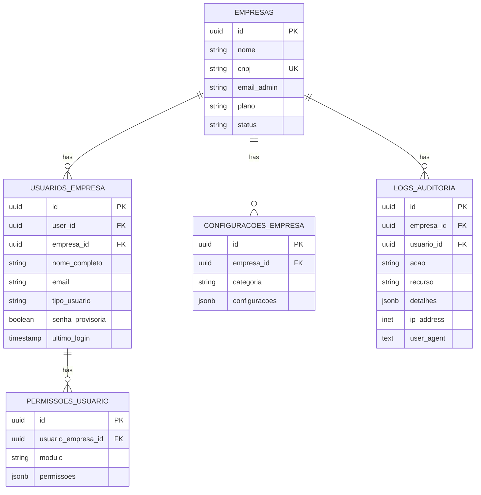
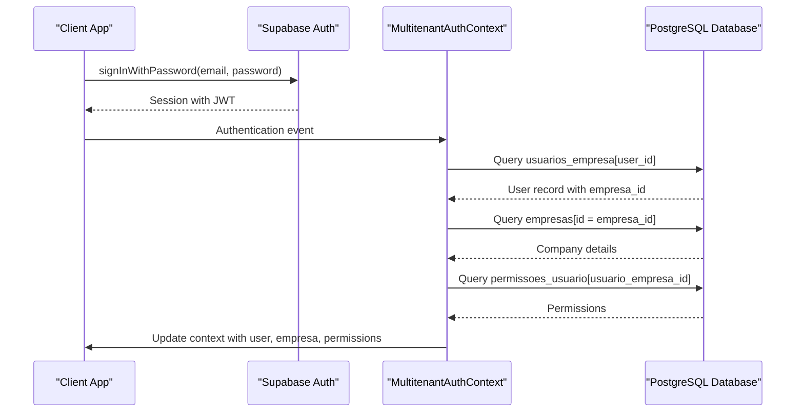
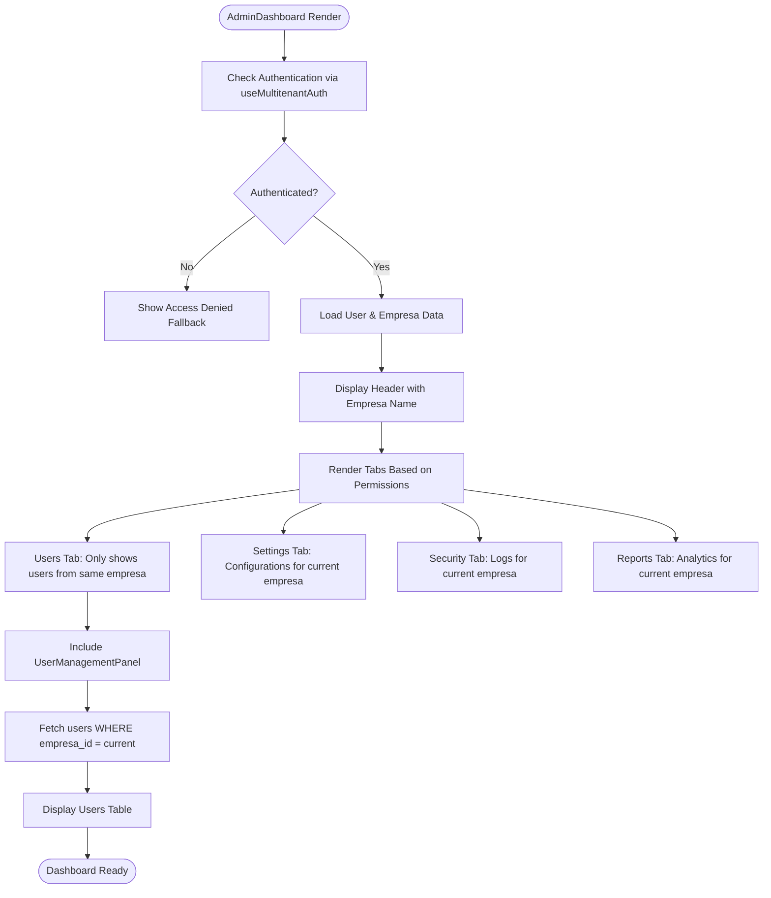

# Tenant Isolation Mechanism

<cite>
**Referenced Files in This Document**  
- [MultitenantAuthContext.tsx](file://src/contexts/MultitenantAuthContext.tsx)
- [multitenant.ts](file://src/types/multitenant.ts)
- [20250116000001_multitenant_auth_system.sql](file://supabase/migrations/20250116000001_multitenant_auth_system.sql)
- [UserManagementPanel.tsx](file://src/components/Admin/UserManagementPanel.tsx)
- [AdminDashboard.tsx](file://src/pages/Admin/AdminDashboard.tsx)
</cite>

## Table of Contents
1. [Introduction](#introduction)
2. [Data Separation Strategy](#data-separation-strategy)
3. [Database-Level Isolation](#database-level-isolation)
4. [Application Context Management](#application-context-management)
5. [Authentication Integration](#authentication-integration)
6. [Component-Level Tenant Awareness](#component-level-tenant-awareness)
7. [Security Implications and Mitigations](#security-implications-and-mitigations)
8. [Conclusion](#conclusion)

## Introduction

The AABB-system implements a robust multitenant architecture that ensures complete data isolation between different companies (empresas) within the same application instance. This documentation details the comprehensive tenant isolation mechanism that prevents cross-company data access while maintaining performance and usability. The system leverages PostgreSQL Row Level Security (RLS) policies, a custom authentication context, and strategic foreign key relationships to enforce tenant boundaries at multiple levels of the application stack.

The core principle of this isolation mechanism is the `empresa_id` foreign key pattern, which serves as the primary discriminator across all tenant-specific tables. Every operation within the system is scoped to the current user's associated company, ensuring that users can only access data belonging to their own organization. This approach provides strong security guarantees while allowing efficient scaling to support multiple tenants on shared infrastructure.

## Data Separation Strategy

The tenant isolation mechanism in the AABB-system is built around the `empresa_id` foreign key pattern, which establishes a clear relationship between data entities and their owning company. This pattern is consistently applied across all tenant-specific tables, creating a foundation for secure multitenancy.



**Diagram sources**
- [20250116000001_multitenant_auth_system.sql](file://supabase/migrations/20250116000001_multitenant_auth_system.sql#L1-L217)

**Section sources**
- [20250116000001_multitenant_auth_system.sql](file://supabase/migrations/20250116000001_multitenant_auth_system.sql#L1-L217)

## Database-Level Isolation

The database layer implements tenant isolation through a combination of foreign key constraints and Row Level Security (RLS) policies. The `empresa_id` column is present in all tenant-specific tables, establishing a direct relationship between data records and their owning company.

The cornerstone of the database isolation strategy is the `get_user_empresa_id()` PostgreSQL function, which resolves the current user's associated company by querying the `usuarios_empresa` table. This function serves as the foundation for all RLS policies, ensuring that data access is always scoped to the correct tenant.

```sql
CREATE OR REPLACE FUNCTION public.get_user_empresa_id()
RETURNS UUID
LANGUAGE SQL
SECURITY DEFINER
AS $$
  SELECT empresa_id 
  FROM public.usuarios_empresa 
  WHERE user_id = auth.uid()
  LIMIT 1;
$$;
```

This function is used within RLS policies to dynamically determine which records a user can access based on their company affiliation. For example, the policy for the `empresas` table restricts SELECT operations to only those records where the ID matches the result of `get_user_empresa_id()`:

```sql
CREATE POLICY "Usuários podem ver apenas sua empresa" ON public.empresas
  FOR SELECT USING (
    id = public.get_user_empresa_id()
  );
```

Similar policies are applied to other tenant-specific tables like `usuarios_empresa`, `permissoes_usuario`, `configuracoes_empresa`, and `logs_auditoria`, creating a consistent isolation pattern across the entire database schema.

**Section sources**
- [20250116000001_multitenant_auth_system.sql](file://supabase/migrations/20250116000001_multitenant_auth_system.sql#L92-L137)

## Application Context Management

The application layer maintains tenant context throughout the user session using the `MultitenantAuthContext` React context. This context stores the authenticated user's information, their associated company, and their permissions, providing a centralized source of truth for tenant-specific data.

```mermaid
classDiagram
class MultitenantAuthContext {
+user : UsuarioEmpresa | null
+empresa : Empresa | null
+permissoes : Record<ModuloSistema, PermissaoModulo>
+isLoading : boolean
+isAuthenticated : boolean
+login(email : string, password : string) : Promise<{ success : boolean; error? : string }>
+logout() : void
+registrarEmpresa(data : RegistroEmpresaData) : Promise<{ success : boolean; error? : string }>
+verificarPermissao(modulo : ModuloSistema, acao : keyof PermissaoModulo) : boolean
+atualizarPermissoes() : Promise<void>
}
class UsuarioEmpresa {
+id : string
+user_id : string
+empresa_id : string
+nome_completo : string
+email : string
+tipo_usuario : 'administrador' | 'funcionario'
+papel : PapelUsuario
+status : 'ativo' | 'inativo' | 'bloqueado'
+senha_provisoria : boolean
+ultimo_login? : string
}
class Empresa {
+id : string
+nome : string
+cnpj : string
+email_admin : string
+plano : 'basico' | 'premium' | 'enterprise'
+status : 'ativo' | 'inativo' | 'suspenso'
+configuracoes : Record<string, any>
}
class PermissaoModulo {
+visualizar : boolean
+criar : boolean
+editar : boolean
+excluir : boolean
+administrar? : boolean
}
MultitenantAuthContext --> UsuarioEmpresa : "contains"
MultitenantAuthContext --> Empresa : "contains"
MultitenantAuthContext --> PermissaoModulo : "contains"
```

**Diagram sources**
- [MultitenantAuthContext.tsx](file://src/contexts/MultitenantAuthContext.tsx#L13-L317)
- [multitenant.ts](file://src/types/multitenant.ts#L1-L297)

**Section sources**
- [MultitenantAuthContext.tsx](file://src/contexts/MultitenantAuthContext.tsx#L13-L317)
- [multitenant.ts](file://src/types/multitenant.ts#L1-L297)

## Authentication Integration

The tenant isolation mechanism integrates with Supabase Auth through a one-to-many relationship between `auth.users` and the `usuarios_empresa` table. When a user authenticates with Supabase, the system uses the `user_id` from the authentication token to look up their corresponding record in `usuarios_empresa`, which contains the `empresa_id` that determines their tenant context.

This integration is implemented in the `carregarDadosUsuario` function within the `MultitenantAuthProvider`, which executes when a user successfully authenticates:



**Diagram sources**
- [MultitenantAuthContext.tsx](file://src/contexts/MultitenantAuthContext.tsx#L13-L317)

**Section sources**
- [MultitenantAuthContext.tsx](file://src/contexts/MultitenantAuthContext.tsx#L13-L317)

## Component-Level Tenant Awareness

Key components in the application respect tenant boundaries by leveraging the `MultitenantAuthContext` to ensure all operations are scoped to the correct company. Two prominent examples are the `AdminDashboard` and `UserManagementPanel` components, which demonstrate how tenant isolation is maintained at the UI level.

The `AdminDashboard` component uses the `useMultitenantAuth` hook to access the current user and company context, displaying information specific to the user's organization:



Similarly, the `UserManagementPanel` component ensures that user management operations are constrained to the current company by using the `empresa_id` from the authentication context when querying and modifying user records.

**Diagram sources**
- [AdminDashboard.tsx](file://src/pages/Admin/AdminDashboard.tsx#L6-L205)
- [UserManagementPanel.tsx](file://src/components/Admin/UserManagementPanel.tsx#L13-L339)

**Section sources**
- [AdminDashboard.tsx](file://src/pages/Admin/AdminDashboard.tsx#L6-L205)
- [UserManagementPanel.tsx](file://src/components/Admin/UserManagementPanel.tsx#L13-L339)

## Security Implications and Mitigations

The tenant isolation mechanism addresses several critical security concerns inherent in multitenant systems. The primary risk is cross-tenant data access, where a user from one company could potentially access data belonging to another company. The AABB-system mitigates this risk through multiple layers of protection.

The most significant mitigation is the use of PostgreSQL Row Level Security (RLS) policies, which enforce data isolation at the database level. Even if an attacker were to bypass application-level controls, the RLS policies would still prevent unauthorized access to data from other tenants. Additionally, the `get_user_empresa_id()` function runs with `SECURITY DEFINER` privileges, ensuring it can access the necessary data to resolve the user's company affiliation.

Another potential vulnerability is improper handling of the `empresa_id` parameter in API calls. To prevent this, the system uses the `registrar_log_auditoria` RPC function, which accepts `p_empresa_id` as a parameter but validates it against the current user's company before proceeding. This ensures that even if a malicious client attempts to specify a different `empresa_id`, the operation will be rejected.

The system also implements comprehensive audit logging through the `logs_auditoria` table, which records all significant actions along with the associated `empresa_id` and `usuario_id`. This provides a complete trail of activity that can be used for security monitoring and incident investigation.

Finally, the application includes automated tests that verify the isolation mechanism works correctly. These tests create multiple companies and users, then attempt cross-tenant operations to ensure they are properly blocked by the RLS policies.

**Section sources**
- [20250116000001_multitenant_auth_system.sql](file://supabase/migrations/20250116000001_multitenant_auth_system.sql#L1-L217)
- [isolamento-multitenant.test.ts](file://src/__tests__/security/isolamento-multitenant.test.ts#L1-L368)

## Conclusion

The tenant isolation mechanism in the AABB-system provides a robust and comprehensive solution for securing multitenant data. By combining database-level RLS policies, application context management, and careful component design, the system ensures that each company's data remains completely isolated from others.

The `empresa_id` foreign key pattern serves as the foundation for this isolation, creating a clear and consistent relationship between data entities and their owning company. The `get_user_empresa_id()` PostgreSQL function enables dynamic resolution of tenant context, while the `MultitenantAuthContext` maintains this context throughout the user session.

Integration with Supabase Auth through the one-to-many relationship between `auth.users` and `usuarios_empresa` provides a seamless authentication experience while maintaining strict tenant boundaries. Components like `AdminDashboard` and `UserManagementPanel` demonstrate how tenant awareness is maintained at the UI level, ensuring that all operations are properly scoped.

The security implications of improper isolation are addressed through multiple layers of protection, including RLS policies, parameter validation, audit logging, and automated testing. Together, these measures create a secure multitenant environment that protects sensitive company data while enabling efficient resource sharing across tenants.