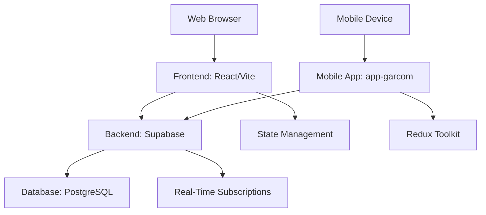
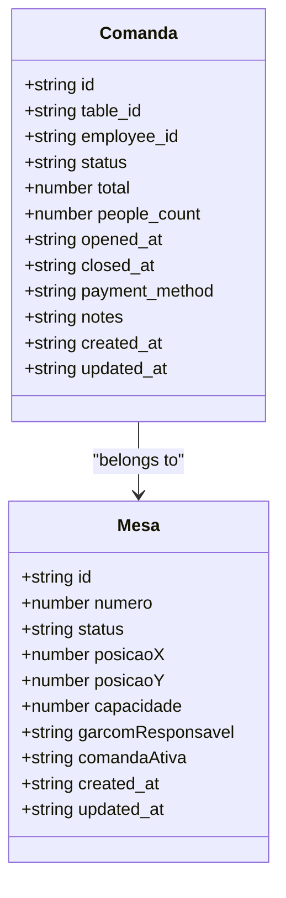
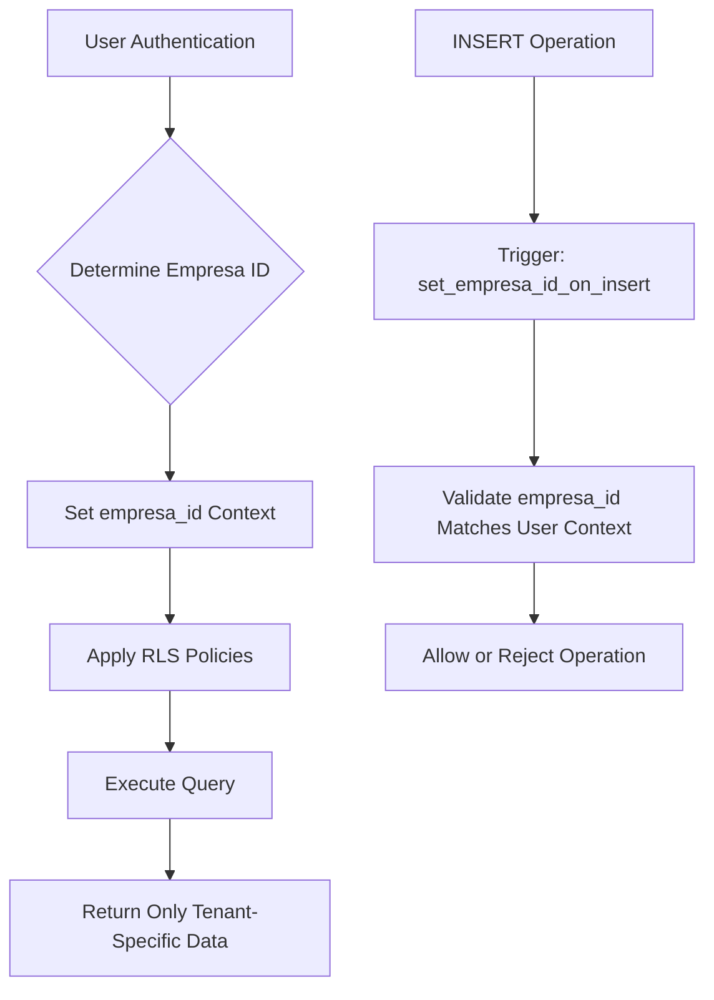
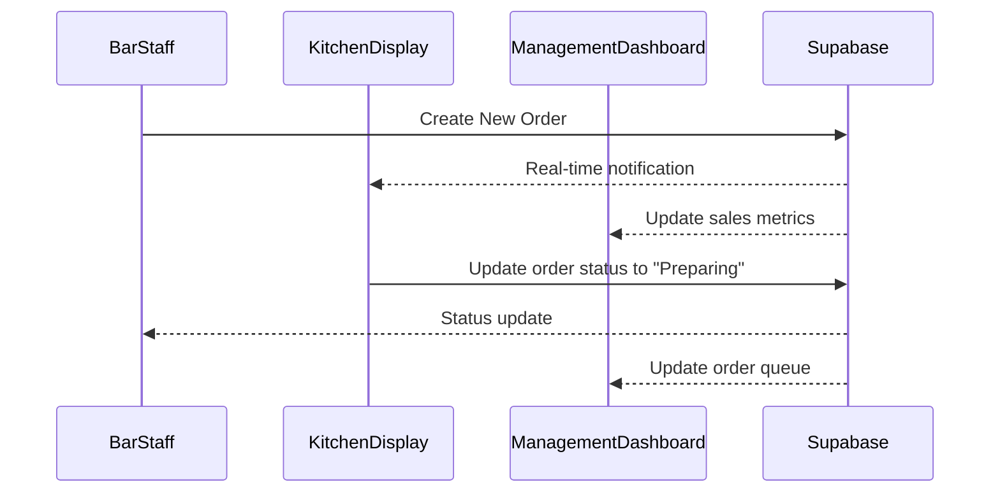
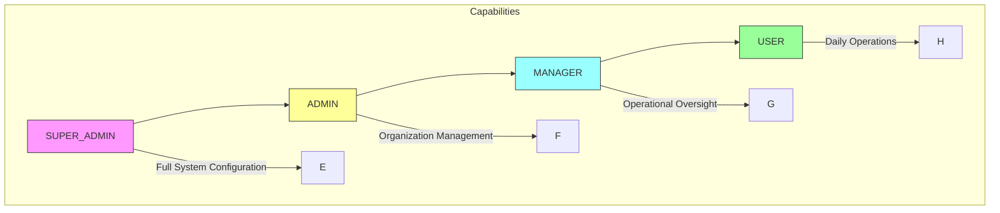

# System Overview

<cite>
**Referenced Files in This Document**   
- [README.md](file://README.md)
- [app-garcom/README.md](file://app-garcom/README.md)
- [src/config/supabase.ts](file://src/config/supabase.ts)
- [src/lib/supabase.ts](file://src/lib/supabase.ts)
- [src/hooks/useAuthWithHierarchy.ts](file://src/hooks/useAuthWithHierarchy.ts)
- [src/contexts/MultitenantAuthContext.tsx](file://src/contexts/MultitenantAuthContext.tsx)
- [src/types/index.ts](file://src/types/index.ts)
- [ISOLAMENTO_MULTITENANT_CORRIGIDO.md](file://ISOLAMENTO_MULTITENANT_CORRIGIDO.md)
</cite>

## Table of Contents
1. [Introduction](#introduction)
2. [System Architecture](#system-architecture)
3. [Core Components and Data Models](#core-components-and-data-models)
4. [Multi-Tenant Design and Security](#multi-tenant-design-and-security)
5. [Real-Time Synchronization](#real-time-synchronization)
6. [Role-Based Access Control](#role-based-access-control)
7. [Application Relationships](#application-relationships)

## Introduction

The AABB-system is a comprehensive club management platform designed to streamline operations for recreational and sports clubs. It integrates multiple critical functionalities including bar management, kitchen operations, inventory control, member administration, and cash management into a unified system. The platform serves as a central hub for managing daily operations, providing real-time insights, and optimizing resource utilization across various departments within a club environment.

This documentation provides an architectural overview of the system, focusing on its full-stack implementation, multi-tenant design, and integration between the main web application and the mobile waiter app (app-garcom). The system has been built with scalability and security in mind, enabling clubs to efficiently manage their operations while maintaining data isolation and role-based access controls.

**Section sources**
- [README.md](file://README.md)

## System Architecture

The AABB-system follows a modern full-stack architecture with a clear separation between frontend, backend, and database layers. The system leverages React/Vite for the frontend interface, Supabase as the backend-as-a-service platform, and PostgreSQL as the underlying database engine. This architecture enables rapid development, real-time data synchronization, and easy deployment.

**Diagram sources**
- [README.md](file://README.md)
- [app-garcom/README.md](file://app-garcom/README.md)

**Section sources**
- [README.md](file://README.md)
- [app-garcom/README.md](file://app-garcom/README.md)

## Core Components and Data Models

The system revolves around several core concepts that represent the fundamental entities in club operations. These include Comandas (tabs/orders), Mesas (tables), and employee hierarchies that govern access and responsibilities within the system.

A Comanda represents a customer's order or tab at the bar or restaurant, containing items ordered, associated table, and payment status. Each Comanda is linked to a specific Mesa (table) where customers are seated, allowing staff to track orders by physical location within the establishment.

**Diagram sources**
- [src/types/index.ts](file://src/types/index.ts#L343-L363)
- [app-garcom/src/types/Comanda.ts](file://app-garcom/src/types/Comanda.ts#L0-L16)
- [app-garcom/src/types/Mesa.ts](file://app-garcom/src/types/Mesa.ts#L0-L12)

**Section sources**
- [src/types/index.ts](file://src/types/index.ts#L343-L363)
- [app-garcom/src/types/Comanda.ts](file://app-garcom/src/types/Comanda.ts#L0-L16)
- [app-garcom/src/types/Mesa.ts](file://app-garcom/src/types/Mesa.ts#L0-L12)

## Multi-Tenant Design and Security

The system implements a robust multi-tenant architecture that ensures complete data isolation between different clubs or organizations using the platform. This design allows multiple independent entities to operate on the same infrastructure while maintaining strict separation of their data and configurations.

Tenant isolation is achieved through several mechanisms:
1. All database tables include an `empresa_id` field that associates records with a specific organization
2. Row-Level Security (RLS) policies in Supabase enforce that users can only access data belonging to their organization
3. Database triggers automatically set the `empresa_id` based on the authenticated user's context
4. A dedicated `empresas` table manages organization-level information and settings

**Diagram sources**
- [ISOLAMENTO_MULTITENANT_CORRIGIDO.md](file://ISOLAMENTO_MULTITENANT_CORRIGIDO.md#L41-L73)
- [src/contexts/MultitenantAuthContext.tsx](file://src/contexts/MultitenantAuthContext.tsx#L13-L13)

**Section sources**
- [ISOLAMENTO_MULTITENANT_CORRIGIDO.md](file://ISOLAMENTO_MULTITENANT_CORRIGIDO.md#L41-L73)
- [src/contexts/MultitenantAuthContext.tsx](file://src/contexts/MultitenantAuthContext.tsx)

## Real-Time Synchronization

The system leverages Supabase's real-time capabilities to provide instant updates across all connected clients. This feature is critical for coordinating operations between different departments such as bar, kitchen, and management staff who need up-to-the-minute information about orders, inventory levels, and table status.

Real-time synchronization is implemented through Supabase's WebSocket-based subscription system, which pushes changes to relevant data channels whenever records are created, updated, or deleted. The frontend applications subscribe to these channels and update their local state accordingly, ensuring all users see consistent and current information without requiring manual page refreshes.

**Diagram sources**
- [src/lib/supabase.ts](file://src/lib/supabase.ts#L24-L53)

**Section sources**
- [src/lib/supabase.ts](file://src/lib/supabase.ts)

## Role-Based Access Control

The system implements a hierarchical role-based access control system that defines user privileges and administrative capabilities. This structure ensures that users have appropriate access to features and data based on their position within the organization.

There are four primary roles in the system:
- **SUPER_ADMIN**: Full system access, including configuration and security settings
- **ADMIN**: Administrative functions within their organization, excluding security settings
- **MANAGER**: Operational management capabilities, including reporting and supervision
- **USER**: Basic operational functions related to their daily tasks

The hierarchy establishes clear delegation patterns where higher-level roles can manage users with lower-level roles, but not vice versa. This prevents privilege escalation and maintains organizational control over user permissions.

**Diagram sources**
- [src/hooks/useAuthWithHierarchy.ts](file://src/hooks/useAuthWithHierarchy.ts#L29-L157)

**Section sources**
- [src/hooks/useAuthWithHierarchy.ts](file://src/hooks/useAuthWithHierarchy.ts)

## Application Relationships

The ecosystem consists of two main applications that work together to provide comprehensive coverage of club operations: the main web application and the mobile waiter app (app-garcom). These applications share the same backend infrastructure and database, ensuring consistency of data across platforms.

The main web application serves as the central management console, providing comprehensive dashboards, reporting tools, and administrative functions for managers and administrators. It offers detailed views of financial performance, inventory levels, member statistics, and operational metrics.

The mobile waiter app (app-garcom) is designed for frontline staff, particularly waiters and service personnel. Built with React Native and Expo, it provides a touch-optimized interface for taking orders, managing tables, and processing payments directly from the floor. The app supports offline operation with automatic synchronization when connectivity is restored, ensuring uninterrupted service during network fluctuations.

Both applications connect to the same Supabase backend, sharing real-time updates and maintaining data consistency. This integrated approach allows seamless coordination between management staff using the web interface and service staff using mobile devices, creating an efficient workflow from order placement to fulfillment and payment processing.

**Section sources**
- [README.md](file://README.md)
- [app-garcom/README.md](file://app-garcom/README.md)