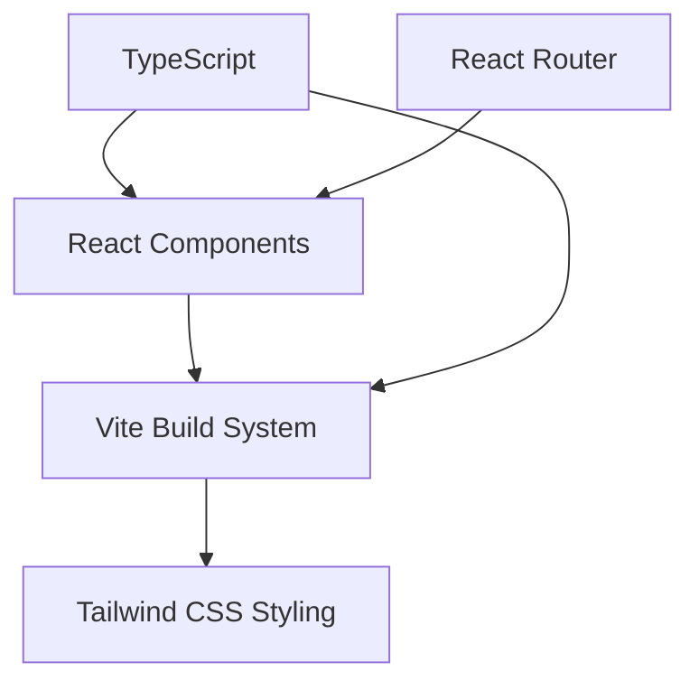
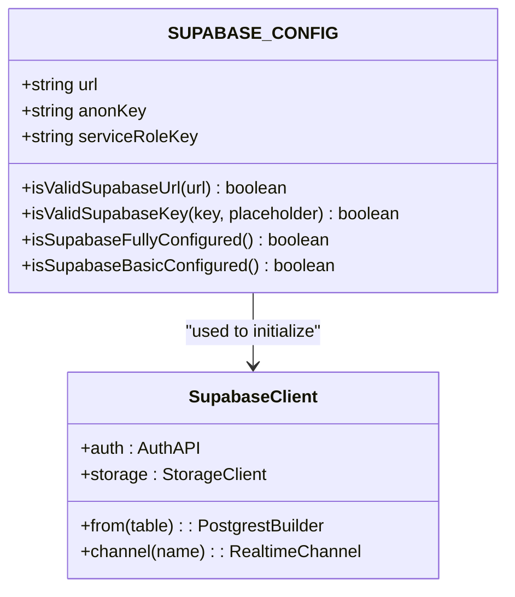

# Technology Stack & Dependencies

<cite>
**Referenced Files in This Document**   
- [package.json](file://package.json)
- [vite.config.ts](file://vite.config.ts)
- [tailwind.config.js](file://tailwind.config.js)
- [vitest.config.ts](file://vitest.config.ts)
- [src/config/supabase.ts](file://src/config/supabase.ts)
- [app-garcom/package.json](file://app-garcom/package.json)
</cite>

## Table of Contents
1. [Frontend Technologies](#frontend-technologies)
2. [Backend Services](#backend-services)
3. [Testing Frameworks](#testing-frameworks)
4. [Build Tools](#build-tools)
5. [Critical Dependencies](#critical-dependencies)
6. [Development Environment Setup](#development-environment-setup)
7. [Technology Integration Points](#technology-integration-points)
8. [Performance Implications](#performance-implications)

## Frontend Technologies

The frontend architecture leverages modern JavaScript technologies to deliver a responsive and maintainable user interface. The primary stack consists of React, TypeScript, Vite, Tailwind CSS, and React Router.

React serves as the foundation for building component-based UIs, enabling reusable and composable interface elements across the application. The implementation uses React 19.1.0, taking advantage of the latest performance optimizations and concurrent rendering features.

TypeScript provides static typing throughout the codebase, enhancing code quality and developer experience through type safety, better autocompletion, and improved refactoring capabilities. The configuration is managed through `tsconfig.json` files at various levels of the project structure.

Vite acts as the build tool and development server, offering fast hot module replacement (HMR) and optimized production builds. The Vite configuration (`vite.config.ts`) includes the React plugin and environment variable prefixing to ensure proper loading of Supabase credentials during development and production.



**Diagram sources**
- [vite.config.ts](file://vite.config.ts#L1-L11)
- [package.json](file://package.json#L15-L30)

Tailwind CSS provides utility-first styling with a responsive design system, allowing for rapid UI development without writing custom CSS. The configuration (`tailwind.config.js`) scans all source files to purge unused styles in production, significantly reducing bundle size.

React Router enables client-side routing for the web application, managing navigation between different views and pages while maintaining proper URL state and browser history.

**Section sources**
- [package.json](file://package.json#L15-L30)
- [vite.config.ts](file://vite.config.ts#L1-L11)
- [tailwind.config.js](file://tailwind.config.js#L1-L14)

## Backend Services

The backend infrastructure is powered entirely by Supabase, an open-source Firebase alternative that provides several integrated services on top of PostgreSQL.

Supabase Auth handles user authentication and authorization, supporting email/password login, session management, and secure token generation. The authentication system integrates with PostgreSQL Row Level Security (RLS) policies to enforce data access controls at the database level.

PostgreSQL serves as the relational database, storing all application data with ACID compliance and robust querying capabilities. The schema is managed through migration files in the `supabase/migrations` directory, ensuring version-controlled database evolution.

Supabase Realtime enables live data synchronization between clients and the database through WebSockets, allowing multiple users to see updates instantly without manual refreshing. This is particularly valuable for collaborative features and real-time dashboards.

Supabase Storage provides file storage capabilities for documents, images, and other binary data, with configurable access policies and integration with the authentication system.

The Supabase configuration is centralized in `src/config/supabase.ts`, which validates environment variables and ensures proper setup before initializing the client. This approach prevents runtime errors due to misconfiguration.



**Diagram sources**
- [src/config/supabase.ts](file://src/config/supabase.ts#L3-L31)

**Section sources**
- [src/config/supabase.ts](file://src/config/supabase.ts#L3-L31)
- [supabase/migrations](file://supabase/migrations)

## Testing Frameworks

The testing strategy combines Vitest and Jest to provide comprehensive test coverage across different aspects of the application.

Vitest serves as the primary testing framework, chosen for its seamless integration with Vite and exceptional speed. It runs tests in a Node.js environment with jsdom for DOM simulation, enabling realistic component testing. The configuration (`vitest.config.ts`) sets up global variables and establishes path aliases to match the build system.

Jest is used through `@testing-library/jest-dom` for additional DOM assertions and matchers that enhance test readability and reliability. The testing library ecosystem (`@testing-library/react`, `@testing-library/user-event`) enables behavior-driven testing that simulates real user interactions.

The test suite includes various categories:
- Unit tests for hooks and utility functions
- Integration tests for authentication flows
- Component tests with mock dependencies
- Coverage reporting for quality assurance

Test scripts are defined in `package.json`, providing commands for development (`test:ui`), continuous integration (`test:run`), and coverage analysis (`test:coverage`). Specific test suites can be executed using targeted scripts like `test:auth` for authentication-related tests.

**Section sources**
- [package.json](file://package.json#L7-L14)
- [vitest.config.ts](file://vitest.config.ts#L1-L14)

## Build Tools

The build infrastructure centers around Vite, which provides both development server capabilities and production build optimization.

Vite leverages native ES modules and esbuild for lightning-fast startup times and hot module replacement. During development, it serves code over native ESM, eliminating the need for bundling and enabling near-instant server start.

For production builds, Vite uses Rollup under the hood to generate optimized assets with code splitting, tree shaking, and minification. The build process automatically optimizes dependencies and generates source maps for debugging.

Additional tooling includes:
- ESLint with TypeScript support for code quality enforcement
- Prettier for consistent code formatting
- TypeScript compiler for type checking

The development workflow is streamlined through npm scripts in `package.json`, allowing developers to run `dev`, `build`, `lint`, and `preview` commands with minimal configuration.

**Section sources**
- [package.json](file://package.json#L7-L14)
- [vite.config.ts](file://vite.config.ts#L1-L11)

## Critical Dependencies

The application relies on several key dependencies that provide essential functionality:

### @supabase/supabase-js
Version: ^2.56.1 (web), ^2.57.4 (mobile)
Purpose: Official Supabase client library for connecting to the Supabase backend services including Auth, Database, Realtime, and Storage.

### zod
Version: ^4.1.9 (web), ^4.1.8 (mobile)
Purpose: TypeScript-first schema validation library used for form validation, API response validation, and type safety. Enables runtime type checking with compile-time type inference.

### framer-motion
Version: ^12.23.12
Purpose: Production-ready motion library for React that enables complex animations and gestures with minimal code. Used for page transitions, component animations, and interactive feedback.

### recharts
Version: ^3.1.2
Purpose: Composable charting library built on React components and D3, used for data visualization in analytics dashboards and reporting features.

Other notable dependencies include:
- react-router-dom: Client-side routing
- react-hook-form: Form state management with validation
- @heroicons/react: SVG icon library
- lucide-react: Another icon set for UI elements
- date-fns: Date manipulation utilities
- axios: HTTP client for external API calls

```mermaid
flowchart TD
A[zod Validation] --> B[Form Submission]
C[framer-motion] --> D[UI Animations]
E[recharts] --> F[Data Visualization]
G[@supabase/supabase-js] --> H[Database Operations]
G --> I[Authentication]
G --> J[Realtime Updates]
G --> K[File Storage]
```

**Diagram sources**
- [package.json](file://package.json#L15-L30)

**Section sources**
- [package.json](file://package.json#L15-L30)
- [app-garcom/package.json](file://app-garcom/package.json#L15-L30)

## Development Environment Setup

To set up the development environment, the following requirements must be met:

Node.js version 18.x or higher is required, as specified by the Vite and React 19 dependencies. The project uses modern JavaScript features that require recent Node.js versions.

npm or yarn can be used as the package manager. After cloning the repository, install dependencies with:
```bash
npm install
```
or
```bash
yarn install
```

Environment variables must be configured in a `.env` file or through the hosting platform. Essential variables include:
- VITE_SUPABASE_URL: Supabase project URL
- VITE_SUPABASE_ANON_KEY: Supabase anonymous key
- VITE_SUPABASE_SERVICE_ROLE_KEY: Supabase service role key (for server-side operations)

The development server can be started with:
```bash
npm run dev
```

For mobile development (app-garcom), Expo CLI is required:
```bash
npm install -g expo-cli
npm run start
```

The codebase follows strict linting rules enforced by ESLint and formatting rules by Prettier, ensuring consistent code style across the team.

**Section sources**
- [package.json](file://package.json#L7-L14)
- [app-garcom/package.json](file://app-garcom/package.json#L7-L14)

## Technology Integration Points

The technology stack components integrate through well-defined interfaces and patterns:

The Supabase client is initialized once with configuration from environment variables and then provided to React components through context providers. This allows any component to access database, auth, and realtime functionality.

TypeScript types are shared between frontend and backend through generated types from the Supabase schema, ensuring type safety across the entire stack. Zod schemas validate data at entry points and provide type inference for downstream processing.

Vite's alias configuration (`@` → `/src`) enables clean import paths throughout the codebase, improving maintainability and reducing relative path complexity.

The testing framework shares configuration with the build system, using the same path aliases and environment setup to ensure tests accurately reflect runtime behavior.

React Router integrates with authentication guards to protect routes based on user roles and permissions, redirecting unauthorized users to login pages.

**Section sources**
- [vite.config.ts](file://vite.config.ts#L1-L11)
- [vitest.config.ts](file://vitest.config.ts#L1-L14)
- [src/config/supabase.ts](file://src/config/supabase.ts#L3-L31)

## Performance Implications

The chosen technology stack has several performance implications:

Vite's use of native ESM and esbuild results in extremely fast development server startup (typically under 1 second) and instant hot module replacement, significantly improving developer productivity.

Tree shaking and code splitting in the Vite production build minimize bundle sizes by only including used code, leading to faster initial load times.

Supabase's realtime functionality reduces the need for polling and manual refreshes, decreasing network overhead and providing immediate feedback to users.

The combination of React 19's concurrent rendering and framer-motion's optimized animation engine ensures smooth 60fps animations even on lower-end devices.

Zod's lightweight validation has minimal runtime overhead compared to reflection-based validators, preserving performance while ensuring data integrity.

Potential performance considerations include:
- Bundle size growth as more dependencies are added
- Database query optimization needs as data volume increases
- Memory usage monitoring for long-running realtime connections
- Careful management of React re-renders in complex component hierarchies

The stack is designed to scale efficiently, with Supabase handling database scaling and Vite optimizing asset delivery through modern web standards.

**Section sources**
- [vite.config.ts](file://vite.config.ts#L1-L11)
- [package.json](file://package.json#L15-L30)
- [src/config/supabase.ts](file://src/config/supabase.ts#L3-L31)