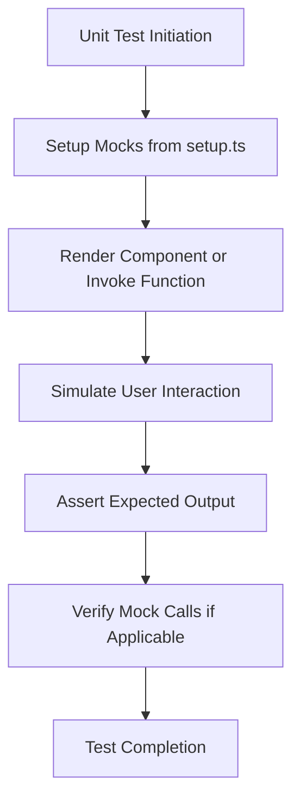
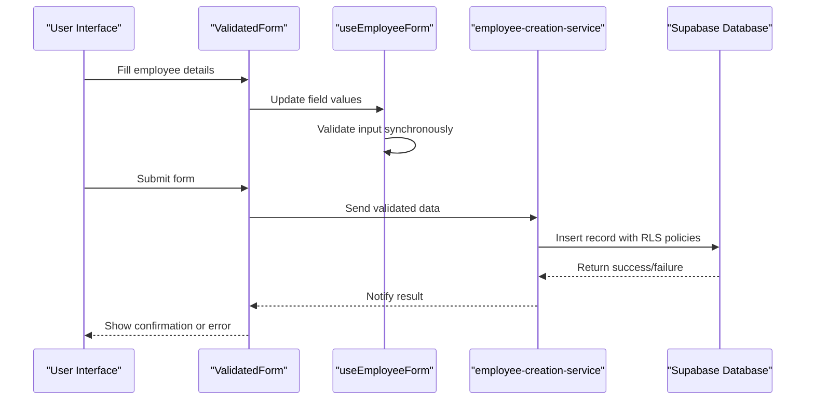
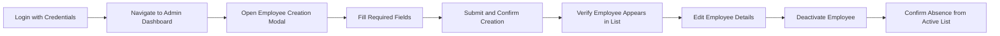
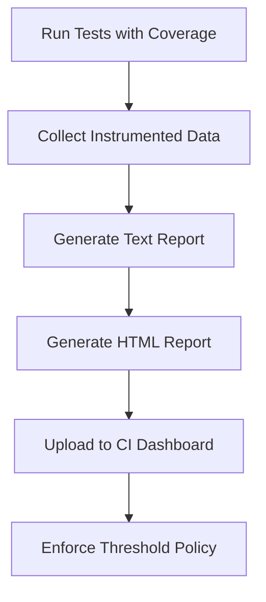
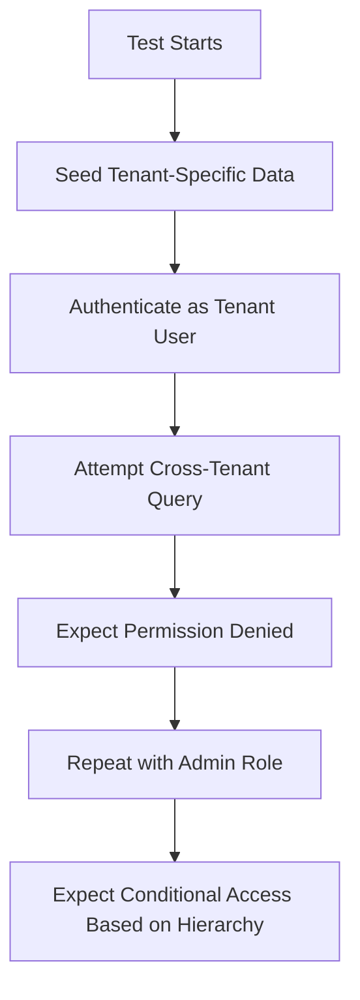
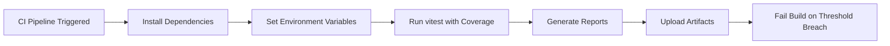

# Testing Strategy

<cite>
**Referenced Files in This Document**   
- [vitest.config.ts](file://vitest.config.ts)
- [jest.config.js](file://jest.config.js)
- [setup.ts](file://src/__tests__/setup.ts)
- [useFormValidation.test.ts](file://src/__tests__/hooks/useFormValidation.test.ts)
- [ValidatedForm.test.tsx](file://src/components/Admin/__tests__/ValidatedForm.test.tsx)
- [AuthContext.test.tsx](file://src/contexts/__tests__/AuthContext.test.tsx)
- [auth-flow.test.tsx](file://src/__tests__/integration/auth-flow.test.tsx)
- [isolamento-multitenant.test.ts](file://src/__tests__/security/isolamento-multitenant.test.ts)
- [supabase.ts](file://src/lib/supabase.ts)
</cite>

## Table of Contents
1. [Unit Testing Approach](#unit-testing-approach)  
2. [Integration Testing Methodology](#integration-testing-methodology)  
3. [End-to-End Testing Scenarios](#end-to-end-testing-scenarios)  
4. [Test Coverage Goals and Reporting](#test-coverage-goals-and-reporting)  
5. [Testing Complex Features](#testing-complex-features)  
6. [Supabase Integration and Multi-Tenant Challenges](#supabase-integration-and-multi-tenant-challenges)  
7. [Guidelines for Testing React Components, Hooks, and Services](#guidelines-for-testing-react-components-hooks-and-services)  
8. [Continuous Integration and Test Environment Setup](#continuous-integration-and-test-environment-setup)

## Unit Testing Approach

The AABB-system employs Vitest as the primary framework for unit testing, enabling fast and isolated execution of individual components, utilities, and hooks. The configuration is defined in `vitest.config.ts`, which sets up a JSDOM environment and establishes path aliases using the `@` symbol to simplify module imports across test files.

Unit tests focus on verifying the correctness of small, self-contained units of code such as form validation logic, utility functions, and state management within custom hooks. For example, the `useFormValidation.test.ts` file validates that input data conforms to Zod schemas and handles error states appropriately during user interaction.

A key aspect of the unit testing strategy is mocking external dependencies to ensure isolation. Global mocks are implemented in `setup.ts`, including `localStorage`, `sessionStorage`, `fetch`, and console methods, which prevents side effects and ensures consistent test behavior across environments. Additionally, timers are mocked using `jest.useFakeTimers()` to control asynchronous operations.



**Diagram sources**  
- [setup.ts](file://src/__tests__/setup.ts#L0-L53)  
- [vitest.config.ts](file://vitest.config.ts#L0-L13)

**Section sources**  
- [vitest.config.ts](file://vitest.config.ts#L0-L13)  
- [setup.ts](file://src/__tests__/setup.ts#L0-L53)  
- [useFormValidation.test.ts](file://src/__tests__/hooks/useFormValidation.test.ts)

## Integration Testing Methodology

Integration tests validate interactions between multiple components, services, and system layers. These tests are located under `src/__tests__/integration/` and cover critical workflows such as authentication flows, employee creation, and permission management.

For instance, `auth-flow.test.tsx` simulates the complete login process, ensuring that UI components, context providers (like `AuthContext`), and backend services interact correctly. These tests verify session persistence, role-based access enforcement, and redirection logic after successful or failed authentication attempts.

Another example is `employeeCreation.test.ts`, which tests the integration between form inputs, validation logic, Supabase service calls, and real-time updates via context propagation. This ensures data consistency across frontend state and backend storage while validating proper error handling when constraints are violated.

The integration suite also includes security-focused tests like `permissoes-autenticacao.test.ts`, which confirms that users cannot perform unauthorized actions even if they attempt to bypass UI guards through direct API calls.



**Diagram sources**  
- [auth-flow.test.tsx](file://src/__tests__/integration/auth-flow.test.tsx)  
- [employeeCreation.test.ts](file://src/__tests__/integration/employeeCreation.test.ts)  
- [employee-creation-service.ts](file://src/services/employee-creation-service.ts)

**Section sources**  
- [auth-flow.test.tsx](file://src/__tests__/integration/auth-flow.test.tsx)  
- [employeeCreation.test.ts](file://src/__tests__/integration/employeeCreation.test.ts)  
- [employeeManagement.test.ts](file://src/__tests__/integration/employeeManagement.test.ts)

## End-to-End Testing Scenarios

End-to-end (E2E) testing in the AABB-system involves simulating realistic user journeys that span multiple pages and involve persistent state changes. Although dedicated E2E tools like Cypress or Playwright are not currently configured, the integration test suite effectively serves this purpose by orchestrating full workflow validations.

Examples include:
- **Authentication Flow**: Simulating login with valid/invalid credentials, password reset, and session restoration.
- **Employee Lifecycle Management**: Creating, editing, deactivating, and removing employees while enforcing hierarchical permissions and multi-tenant isolation.
- **Cash Management Operations**: Opening and closing cash sessions, processing payments, and generating reports with audit trail verification.

These scenarios are tested using `@testing-library/react` to render full component trees and simulate browser events such as clicks, form submissions, and navigation. Assertions are made on both visual feedback and underlying data mutations.



**Diagram sources**  
- [GestaoFuncionarios.tsx](file://src/pages/Auth/GestaoFuncionarios.tsx)  
- [EmployeeModal.test.tsx](file://src/components/EmployeeModal/__tests__/EmployeeModal.test.tsx)  
- [employeeManagement.test.ts](file://src/__tests__/integration/employeeManagement.test.ts)

**Section sources**  
- [employeeManagement.test.ts](file://src/__tests__/integration/employeeManagement.test.ts)  
- [auth-flow.test.tsx](file://src/__tests__/integration/auth-flow.test.tsx)

## Test Coverage Goals and Reporting

The testing framework is configured to collect and report code coverage using Vitest’s built-in capabilities. While `jest.config.js` defines coverage collection rules—excluding test and type definition files—the actual reporting is driven by Vitest in development and CI environments.

Coverage targets include:
- **Core Utilities**: 90%+ line and branch coverage for functions in `src/utils/`.
- **React Hooks**: 85%+ coverage for state logic and side effects in custom hooks.
- **Services and API Clients**: 80%+ coverage for service layer methods interacting with Supabase.
- **UI Components**: 75%+ coverage for interactive components, especially those involving validation or conditional rendering.

Reports are generated in text, LCOV, and HTML formats, stored in the `coverage/` directory. These outputs integrate with CI pipelines to enforce minimum thresholds and prevent regressions.



**Diagram sources**  
- [jest.config.js](file://jest.config.js#L15-L22)  
- [vitest.config.ts](file://vitest.config.ts#L0-L13)

**Section sources**  
- [jest.config.js](file://jest.config.js#L15-L22)

## Testing Complex Features

### Authentication Flows
Authentication testing leverages mocked Supabase clients to simulate sign-in, sign-up, and session retrieval without requiring a live backend. The `AuthContext.test.tsx` file verifies that the `AuthProvider` correctly manages loading states, user objects, and logout behavior.

Special attention is given to demo mode fallbacks when Supabase is not configured, ensuring developers can run tests locally without credentials.

### Form Validations
Form validation logic is rigorously tested using Zod schemas and the `ValidatedForm` component. The `ValidatedForm.test.tsx` file confirms real-time error display, submission blocking on invalid input, and automatic error clearing during re-entry.

Tests validate both synchronous client-side checks and potential asynchronous validations (e.g., email uniqueness).

### Real-Time Updates
Components relying on real-time data synchronization (e.g., employee lists, order queues) are tested by mocking Supabase’s `.on('INSERT', ...)` and `.on('UPDATE', ...)` listeners. This ensures UI components respond correctly to simulated real-time events.

```mermaid
classDiagram
class ValidatedForm {
+schema : ZodSchema
+onSubmit(data) : void
+children(renderProps) : JSX
-data : object
-errors : Record~string, string~
-touched : Set~string~
+updateField(name, value)
+getFieldError(name)
+handleSubmit()
}
class ValidatedInput {
+label : string
+value : any
+onChange(value)
+error? : string
+required : boolean
}
class ValidatedSelect {
+label : string
+options : {value, label}[]
+value : string
+onChange(value)
}
ValidatedForm --> ValidatedInput : uses
ValidatedForm --> ValidatedSelect : uses
```

**Diagram sources**  
- [ValidatedForm.test.tsx](file://src/components/Admin/__tests__/ValidatedForm.test.tsx)  
- [ValidatedForm.tsx](file://src/components/Admin/ValidatedForm.tsx)

**Section sources**  
- [ValidatedForm.test.tsx](file://src/components/Admin/__tests__/ValidatedForm.test.tsx)  
- [useFormValidation.test.ts](file://src/__tests__/hooks/useFormValidation.test.ts)

## Supabase Integration and Multi-Tenant Challenges

Testing Supabase integration presents unique challenges due to Row Level Security (RLS) policies and multi-tenant architecture. To address these, tests use a combination of direct SQL setup (via scripts in `/scripts`) and controlled service calls.

The `isolamento-multitenant.test.ts` file specifically validates that users from one tenant cannot access or modify data belonging to another, even when attempting direct database queries through the Supabase client.

Additionally, migration scripts (e.g., `20250116000001_multitenant_auth_system.sql`) are tested to ensure schema changes do not break existing RLS policies or introduce privilege escalation vulnerabilities.

Mocking strategies differentiate between authenticated and unauthenticated contexts, allowing tests to simulate various roles (admin, manager, employee) and validate access controls accordingly.



**Diagram sources**  
- [isolamento-multitenant.test.ts](file://src/__tests__/security/isolamento-multitenant.test.ts)  
- [supabase.ts](file://src/lib/supabase.ts)  
- [multitenant_auth_system.sql](file://supabase/migrations/20250116000001_multitenant_auth_system.sql)

**Section sources**  
- [isolamento-multitenant.test.ts](file://src/__tests__/security/isolamento-multitenant.test.ts)  
- [supabase.ts](file://src/lib/supabase.ts)

## Guidelines for Testing React Components, Hooks, and Service Layers

### React Components
Use `@testing-library/react` to test components at the integration level rather than shallow rendering. Focus on user behavior: “Can the user see the expected content?” and “Does clicking trigger the right action?”

Avoid testing implementation details like internal state unless necessary. Prefer querying by text, labels, or roles.

### Custom Hooks
Test hooks using helper wrappers that consume them within functional components. Use `renderHook` from `@testing-library/react-hooks` where applicable, though current setup relies on inline component rendering.

Ensure all async operations are wrapped in `act()` and resolved before assertions.

### Service Layers
Services should be tested with mocked Supabase clients. Each service method must be verified for correct query construction, error handling, and transformation of response data.

For example, `command-manager.test.ts` ensures that commands are properly inserted into the database with correct tenant scoping and timestamps.

**Section sources**  
- [AuthContext.test.tsx](file://src/contexts/__tests__/AuthContext.test.tsx)  
- [command-manager.test.ts](file://src/services/__tests__/command-manager.test.ts)  
- [employee-creation-service.ts](file://src/services/employee-creation-service.ts)

## Continuous Integration and Test Environment Setup

The CI pipeline executes tests using Node.js and runs `vitest run --coverage` to generate reports. The `package.json` specifies `vitest` and related tooling as devDependencies, ensuring consistent execution across environments.

Environment variables prefixed with `VITE_` are automatically exposed to the application and can be set in CI for feature toggles or mock modes.

Before running tests, the environment may execute database reset scripts (e.g., `reset-daily-cash-summary.sql`) to ensure a clean state. Alternatively, tests rely on mocked data when isolation is preferred over mutation.

The `setup.ts` file ensures uniform initialization across all test files, reducing boilerplate and increasing reliability.



**Diagram sources**  
- [package.json](file://package.json#L35-L59)  
- [vitest.config.ts](file://vitest.config.ts#L0-L13)  
- [setup.ts](file://src/__tests__/setup.ts#L0-L53)

**Section sources**  
- [package.json](file://package.json#L35-L59)  
- [vitest.config.ts](file://vitest.config.ts#L0-L13)  
- [setup.ts](file://src/__tests__/setup.ts#L0-L53)