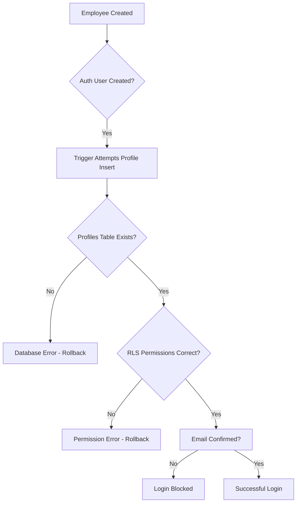
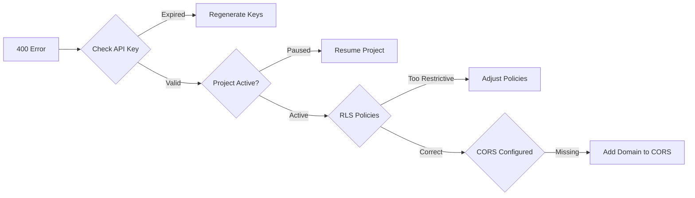
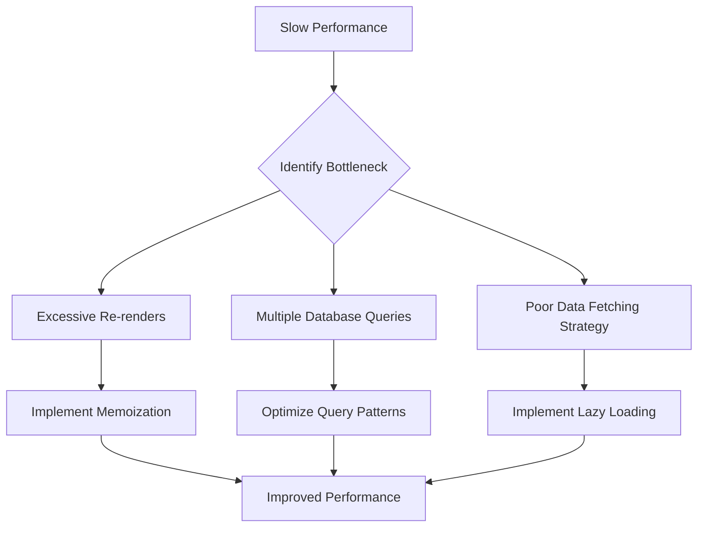
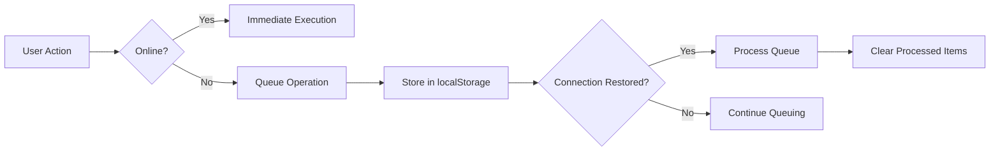

# Troubleshooting Guide

<cite>
**Referenced Files in This Document **   
- [employee-creation-service.ts](file://src/services/employee-creation-service.ts)
- [authErrors.ts](file://src/utils/authErrors.ts)
- [useNetworkStatus.ts](file://src/hooks/useNetworkStatus.ts)
- [NetworkNotification.tsx](file://src/components/NetworkNotification.tsx)
- [ErrorNotification.tsx](file://src/components/ErrorRecovery/ErrorNotification.tsx)
- [ConnectionTester.tsx](file://src/components/Admin/ConnectionTester.tsx)
- [CORRECAO_ERROS_400.md](file://CORRECAO_ERROS_400.md)
- [DIAGNOSTICO_CREDENCIAIS.md](file://DIAGNOSTICO_CREDENCIAIS.md)
- [PERFORMANCE_OPTIMIZATIONS.md](file://PERFORMANCE_OPTIMIZATIONS.md)
- [AnalyticsDashboard.tsx](file://src/components/Analytics/AnalyticsDashboard.tsx)
</cite>

## Table of Contents
1. [Authentication Issues](#authentication-issues)
2. [Database Problems](#database-problems)
3. [Performance Bottlenecks](#performance-bottlenecks)
4. [UI and Connectivity Issues](#ui-and-connectivity-issues)
5. [Data Inconsistency and Race Conditions](#data-inconsistency-and-race-conditions)
6. [Debugging Techniques](#debugging-techniques)
7. [Escalation Paths](#escalation-paths)

## Authentication Issues

This section addresses common authentication problems, particularly related to employee creation and credential management.

### Problem: Invalid Credentials After Employee Creation
**Symptom**: Newly created employees cannot log in with generated temporary credentials despite successful creation process.

**Diagnostic Steps**:
1. Check browser console for "Credenciais Inválidas" error messages
2. Verify Supabase Auth logs for failed login attempts
3. Confirm email confirmation status in Supabase dashboard
4. Review employee creation service logs for trigger failures

**Root Cause Analysis**:
The issue stems from the Supabase `handle_new_user` trigger failing when attempting to insert into the profiles table. This occurs due to either missing tables, RLS policy conflicts, or unconfirmed emails preventing authentication.



**Verified Solutions**:
1. **Ensure Admin Client Configuration**: Use service role key to create users with automatic email confirmation
2. **Create Profiles Table**: Execute SQL to create missing profiles table if it doesn't exist
3. **Confirm Existing Emails**: Run update query to confirm emails for existing users
4. **Temporary Trigger Disable**: Disable trigger during migration, then re-enable after fixes

**Section sources**
- [employee-creation-service.ts](file://src/services/employee-creation-service.ts#L4-L799)
- [DIAGNOSTICO_CREDENCIAIS.md](file://DIAGNOSTICO_CREDENCIAIS.md)

## Database Problems

This section covers database-related issues affecting system stability and data integrity.

### Problem: 400 Bad Request Errors on Supabase Calls
**Symptom**: HTTP 400 errors when making requests to Supabase endpoints, particularly during authentication and data retrieval.

**Diagnostic Steps**:
1. Open `debug-supabase-400-errors.html` and run diagnostic tests
2. Check network tab for failed requests to auth/v1/token endpoint
3. Verify Supabase project status in dashboard
4. Test API connectivity using ConnectionTester component

**Root Cause Analysis**:
400 errors typically result from one of four causes: expired API keys, paused Supabase projects, overly restrictive RLS policies, or CORS configuration issues. The most common cause is an expired anon key requiring regeneration.



**Verified Solutions**:
1. **Regenerate API Keys**: Obtain new anon and service_role keys from Supabase dashboard
2. **Resume Paused Projects**: Reactivate projects suspended due to inactivity
3. **Adjust RLS Policies**: Temporarily disable row level security for testing
4. **Configure CORS**: Add application domains to allowed origins

**Section sources**
- [CORRECAO_ERROS_400.md](file://CORRECAO_ERROS_400.md)
- [ConnectionTester.tsx](file://src/components/Admin/ConnectionTester.tsx#L291-L318)

## Performance Bottlenecks

This section addresses performance issues affecting system responsiveness and user experience.

### Problem: Slow Dashboard Loading and Rendering
**Symptom**: Dashboard takes several seconds to load, with noticeable UI lag during interactions.

**Diagnostic Steps**:
1. Open Chrome DevTools Performance tab and record page load
2. Analyze First Contentful Paint (FCP) and Largest Contentful Paint (LCP) metrics
3. Check AnalyticsDashboard component for slow operations
4. Monitor network tab for excessive database queries

**Root Cause Analysis**:
Performance degradation results from unoptimized rendering, excessive re-renders, and inefficient data fetching patterns. The system initially made 4-6 simultaneous queries compared to the optimized 1-2 queries.



**Verified Solutions**:
1. **Enable Optimized Context**: Set USE_OPTIMIZED_CONTEXT to true in performance config
2. **Implement Virtual Scrolling**: For large lists like employee records
3. **Use Code Splitting**: Load modules dynamically based on route
4. **Configure Caching**: Implement TTL-based caching for frequently accessed data

**Section sources**
- [PERFORMANCE_OPTIMIZATIONS.md](file://PERFORMANCE_OPTIMIZATIONS.md)
- [AnalyticsDashboard.tsx](file://src/components/Analytics/AnalyticsDashboard.tsx#L286-L434)

## UI and Connectivity Issues

This section covers user interface problems and network connectivity challenges.

### Problem: Unstable Network Connection Handling
**Symptom**: Application fails to handle offline scenarios gracefully, losing data during connection interruptions.

**Diagnostic Steps**:
1. Use Chrome DevTools Network tab to simulate offline mode
2. Attempt to create employees while offline
3. Check localStorage for saved offline data
4. Restore connection and verify data synchronization

**Root Cause Analysis**:
The system lacked robust offline-first capabilities, risking data loss during network interruptions. Without proper queuing mechanisms, operations would fail immediately when connectivity was lost.



**Verified Solutions**:
1. **Implement useNetworkStatus Hook**: Monitor online/offline state changes
2. **Add NetworkNotification Component**: Provide visual feedback on connection status
3. **Enable Offline Storage**: Use localStorage to queue operations during downtime
4. **Automatic Sync**: Resume processing queued operations when connection restores

**Section sources**
- [useNetworkStatus.ts](file://src/hooks/useNetworkStatus.ts#L2-L31)
- [NetworkNotification.tsx](file://src/components/NetworkNotification.tsx#L33-L61)

## Data Inconsistency and Race Conditions

This section addresses issues related to data synchronization and concurrent access.

### Problem: Employee Data Inconsistency Across Tables
**Symptom**: Employee information appears correct in some modules but missing or incorrect in others.

**Diagnostic Steps**:
1. Trace employee creation flow through all relevant services
2. Check transaction boundaries in employee-creation-service
3. Verify foreign key relationships between tables
4. Review error handling in multi-step processes

**Root Cause Analysis**:
Data inconsistency occurs when partial failures happen during the multi-step employee creation process. If one step succeeds but subsequent steps fail, orphaned records remain without proper cleanup.

**Verified Solutions**:
1. **Implement Transaction Management**: Wrap related operations in database transactions
2. **Add Cleanup Procedures**: Remove previously created records when later steps fail
3. **Enhance Error Logging**: Capture detailed context for debugging inconsistencies
4. **Validate Cross-Table References**: Ensure referential integrity across related entities

**Section sources**
- [employee-creation-service.ts](file://src/services/employee-creation-service.ts#L4-L799)
- [ErrorNotification.tsx](file://src/components/ErrorRecovery/ErrorNotification.tsx#L109-L145)

## Debugging Techniques

This section provides methodologies for diagnosing and resolving system issues.

### Browser Developer Tools Usage
Utilize Chrome DevTools to diagnose frontend issues:

1. **Console Tab**: Monitor JavaScript errors and debug messages
2. **Network Tab**: Analyze API calls, response times, and payload sizes
3. **Application Tab**: Inspect localStorage for offline data storage
4. **Performance Tab**: Record and analyze runtime performance

### Server Log Analysis
Monitor backend operations through structured logging:

1. **Check Service Logs**: Review employee-creation-service execution details
2. **Analyze Error Patterns**: Identify recurring issues from log entries
3. **Trace Operation Flow**: Follow request processing through multiple components
4. **Monitor Retry Mechanisms**: Verify exponential backoff functionality

### Database Query Investigation
Use direct SQL queries to validate data integrity:

```sql
-- Check for orphaned employee records
SELECT * FROM bar_employees 
WHERE id NOT IN (SELECT employee_id FROM usuarios_empresa);

-- Verify email confirmation status
SELECT id, email, email_confirmed_at 
FROM auth.users 
WHERE email_confirmed_at IS NULL;
```

**Section sources**
- [employee-creation-service.ts](file://src/services/employee-creation-service.ts#L4-L799)
- [authErrors.ts](file://src/utils/authErrors.ts#L79-L97)

## Escalation Paths

For unresolved issues, follow this escalation procedure:

1. **Collect Diagnostic Information**:
   - Browser console logs
   - Network request/response details
   - Timestamps of occurrence
   - User roles and permissions
   - Specific error messages

2. **Verify Basic Configuration**:
   - Confirm Supabase project status
   - Validate API key configuration
   - Check RLS policy settings
   - Ensure proper CORS configuration

3. **Contact Support With**:
   - Detailed description of the problem
   - Steps to reproduce the issue
   - Collected diagnostic information
   - Screenshots or screen recordings
   - Affected user accounts

When reporting issues, include the output from running diagnostic HTML files like `debug-supabase-400-errors.html` and `test-database-error-fix.html`, as these provide critical system health information.

**Section sources**
- [CORRECAO_ERROS_400.md](file://CORRECAO_ERROS_400.md)
- [DIAGNOSTICO_CREDENCIAIS.md](file://DIAGNOSTICO_CREDENCIAIS.md)