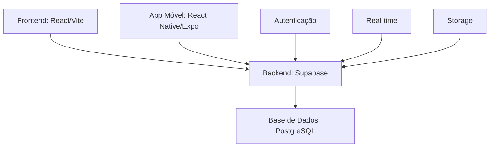
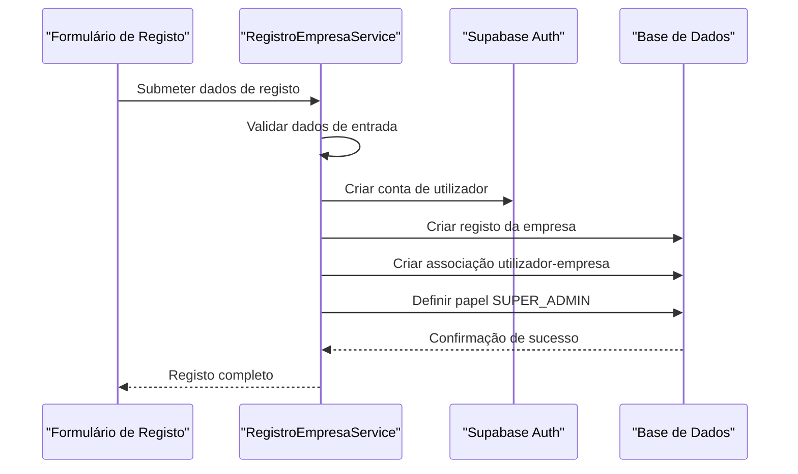
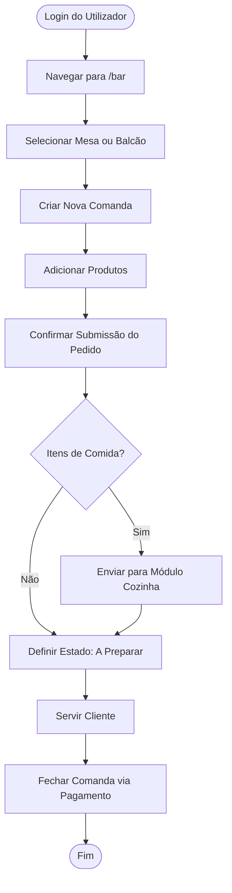
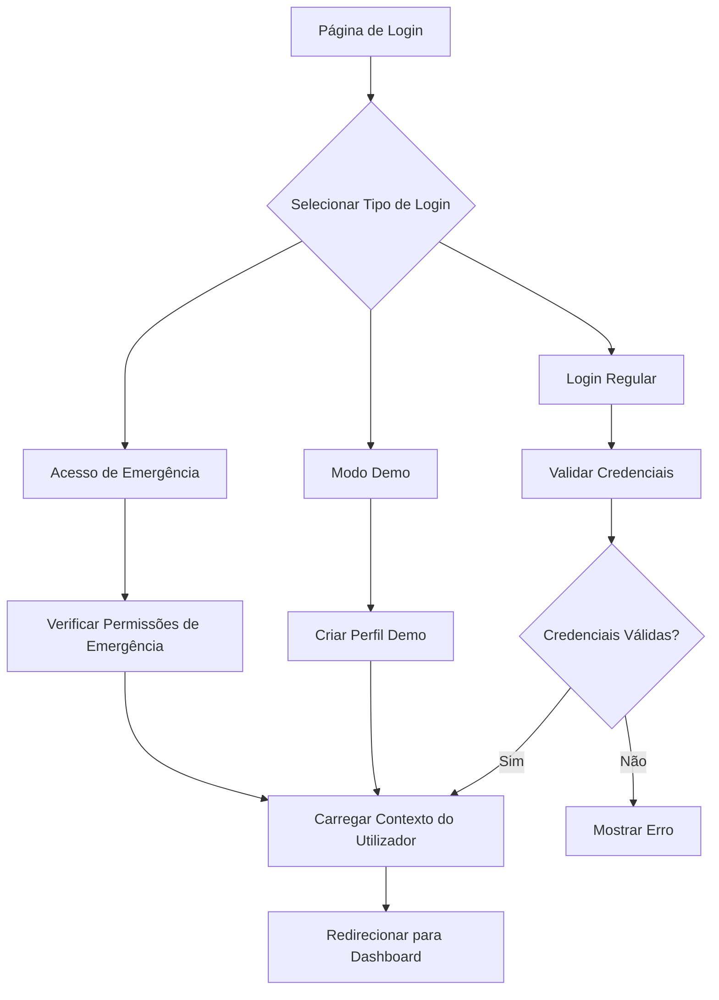
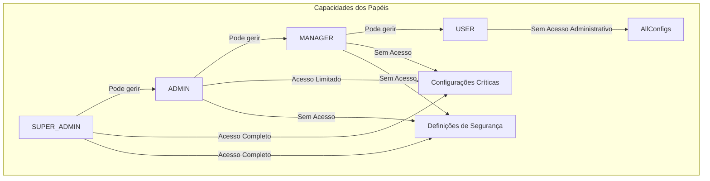
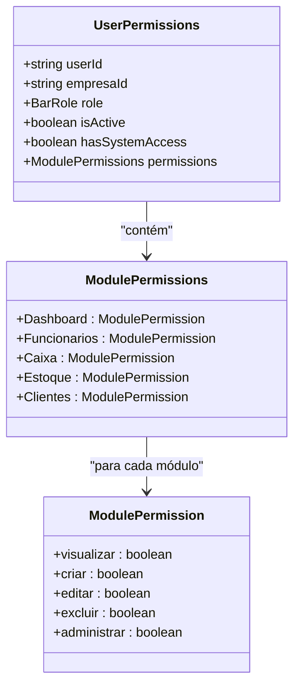
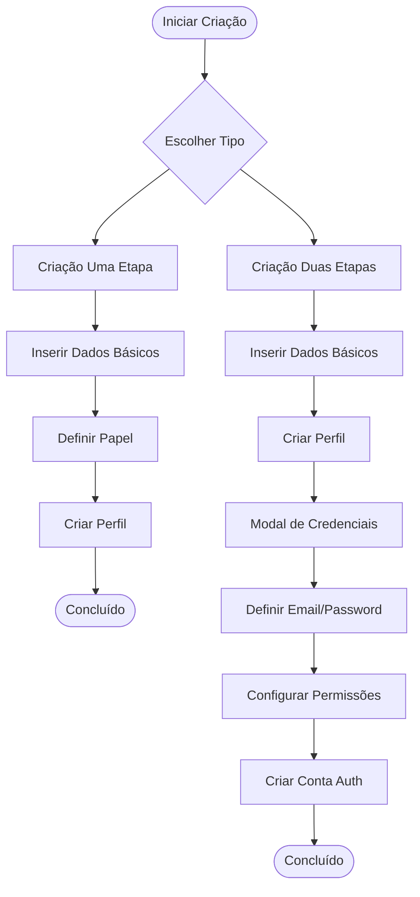
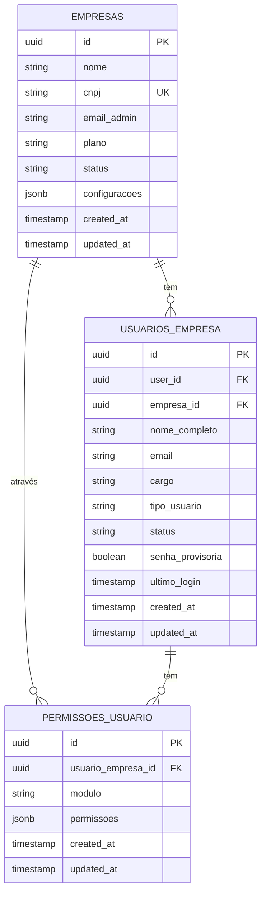

# Wiki do Sistema AABB - Documentação Completa em Português

## Índice
1. [Visão Geral do Sistema](#visão-geral-do-sistema)
2. [Pilha Tecnológica e Dependências](#pilha-tecnológica-e-dependências)
3. [Instalação e Configuração](#instalação-e-configuração)
4. [Módulos Principais](#módulos-principais)
5. [Autenticação e Autorização](#autenticação-e-autorização)
6. [Gestão de Funcionários](#gestão-de-funcionários)
7. [Arquitetura Multi-Tenant](#arquitetura-multi-tenant)
8. [Design do Schema da Base de Dados](#design-do-schema-da-base-de-dados)
9. [Camada de Integração de API](#camada-de-integração-de-api)
10. [Gestão de Estado](#gestão-de-estado)
11. [Estratégia de Testes](#estratégia-de-testes)
12. [Implantação e Operações](#implantação-e-operações)
13. [Guia de Resolução de Problemas](#guia-de-resolução-de-problemas)

---

## Visão Geral do Sistema

### Introdução
O sistema AABB é uma plataforma abrangente de gestão de clubes projetada para otimizar as operações de clubes recreativos e desportivos. Integra múltiplas funcionalidades críticas incluindo gestão de bar, operações de cozinha, controle de inventário, administração de membros e gestão de caixa numa plataforma unificada.

### Arquitetura do Sistema
O sistema AABB segue uma arquitetura moderna full-stack com separação clara entre as camadas frontend, backend e base de dados. O sistema utiliza React/Vite para a interface frontend, Supabase como plataforma backend-as-a-service e PostgreSQL como motor de base de dados subjacente.



### Componentes Principais e Modelos de Dados
O sistema é construído em torno de entidades centrais que representam os aspetos fundamentais das operações do clube:

- **Comandas**: Representam pedidos ou contas de clientes
- **Mesas**: Gerem o estado e disponibilidade das mesas
- **Produtos**: Catálogo de itens disponíveis para venda
- **Utilizadores**: Gestão de funcionários e membros
- **Empresas**: Suporte multi-tenant para múltiplos clubes

### Design Multi-Tenant e Segurança
O sistema implementa uma arquitetura multi-tenant robusta que garante isolamento completo de dados entre diferentes clubes ou organizações que utilizam a plataforma. Este design permite que múltiplas entidades independentes operem na mesma infraestrutura mantendo separação rigorosa dos seus dados e configurações.

O isolamento de tenants é conseguido através de vários mecanismos:
1. Todas as tabelas da base de dados incluem um campo `empresa_id` que associa registos a organizações específicas
2. Políticas de Row Level Security (RLS) aplicam filtros automáticos baseados no contexto do utilizador
3. Middleware de aplicação valida permissões antes do processamento de pedidos
4. Logs de auditoria capturam todas as atividades críticas com rastreamento específico por tenant

---

## Pilha Tecnológica e Dependências

### Frontend
- **React 18**: Biblioteca de interface de utilizador para construção de componentes interativos
- **Vite**: Ferramenta de build moderna para desenvolvimento rápido
- **TypeScript**: Superset tipado do JavaScript para melhor experiência de desenvolvimento
- **Tailwind CSS**: Framework de CSS utility-first para estilização
- **React Router**: Navegação e roteamento no lado do cliente

### Backend
- **Supabase**: Plataforma backend-as-a-service que fornece:
  - Autenticação e autorização
  - Base de dados PostgreSQL
  - APIs REST e GraphQL geradas automaticamente
  - Subscriptions em tempo real
  - Storage de ficheiros

### Base de Dados
- **PostgreSQL**: Sistema de gestão de base de dados relacional
- **Row Level Security (RLS)**: Isolamento de dados ao nível da linha
- **Triggers e Funções**: Lógica de negócio ao nível da base de dados

### Móvel (App Garçom)
- **React Native**: Framework para desenvolvimento de aplicações móveis nativas
- **Expo**: Plataforma e conjunto de ferramentas para React Native

### Ferramentas de Desenvolvimento
- **ESLint**: Linting de código JavaScript/TypeScript
- **Jest**: Framework de testes unitários
- **Vitest**: Framework de testes rápido para Vite

---

## Instalação e Configuração

### Pré-requisitos
- Node.js 18 ou superior
- npm ou yarn
- Conta Supabase
- Git

### Configuração do Projeto
1. **Clonar o repositório**:
   ```bash
   git clone [url-do-repositorio]
   cd AABB-system
   ```

2. **Instalar dependências**:
   ```bash
   npm install
   ```

3. **Configurar variáveis de ambiente**:
   Criar um ficheiro `.env` na raiz do projeto:
   ```env
   VITE_SUPABASE_URL=your_supabase_url
   VITE_SUPABASE_ANON_KEY=your_supabase_anon_key
   ```

### Configuração da Base de Dados Supabase
1. Criar um novo projeto no Supabase
2. Executar as migrações da base de dados:
   ```bash
   npx supabase db push
   ```
3. Configurar as políticas Row Level Security
4. Popular a base de dados com dados iniciais (opcional)

### Inicialização do Sistema Multi-Tenant
O sistema AABB apresenta uma arquitetura multi-tenant que permite que múltiplas empresas operem dentro do mesmo sistema mantendo isolamento de dados.

#### Processo de Registo de Empresa
O processo de registo é gerido pela classe `RegistroEmpresaService` que gere o fluxo completo de criação de empresa e configuração do primeiro utilizador:



---

## Módulos Principais

### Módulo Dashboard
O módulo Dashboard serve como o centro principal para monitorização de indicadores-chave de desempenho (KPIs) e navegação entre módulos do sistema. Fornece uma visão executiva das operações do clube através de estatísticas em tempo real e acesso rápido às funcionalidades principais.

**Funcionalidades principais:**
- Exibição em tempo real da receita do dia, pedidos pendentes, contagem de vendas e itens com stock baixo
- Sistema de alertas interativo para escassez de inventário com navegação direta para secções relevantes
- Rastreamento de pedidos recentes com visualização de estado
- Botões de acesso rápido a todos os módulos principais
- Indicadores de modo demonstração

### Módulo Bar
O módulo Bar gere o ciclo de vida dos pedidos desde a criação até à entrega, focando no serviço de mesa e vendas no balcão. Trata da gestão de comandas, colocação de pedidos e rastreamento de pedidos em tempo real.

**Funcionalidades principais:**
- Criação de pedidos através de interface modal com seleção de itens do menu
- Filtragem em tempo real por estado, número de mesa e termo de pesquisa
- Indicadores visuais para mesas com múltiplos pedidos
- Rastreamento de receita e estatísticas de pedidos
- Suporte para pedidos baseados em mesa e no balcão

**Fluxo de trabalho típico:**


### Módulo Cozinha
O módulo Cozinha fornece ferramentas para gerir fluxos de trabalho de preparação de comida e configuração de menu. Oferece uma interface com separadores duplos separando gestão de pedidos da administração do menu.

**Funcionalidades principais:**
- Interface de gestão de pedidos para acompanhamento do estado de preparação
- Sistema de configuração de menu para adicionar/editar itens
- Notificações em tempo real para novos pedidos
- Gestão de estados de pedidos (pendente → a preparar → pronto → entregue)

### Módulo Inventário
O módulo Inventário gere níveis de stock, rastreamento de produtos e alertas de reabastecimento. Fornece visibilidade em tempo real dos níveis de inventário e suporta operações de gestão de stock.

**Funcionalidades principais:**
- Rastreamento de níveis de stock em tempo real
- Sistema de alertas para itens com stock baixo
- Funcionalidade de atualização em massa para ajustes de inventário
- Relatórios e análises de movimento de stock
- Gestão de categorias e organização de produtos

### Módulo Membros
O módulo Membros gere informações de patrocinadores e membros, incluindo detalhes pessoais, estado de adesão e privilégios associados. Permite registo, atualizações de perfil e rastreamento de estado.

**Funcionalidades principais:**
- Sistema de registo e gestão de membros
- Rastreamento de estado de adesão e renovações
- Gestão de privilégios e descontos
- Histórico e análises de atividade de membros

### Módulo Gestão de Caixa
O módulo Gestão de Caixa fornece ferramentas abrangentes para rastreamento financeiro, gestão de sessões de caixa e relatórios. Gere o fluxo de caixa diário e transações financeiras.

**Componentes principais:**
- Visão geral do dashboard da sessão de caixa atual
- Histórico detalhado de transações
- Rastreamento de movimento de caixa diário
- Capacidades de relatórios financeiros
- Gestão de sessões de caixa (abertura e fecho)

---

## Autenticação e Autorização

### Processo de Login
O sistema de autenticação suporta múltiplos fluxos de login incluindo autenticação tradicional de utilizador, modo demonstração e fallback de emergência.



### Controle de Acesso Baseado em Papéis

#### Estrutura Hierárquica de Papéis
O sistema implementa uma estrutura hierárquica de papéis de quatro níveis: SUPER_ADMIN, ADMIN, MANAGER e USER. Papéis de nível superior podem gerir papéis de nível inferior mas não vice-versa.



#### Definições de Papéis
- **Gerente**: Acesso completo a todos os módulos com operações CRUD completas e capacidades administrativas
- **Atendente**: Acesso ao dashboard, monitorização de bar, serviço de bar e módulos de gestão de clientes
- **Garçom**: Acesso focado ao serviço de bar com capacidades de criação de transações
- **Cozinheiro**: Acesso especializado à monitorização de cozinha com capacidades de processamento de pedidos
- **Barman**: Similar ao garçom mas com capacidades melhoradas específicas do bar

### Sistema de Permissões
As permissões de utilizador são organizadas como uma estrutura aninhada de módulos e ações. Cada módulo contém flags booleanos para ações específicas como 'visualizar', 'criar', 'editar', 'excluir' e 'administrar'.



### Funcionalidade de Modo Demo
O modo demo fornece acesso instantâneo ao conjunto completo de funcionalidades do sistema AABB, permitindo que utilizadores explorem todos os módulos e funcionalidades sem requisitos de autenticação.

**Características do perfil demo:**
- Privilégios administrativos completos em todas as áreas funcionais
- Acesso a todos os conjuntos de dados de demonstração
- Capacidade de navegar entre todos os módulos sem restrições
- Avatar pré-configurado usando gerador de iniciais DiceBear
- Sessão persistente durante o período demo

---

## Gestão de Funcionários

### Fluxo de Criação de Funcionários
O sistema suporta dois fluxos de criação de funcionários: criação em uma etapa e criação em duas etapas com credenciais.

#### Criação de Funcionários em Uma Etapa
Criação rápida de perfis de funcionários com dados básicos e permissões pré-definidas baseadas no papel.

#### Criação de Funcionários em Duas Etapas com Credenciais
Processo mais robusto que inclui:
1. Criação do perfil do funcionário com dados básicos
2. Configuração de credenciais de login e permissões detalhadas



### Sistema de Atribuição de Permissões
O sistema oferece três abordagens para atribuição de permissões:

#### Presets de Permissões Baseados em Papéis
Configurações pré-definidas de permissões que correspondem a papéis funcionais padrão:
- **Preset Gerente**: Acesso completo a todos os módulos
- **Preset Atendente**: Acesso operacional com limitações administrativas
- **Preset Garçom**: Acesso focado no serviço com capacidades limitadas de modificação

#### Editor de Permissões UI
Interface interativa que permite aos administradores personalizar permissões por módulo e ação específica.

#### Mapeamento de Permissões Frontend-Backend
Sistema que garante que as permissões definidas no frontend são corretamente aplicadas e validadas no backend.

### Gestão do Ciclo de Vida do Funcionário

#### Processo de Desativação de Funcionário
Desativação temporária que preserva dados históricos mantendo a integridade dos registos.

#### Processo de Reativação de Funcionário
Restauração de funcionários previamente desativados com validação de permissões.

#### Procedimento de Remoção de Funcionário
Remoção permanente com salvaguardas para preservar integridade referencial.

### Sistema de Logs de Auditoria
Mecanismo abrangente para rastreamento de todas as atividades relacionadas com funcionários.

#### Mecanismo de Logs de Auditoria
Sistema automatizado que captura:
- Criação, modificação e remoção de funcionários
- Alterações de permissões
- Tentativas de login e ações de autenticação
- Atividades administrativas

#### Visualizador de Logs de Auditoria
Interface para revisar histórico de auditoria com:
- Filtragem por utilizador, ação e período de tempo
- Visualização detalhada de alterações
- Capacidades de exportação para conformidade

---

## Arquitetura Multi-Tenant

### Mecanismo de Isolamento de Tenants
A arquitetura multi-tenant garante isolamento completo de dados entre diferentes organizações através de múltiplas camadas de segurança.

### Políticas de Row Level Security
Todas as tabelas sensíveis a tenants têm RLS habilitado com políticas rigorosas baseadas em `empresa_id`:

```sql
-- Exemplo de política RLS
CREATE POLICY "Utilizadores podem ver apenas sua empresa"
ON empresas FOR ALL
USING (id = get_user_empresa_id());
```

### Fluxo de Registo de Empresa
Processo orchestrado para criar novas organizações no sistema:

1. Validação de dados da empresa (nome, CNPJ, etc.)
2. Verificação de unicidade do CNPJ
3. Criação de conta de utilizador no Supabase Auth
4. Inserção de registo da empresa
5. Criação de associação utilizador-empresa com privilégios SUPER_ADMIN
6. Configuração de definições padrão da empresa

### Restrições de Dados Cross-Tenant
Salvaguardas implementadas para prevenir acesso não autorizado cross-tenant:
- Todas as operações de base de dados filtram por `empresa_id`
- Middleware de aplicação valida contexto de tenant
- Políticas RLS aplicam verificações duplas (USING e WITH CHECK)
- Logs de auditoria capturam todas as operações críticas

---

## Design do Schema da Base de Dados

### Tabelas Principais

#### Empresas
Armazena metadados de empresas incluindo nome, CNPJ, informações de contacto, tipo de plano e estado.

#### Utilizadores_Empresa
Associa utilizadores autenticados às suas respetivas empresas, incluindo papel e estado de emprego.

#### Permissões_Utilizador
Define permissões granulares por utilizador e módulo.

#### Configurações_Empresa
Contém definições de configuração com âmbito para cada empresa.

#### Logs_Auditoria
Captura logs de auditoria ligados a tenants específicos.

### Diagrama de Relacionamentos


---

## Camada de Integração de API

### Integração Supabase
O sistema utiliza o cliente Supabase para todas as interações com a base de dados, fornecendo:
- APIs REST geradas automaticamente
- Subscriptions em tempo real
- Autenticação integrada
- Políticas de segurança ao nível da linha

### Serviços de Dados
Serviços especializados para diferentes domínios:
- **AuthService**: Gestão de autenticação e autorização
- **EmployeeService**: Operações de gestão de funcionários
- **OrderService**: Gestão de pedidos e comandas
- **InventoryService**: Operações de inventário e stock

### Gestão de Estado em Tempo Real
Utilização de subscriptions Supabase para atualizações de dados em tempo real:
- Estados de pedidos
- Níveis de inventário
- Atividade de utilizadores
- Notificações do sistema

---

## Gestão de Estado

### React Context API
O sistema utiliza múltiplos contextos React para gestão de estado:

#### AppContext
Contexto principal que fornece:
- Dados de utilizador e empresa
- Estados de pedidos e inventário
- Notificações do sistema
- Métodos para operações CRUD

#### AuthContext
Contexto especializado para:
- Estado de autenticação
- Informações de utilizador
- Permissões e papéis
- Métodos de login/logout

### Otimização de Performance
Estratégias implementadas para otimização:
- Lazy loading de componentes
- Memoização com React.memo
- Debouncing para operações de pesquisa
- Paginação para grandes conjuntos de dados

---

## Estratégia de Testes

### Testes Unitários
- Utilização do Jest para testes de componentes e funções
- Cobertura de hooks customizados e utilitários
- Testes de validação de dados e transformações

### Testes de Integração
- Testes de fluxos completos de utilizador
- Validação de integrações com Supabase
- Testes de políticas de autorização

### Testes de Segurança
- Validação de isolamento multi-tenant
- Testes de políticas RLS
- Verificação de controlos de acesso

---

## Implantação e Operações

### Configuração de Ambiente
Variáveis de ambiente necessárias:
```env
VITE_SUPABASE_URL=your_supabase_project_url
VITE_SUPABASE_ANON_KEY=your_supabase_anon_key
VITE_APP_ENVIRONMENT=production
```

### Processo de Build
```bash
# Build para produção
npm run build

# Preview da build
npm run preview
```

### Implantação
O sistema pode ser implantado em várias plataformas:
- **Vercel**: Configuração otimizada incluída
- **Netlify**: Suporte para deployment contínuo
- **Servidor próprio**: Build estática compatível

### Monitorização
- Logs de aplicação através do sistema de auditoria
- Monitorização de performance com métricas customizadas
- Alertas para problemas críticos do sistema

---

## Guia de Resolução de Problemas

### Problemas Comuns

#### Problemas de Autenticação
**Sintoma**: Utilizadores não conseguem fazer login
**Soluções**:
1. Verificar configuração das variáveis de ambiente
2. Validar políticas RLS na base de dados
3. Confirmar estado ativo do utilizador

#### Problemas de Isolamento Multi-Tenant
**Sintoma**: Utilizadores veem dados de outras empresas
**Soluções**:
1. Verificar função `get_user_empresa_id()`
2. Revisar políticas RLS em todas as tabelas
3. Validar contexto de autenticação

#### Problemas de Performance
**Sintoma**: Interface lenta ou não responsiva
**Soluções**:
1. Otimizar queries de base de dados
2. Implementar paginação em listas grandes
3. Adicionar índices apropriados na base de dados

### Logs e Debugging
- Utilizar console do browser para logs do frontend
- Verificar logs do Supabase para problemas de backend
- Consultar tabela de logs de auditoria para atividade de utilizadores

### Contactos de Suporte
Para problemas técnicos complexos:
1. Consultar documentação técnica detalhada
2. Verificar issues conhecidos no repositório
3. Contactar equipa de desenvolvimento

---

## Conclusão

Este wiki fornece uma visão abrangente do sistema AABB, cobrindo todos os aspetos desde a arquitetura até à implementação prática. O sistema foi projetado com foco na escalabilidade, segurança e facilidade de uso, fornecendo uma solução robusta para gestão de clubes.

Para informações mais detalhadas sobre componentes específicos, consulte a documentação técnica individual de cada módulo ou entre em contacto com a equipa de desenvolvimento.