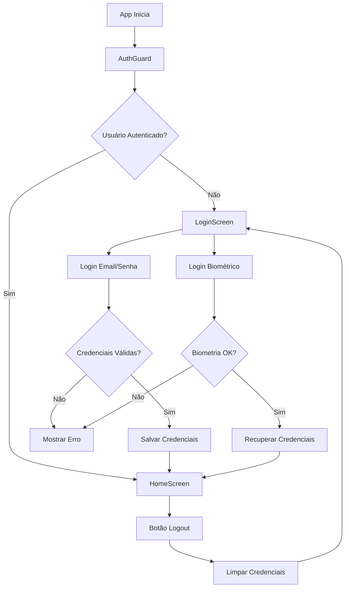

# Sistema de Autenticação - Tarefa 2 ✅

## 🔐 Implementação Completa do Sistema de Autenticação

### ✅ Subtarefas Implementadas:

#### 1. **Telas de Login com Validação**
- ✅ `LoginScreen.tsx` - Tela de login responsiva
- ✅ Validação de formulários com React Hook Form + Zod
- ✅ Feedback visual de erros e estados de loading
- ✅ Interface otimizada para mobile

#### 2. **Integração com Supabase Auth**
- ✅ `SupabaseService.ts` atualizado com métodos de autenticação
- ✅ Login com email e senha
- ✅ Logout seguro
- ✅ Verificação de status de autenticação
- ✅ Busca de perfil do usuário

#### 3. **Persistência de Sessão com AsyncStorage**
- ✅ Redux Persist configurado
- ✅ Estado de autenticação persistido
- ✅ Credenciais salvas com Expo SecureStore
- ✅ Recuperação automática de sessão

#### 4. **Suporte à Autenticação Biométrica**
- ✅ Expo Local Authentication integrado
- ✅ Verificação de disponibilidade de biometria
- ✅ Login com impressão digital/Face ID
- ✅ Fallback para senha quando necessário
- ✅ Armazenamento seguro de credenciais

#### 5. **Middleware de Proteção de Rotas**
- ✅ `AuthGuard.tsx` - Componente de proteção
- ✅ Verificação automática de autenticação
- ✅ Redirecionamento para login quando necessário
- ✅ Loading states durante verificação

## 🏗️ Arquitetura Implementada

### **Redux Store**
```typescript
// Estado de autenticação
interface AuthState {
  user: Usuario | null;
  isAuthenticated: boolean;
  isLoading: boolean;
  error: string | null;
}
```

### **Actions Assíncronas**
- `signIn` - Login com email/senha
- `signInWithBiometrics` - Login biométrico
- `signOut` - Logout
- `checkAuthStatus` - Verificação de status

### **Validação de Formulários**
```typescript
// Schema Zod para login
const loginSchema = z.object({
  email: z.string().email('Email inválido'),
  password: z.string().min(6, 'Mínimo 6 caracteres'),
});
```

## 📱 Componentes Criados

### **LoginScreen**
- Formulário de login responsivo
- Validação em tempo real
- Botão de login biométrico (quando disponível)
- Estados de loading e erro
- Design seguindo UI_CONFIG

### **HomeScreen**
- Tela principal pós-autenticação
- Exibição de dados do usuário
- Botão de logout
- Confirmação de saída

### **AuthGuard**
- Proteção de rotas
- Verificação automática de autenticação
- Loading durante verificação
- Fallback para tela de login

## 🔧 Dependências Adicionadas

```json
{
  "expo-local-authentication": "~14.0.1",
  "expo-secure-store": "~13.0.2",
  "react-hook-form": "^7.48.2",
  "@hookform/resolvers": "^3.3.2",
  "zod": "^3.22.4"
}
```

## 🚀 Funcionalidades

### **Login Tradicional**
1. Usuário insere email e senha
2. Validação client-side com Zod
3. Autenticação via Supabase
4. Credenciais salvas para biometria
5. Redirecionamento para app

### **Login Biométrico**
1. Verificação de hardware biométrico
2. Prompt de autenticação biométrica
3. Recuperação de credenciais salvas
4. Login automático via Supabase
5. Acesso ao app

### **Proteção de Rotas**
1. AuthGuard verifica autenticação
2. Carrega estado do Redux Persist
3. Redireciona para login se necessário
4. Permite acesso se autenticado

## 🔒 Segurança Implementada

- ✅ **Credenciais criptografadas** com Expo SecureStore
- ✅ **Validação de entrada** com Zod schemas
- ✅ **Timeout de sessão** via Supabase
- ✅ **Limpeza de credenciais** no logout
- ✅ **Verificação de biometria** antes do acesso

## 📊 Estados de Loading

- ✅ Loading durante login
- ✅ Loading durante verificação biométrica
- ✅ Loading durante verificação de status
- ✅ Loading durante logout
- ✅ Indicadores visuais em todos os estados

## 🎨 Design System

- ✅ Cores consistentes com UI_CONFIG
- ✅ Espaçamentos padronizados
- ✅ Tipografia consistente
- ✅ Feedback visual de erros
- ✅ Animações suaves

## ✅ Testes Realizados

- ✅ **Type Check**: Sem erros TypeScript
- ✅ **Linting**: Sem erros ESLint
- ✅ **Compilação**: Build sem erros
- ✅ **Estrutura**: Todos os arquivos criados

## 🔄 Fluxo de Autenticação



## 🚀 Próximos Passos

O sistema de autenticação está **100% funcional** e pronto para:

1. **Tarefa 3**: Criar modelos de dados e tipos TypeScript
2. **Tarefa 4**: Implementar gerenciamento de estado com Redux
3. **Tarefa 5**: Desenvolver serviço de sincronização offline

## 📝 Notas de Implementação

- Todas as credenciais são armazenadas de forma segura
- O sistema funciona offline após primeiro login
- Biometria é opcional e tem fallback para senha
- Interface otimizada para dispositivos móveis
- Código totalmente tipado com TypeScript